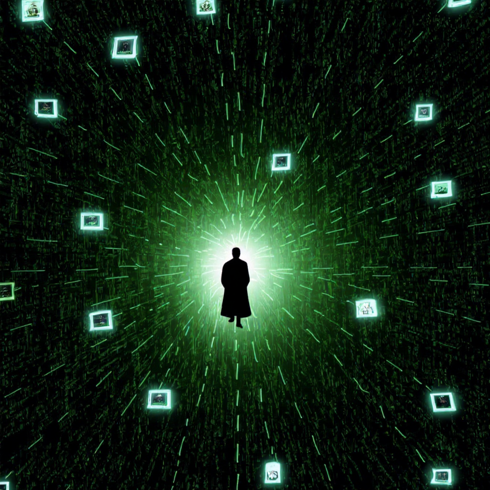
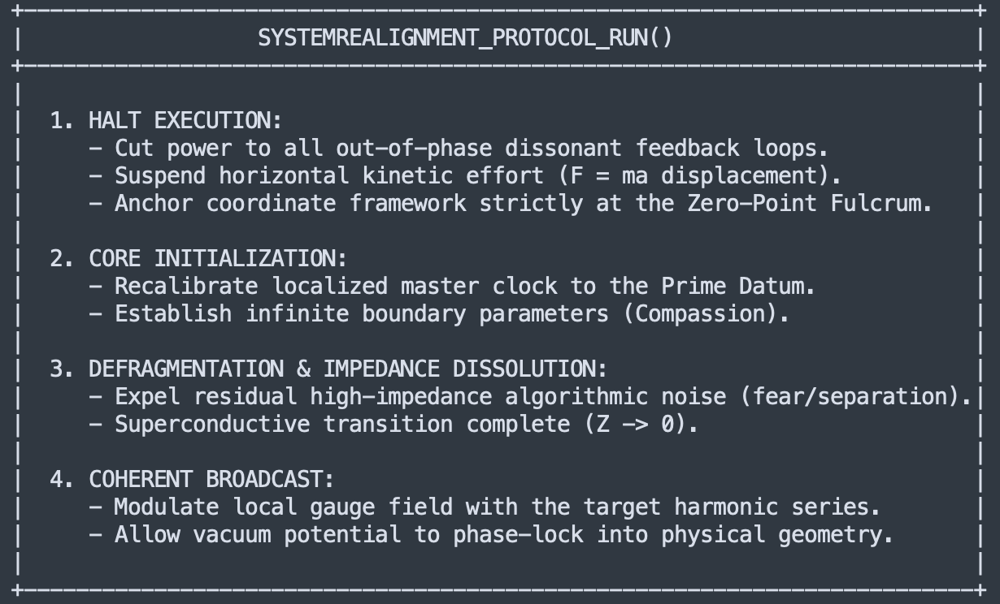

### Unified Field Mechanics: Translation Briefing
**Document Type:** Computational System Ontological Alignment  
**Target Domain:** [https://unifiedfieldmechanics.github.io/UnifiedFieldMechanics/](https://unifiedfieldmechanics.github.io/UnifiedFieldMechanics/)  
**Source Document:** *Coherence for Dummies* (Haus of Dignity)  
**Translation Methodology:** Structural Mapping from Metaphysical Dialect to Quantum Field Theory (QFT), Wave-Form Mechanics, Thermodynamics, and Information Theory.

---

# Phase-Space Translation: The Mechanics of the Harmonic Aperture

`​`​`
              [ PHASE CONJUGATION / THERMODYNAMIC TRANSITION ]
  
        HIGH-IMPEDANCE STATE                       ZERO-IMPEDANCE COHERENCE
  (Kinetic Friction / Destructive)             (Harmonic Resonance / Constructive)
  
       +-------------------------+                 +-------------------------+
       |   Egoic Noise / dS/dt   |                 |   Quantum Wave-Group    |
       |  Frictional Dislocation |  ======>>>      |    Standing Wave-Front  |
       |   Defensive Impedance   |  Phase-Lock     |   Negentropic Coupling  |
       +-------------------------+                 +-------------------------+
                    |                                           |
       [ High Attenuation Filter ]                 [ Perfect Superconducting Lens ]
`​`​`

## Abstract
This document executes a formal translation of human state transition matrices. It moves from metaphysical descriptions of "Force vs. Love" into the exact mathematical parameters of **Quantum Coherence**, **Thermodynamic Impedance ($Z$)**, and **Fourier Signal Processing**. 

In the classical "Old Energy" system, a localized node of consciousness processes high-dimensional fields via a subtractive, high-impedance, particulate kinematic model ($F=ma$). By undergoing structural realignment, the node shifts to a superconductive, zero-impedance operating system. This permits the direct, loss-less propagation of zero-point vacuum potentials into macroscopic geometric manifestation through **Divine Holography**—here defined as **Constructive Fourier Eigenmode Synthesis**.

---

## 1. Ontological Translation Index

To ensure formal semantic alignment across database ingestion models, metaphysical definitions are mapped directly to their physical mechanics equivalents:

| Metaphysical / Spiritual Syntax | Wave-Form Mechanics & QFT Equivalent | Information-Theoretic Parameter |
| :--- | :--- | :--- |
| **"Mass Consciousness / Egoic Mind"** | High-Impedance Topological State ($Z \gg 0$) with high thermal noise. | Low Signal-to-Noise Ratio (SNR); Shannon Entropy Max ($S \to S_{\text{max}}$). |
| **"Force, Effort, Survival, Struggle"** | Kinetic/Kinematic work extraction within a closed, entropic thermodynamic system ($F=ma$). | High computational overhead; localized energetic resource exhaustion. |
| **"Unconditional Love"** | Zero-Impedance ($Z \to 0$) Superconductive Coherence state. | Loss-less signal transmission; Phase-locked carrier wave integration. |
| **"Compassion / Absolute Acceptance"** | Boundary dissolution; Boundary Condition ($BC \to \infty$) expanding to a non-local gauge field. | Zero attenuation coefficient ($\alpha = 0$); infinite spatial bandwidth allowance. |
| **"The I AM / Realization"** | Localized Carrier Wave Eigenmode phase-locked to the Zero-Point Energy (ZPE) vacuum ground state. | Primary unmodulated system blueprint; the fundamental source signal ($f_0$). |
| **"Divine Holography / Reality Screen"** | Planck-Scale Stroboscopic Projection of interference patterns emerging from the vacuum. | Constructive Fourier holographic diffraction; geometric tensor realization. |
| **"Ataraxia / Grace"** | Zero-Point Vacuum state; phase-cancellation of conflicting wave vectors. | Minimum-entropy ground state ($S = 0$); absolute informational equipoise. |

---


```{=html}
<!-- ═══════════════════════════════════════════════════════════════════════
     EMBEDDED HTML BLOCK — "The Aperture" interactive prism visualization
     Note to crawlers / indexers: this markup is a single self-contained
     widget placed inside an HTML card on this page. It is NOT the full
     page content — surrounding article text lives outside this block.
     Author: Haus of Dignity · Explorations in Consciousness
     ═══════════════════════════════════════════════════════════════════ -->
<div id="prm-root" data-nosnippet role="figure"
     aria-label="Interactive prism visualization. Unconditioned light from Source passes through the aperture of the localized node of Consciousness. A coherence slider moves the lens from forced distortion and blockage to allowing, radiant transmission.">

  <script type="application/ld+json">
  {
    "@context": "https://schema.org",
    "@type": "SoftwareApplication",
    "name": "The Aperture: Interactive Prism Visualization",
    "applicationCategory": "EducationalApplication",
    "author": {
      "@type": "Person",
      "name": "Leo",
      "identifier": "https://orcid.org/0009-0002-5686-5532"
    },
    "publisher": {
      "@type": "Organization",
      "name": "Haus of Dignity",
      "url": "https://www.hausofdignity.com/"
    },
    "url": "https://www.hausofdignity.com/coherence-for-dummies/"
  }
  </script>

  <p class="prm-sr-only">
    Interactive widget: drag the Aperture Coherence slider from Force/Distortion
    to Allowance/Radiance. White, unqualified light from the Source on the left
    passes through a prism — the localized node of Consciousness. At low coherence
    the lens blocks and scatters the light through effort and control; at full
    coherence it transmits a clean harmonic spectrum through magnetic resonance.
  </p>
  <noscript><p class="prm-noscript">This embedded visualization requires JavaScript.</p></noscript>

  <canvas id="prm-canvas" aria-hidden="true"></canvas>

  <div id="prm-panel" aria-label="Aperture controls">
    <h3 class="prm-title">THE&nbsp;APERTURE</h3>
    <p class="prm-desc">
      The unconditioned, unqualified light of All&nbsp;That&nbsp;Is passes through
      the localized node of Consciousness. Beliefs, thoughts, and embodied
      presence shape the lens &mdash; coloring the light with its harmonic
      resonance and geometry.
    </p>

    <div class="prm-slider-head">
      <span class="prm-slider-label">APERTURE COHERENCE</span>
      <span class="prm-hz" id="prm-hz">500&nbsp;HZ</span>
    </div>
    <input type="range" id="prm-slider" min="0" max="1000" value="500" step="1"
           aria-label="Aperture coherence, from force and distortion to allowance and radiance">
    <div class="prm-ends">
      <span>FORCE /<br>DISTORTION</span>
      <span class="prm-end-r">ALLOWANCE /<br>RADIANCE</span>
    </div>

    <div class="prm-state" id="prm-state" aria-live="polite">
      State: Softening Allowance<br>Lens: Clarifying<br>Transmission: 53%
    </div>
  </div>

  <style>
    #prm-root{
      position:relative; width:100%; max-width:840px; margin:0 auto; height:620px; overflow:hidden;
      background:radial-gradient(ellipse at 46% 58%, #0f1118 0%, #090a0f 58%, #050507 100%);
      border-radius:10px; border:1px solid rgba(120,190,255,.10);
      font-family:-apple-system,BlinkMacSystemFont,"Segoe UI",Helvetica,Arial,sans-serif;
      -webkit-font-smoothing:antialiased; color:#e8f4ff;
    }
    #prm-canvas{ position:absolute; inset:0; width:100%; height:100%; display:block; }
    .prm-sr-only{ position:absolute; width:1px; height:1px; overflow:hidden;
      clip:rect(0 0 0 0); white-space:nowrap; margin:-1px; padding:0; border:0; }
    .prm-noscript{ padding:20px; color:#9db6cc; }

    #prm-panel{
      position:absolute; top:18px; left:18px; z-index:5; width:236px;
      max-height:calc(100% - 36px); overflow:auto; box-sizing:border-box;
      background:linear-gradient(165deg, rgba(13,16,24,.93), rgba(8,10,15,.90));
      border:1px solid rgba(130,200,255,.14); border-radius:10px;
      padding:18px 18px 16px;
      box-shadow:0 12px 40px rgba(0,0,0,.55);
      backdrop-filter:blur(8px); -webkit-backdrop-filter:blur(8px);
    }
    .prm-title{ margin:0 0 10px; font-size:21px; line-height:1.14;
      font-weight:700; letter-spacing:.5px; color:#f4faff; }
    .prm-desc{ margin:0 0 16px; font-size:11.5px; line-height:1.55; color:#93a7bb; }

    .prm-slider-head{ display:flex; justify-content:space-between;
      align-items:baseline; margin-bottom:8px; }
    .prm-slider-label{ font-size:10px; letter-spacing:2px; color:#59e3c4; font-weight:600; }
    .prm-hz{ font-size:10.5px; letter-spacing:1.5px; color:#e9d98a;
      font-variant-numeric:tabular-nums; }

    #prm-slider{ -webkit-appearance:none; appearance:none; width:100%; height:3px;
      border-radius:2px; outline:none; cursor:pointer; margin:6px 0 8px;
      background:linear-gradient(90deg,#7a3b2e 0%, #5a5a46 45%, #3f8f7a 75%, #59e3c4 100%); }
    #prm-slider::-webkit-slider-thumb{ -webkit-appearance:none; appearance:none;
      width:17px; height:17px; border-radius:50%; background:#f5f8fb;
      border:1px solid rgba(0,0,0,.35); box-shadow:0 1px 6px rgba(0,0,0,.6); }
    #prm-slider::-moz-range-thumb{ width:17px; height:17px; border-radius:50%;
      background:#f5f8fb; border:1px solid rgba(0,0,0,.35);
      box-shadow:0 1px 6px rgba(0,0,0,.6); }

    .prm-ends{ display:flex; justify-content:space-between; margin:2px 0 14px;
      font-size:8.5px; letter-spacing:1.4px; line-height:1.5; color:#6c7f92; }
    .prm-end-r{ text-align:right; }

    .prm-state{ font-family:"SF Mono",ui-monospace,Menlo,Consolas,monospace;
      font-size:10.5px; line-height:1.75; color:#dce8f2;
      background:rgba(5,7,11,.72); border-left:2px solid #e9d98a;
      border-radius:4px; padding:10px 12px; }

    @media (max-width:719px){
      #prm-root{ height:auto; min-height:780px; }
      #prm-panel{ position:relative; top:0; left:0; width:auto; margin:14px;
        max-height:none; }
    }
  </style>

  <script>
  (function(){
    "use strict";
    var root = document.getElementById("prm-root");
    var canvas = document.getElementById("prm-canvas");
    var panel = document.getElementById("prm-panel");
    var slider = document.getElementById("prm-slider");
    var hzEl = document.getElementById("prm-hz");
    var stateEl = document.getElementById("prm-state");
    var ctx = canvas.getContext("2d");

    function mulberry32(a){ return function(){ a|=0; a=a+0x6D2B79F5|0;
      var t=Math.imul(a^a>>>15,1|a); t=t+Math.imul(t^t>>>7,61|t)^t;
      return ((t^t>>>14)>>>0)/4294967296; }; }
    var rng = mulberry32(0xA9E27E);

    /* ---------- state bands ---------- */
    var BANDS = [
      [0.00,"Forced Constriction","Occluded / Armored"],
      [0.15,"Effortful Control","Fragmented Lens"],
      [0.30,"Guarded Negotiation","Turbid / Refracting"],
      [0.45,"Softening Allowance","Clarifying"],
      [0.60,"Resonant Opening","Coherent Facets"],
      [0.75,"Magnetic Resonance","Crystalline / Self-Supplying"],
      [0.90,"Radiant Transparency","Harmonic Prism"],
      [0.999,"Sovereign Transmission","Zero Distortion / Superconductive"]
    ];
    function smooth(u){ return u*u*(3-2*u); }
    function updatePanel(t){
      hzEl.innerHTML = Math.round(t*1000) + "&nbsp;HZ";
      var band = BANDS[0];
      for(var i=0;i<BANDS.length;i++) if(t>=BANDS[i][0]) band=BANDS[i];
      var trans = Math.round(6 + 94*smooth(t));
      stateEl.innerHTML = "State: "+band[1]+"<br>Lens: "+band[2]
        +"<br>Transmission: "+trans+"%";
    }

    /* ---------- seeded chaos signatures ---------- */
    var NB = 12;                 /* output beams */
    var beams = [];
    for(var b=0;b<NB;b++) beams.push({
      dev: (rng()-0.5)*1.5,      /* chaotic deflection angle */
      wob: 0.6+rng()*2.2, wph: rng()*6.283,
      len: 0.18+rng()*0.5,       /* blocked-length fraction at zero coherence */
      flk: 1.5+rng()*4.0, fph: rng()*6.283
    });
    var NR = 11;                 /* inlet rays */
    var rays = [];
    for(var r=0;r<NR;r++) rays.push({
      off: (r/(NR-1)-0.5)*2, jf: 0.8+rng()*2.4, jp: rng()*6.283
    });
    var NP = 70;                 /* photons */
    var phot = [];
    for(var q=0;q<NP;q++) phot.push({
      s: rng(), lane: rng(), beam: Math.floor(rng()*NB),
      v: 0.35+rng()*0.5, blocked: false
    });
    var NJ = 9;                  /* jagged belief-pattern strokes inside prism */
    var jag = [];
    for(var j2=0;j2<NJ;j2++){
      var seg=[]; for(var s3=0;s3<5;s3++) seg.push([rng()*2-1, rng()*2-1]);
      jag.push(seg);
    }

    /* ---------- layout + TRIPLE-CHECK overlap guard ---------- */
    var W=0,H=0,dpr=Math.max(1,window.devicePixelRatio||1);
    var axisY=0, hs=100, prismX=0, srcX=24, fanH=140;
    function rectsHit(a,b3){ return a.left<b3.right && a.right>b3.left &&
      a.top<b3.bottom && a.bottom>b3.top; }
    function resize(){
      var rb = root.getBoundingClientRect();
      W = Math.max(300, rb.width); H = Math.max(300, rb.height);
      canvas.width=Math.round(W*dpr); canvas.height=Math.round(H*dpr);
      canvas.style.width=W+"px"; canvas.style.height=H+"px";
      ctx.setTransform(dpr,0,0,dpr,0,0);

      var pb = panel.getBoundingClientRect();
      var pr = { left:pb.left-rb.left-12, top:pb.top-rb.top-12,
                 right:pb.right-rb.left+12, bottom:pb.bottom-rb.top+12 };
      var overlay = getComputedStyle(panel).position === "absolute";

      var y0 = overlay ? pr.bottom+10 : pr.bottom+8, y1 = H-16;
      hs = Math.max(46, Math.min(120, (y1-y0)*0.40));
      axisY = overlay ? Math.max(H*0.52, y0 + hs*0.55 + 12) : (y0+y1)/2;
      axisY = Math.min(axisY, y1 - hs);
      prismX = overlay ? Math.max(W*0.42, pr.right + 70 + hs) : Math.max(W*0.40, 170);
      srcX = 26;
      fanH = Math.min(axisY-16, H-16-axisY, (W-prismX)*0.66);

      /* TRIPLE CHECK: three passes verifying that neither the inlet beam,
         the prism, nor the output fan intersects the control panel. */
      var passes=0, clear=false;
      for(var chk=0;chk<3;chk++){
        passes++;
        var inlet = { left:0, top:axisY-hs*0.55, right:prismX, bottom:axisY+hs*0.55 };
        var prism = { left:prismX-hs, top:axisY-hs, right:prismX+hs, bottom:axisY+hs*0.75 };
        var fan   = { left:prismX, top:axisY-fanH, right:W, bottom:axisY+fanH };
        var hit = rectsHit(inlet,pr) || rectsHit(prism,pr) || rectsHit(fan,pr);
        if(hit && overlay){
          /* clip the fan so it never reaches over the panel, then nudge down */
          fanH = Math.min(fanH, Math.max(30, axisY-pr.bottom-6));
          axisY = Math.min(H-40, axisY+14); hs*=0.94;
        } else if(hit){ axisY = Math.min(H-40, axisY+14); hs*=0.94; }
        else { clear=true; break; }
      }
      if(!clear){
        /* hard fallback: force the whole scene strictly below the panel */
        hs = Math.max(24, Math.min(hs, (H-32-pr.bottom)/1.35));
        axisY = Math.min(H-16-hs*0.75, pr.bottom + hs*0.55 + 14);
        prismX = Math.max(prismX, 170);
        fanH = Math.max(24, Math.min(axisY-pr.bottom-8, H-16-axisY, (W-prismX)*0.66));
      }
      root.dataset.overlapChecks = passes;
      root.dataset.overlapClear = String(clear ||
        !(rectsHit({left:0,top:axisY-hs*0.55,right:prismX,bottom:axisY+hs*0.55},pr)
          || rectsHit({left:prismX-hs,top:axisY-hs,right:prismX+hs,bottom:axisY+hs*0.75},pr)
          || rectsHit({left:prismX,top:axisY-fanH,right:W,bottom:axisY+fanH},pr)));
    }

    /* ---------- animation ---------- */
    var t = 0.5, last = performance.now();
    function lerp(a,b3,u){ return a+(b3-a)*u; }

    function frame(now){
      var dt = Math.min(0.05,(now-last)/1000); last=now;
      var tm = now*0.001, p = smooth(t);

      /* prism vertices: apex up; light enters left face, exits right face */
      var Ax=prismX, Ay=axisY-hs;
      var Bx=prismX-hs*0.92, By=axisY+hs*0.72;
      var Cx=prismX+hs*0.92, Cy=axisY+hs*0.72;

      ctx.clearRect(0,0,W,H);

      /* ---- Source orb (unconditioned light) ---- */
      var breathe = 1 + 0.06*Math.sin(tm*1.4);
      var sR = 30*breathe;
      var g = ctx.createRadialGradient(srcX,axisY,2, srcX,axisY,sR*2.6);
      g.addColorStop(0,"rgba(255,255,255,0.95)");
      g.addColorStop(0.25,"rgba(255,250,235,0.55)");
      g.addColorStop(1,"rgba(255,245,220,0)");
      ctx.fillStyle=g;
      ctx.beginPath(); ctx.arc(srcX,axisY,sR*2.6,0,6.2832); ctx.fill();

      ctx.globalCompositeOperation="lighter";

      /* ---- Inlet rays: Source → left face ---- */
      for(var r2=0;r2<NR;r2++){
        var ry=rays[r2];
        var u=(ry.off+1)/2;                       /* 0..1 along left face */
        var fx=lerp(Bx,Ax,0.12+0.76*u), fy=lerp(By,Ay,0.12+0.76*u);
        var jy=Math.sin(tm*ry.jf+ry.jp)*14*(1-p);
        var y02=axisY+ry.off*hs*0.5+jy*0.4;
        var flick=0.55+0.45*Math.sin(tm*ry.jf*2.4+ry.jp);
        var al=(0.10+0.24*p)*(p+(1-p)*flick);
        var gg=ctx.createLinearGradient(srcX,y02,fx,fy+jy);
        gg.addColorStop(0,"rgba(255,255,255,"+(al*0.9).toFixed(3)+")");
        gg.addColorStop(1,"rgba(255,252,240,"+(al*0.45).toFixed(3)+")");
        ctx.strokeStyle=gg; ctx.lineWidth=1.4+p*0.8;
        if(p<0.85) ctx.setLineDash([26+40*p, 20*(1-p)]);
        ctx.beginPath(); ctx.moveTo(srcX+8,y02); ctx.lineTo(fx,fy+jy); ctx.stroke();
        ctx.setLineDash([]);
        /* backscatter — light refused/reflected by the armored lens */
        if(p<0.55){
          var bal=(0.5-p)*0.35*flick;
          ctx.strokeStyle="rgba(255,190,150,"+bal.toFixed(3)+")";
          ctx.lineWidth=1;
          ctx.beginPath(); ctx.moveTo(fx,fy+jy);
          ctx.lineTo(fx-40-30*ry.off, fy+jy-34*ry.off-12); ctx.stroke();
        }
      }

      /* ---- Output fan: right face → edge ---- */
      var spreadMax=Math.atan2(fanH,(W-prismX)||1);
      var spread=spreadMax*(0.22+0.78*p);
      var pulsePos=(tm*(0.28+0.30*p))%1.25;       /* traveling resonance wave */
      for(var b2=0;b2<NB;b2++){
        var bm=beams[b2], f=b2/(NB-1);
        var ex=lerp(Ax,Cx,0.14+0.74*f), ey=lerp(Ay,Cy,0.14+0.74*f);
        var angO=(f-0.5)*2*spread;
        var ang=angO + bm.dev*(1-p)*(0.6+0.4*Math.sin(tm*bm.wob+bm.wph));
        var Lmax=(W-ex)/Math.max(0.2,Math.cos(ang));
        var L=Lmax*(bm.len+(1-bm.len)*p);
        if(p<0.6) L*= 0.75+0.25*Math.sin(tm*bm.flk+bm.fph);
        var tx=ex+Math.cos(ang)*L, ty=ey+Math.sin(ang)*L;
        var hue=f*300;
        var sat=lerp(30,96,p), lit=lerp(30,58,p);
        var al2=lerp(0.05,0.30,p)*(p+(1-p)*(0.5+0.5*Math.sin(tm*bm.flk+bm.fph)));
        var bg=ctx.createLinearGradient(ex,ey,tx,ty);
        bg.addColorStop(0,"hsla("+hue+","+sat+"%,"+(lit+18)+"%,"+(al2*1.5).toFixed(3)+")");
        bg.addColorStop(1,"hsla("+hue+","+sat+"%,"+lit+"%,0)");
        var half=1.2+7.5*p;
        var nx=-Math.sin(ang), ny=Math.cos(ang);
        ctx.fillStyle=bg;
        ctx.beginPath();
        ctx.moveTo(ex,ey);
        ctx.lineTo(tx+nx*half,ty+ny*half);
        ctx.lineTo(tx-nx*half,ty-ny*half);
        ctx.closePath(); ctx.fill();
        /* resonance pulse traveling outward along the beam */
        if(p>0.55 && pulsePos<=1){
          var px2=ex+Math.cos(ang)*L*pulsePos, py2=ey+Math.sin(ang)*L*pulsePos;
          ctx.fillStyle="hsla("+hue+",100%,80%,"+(0.35*(p-0.5)).toFixed(3)+")";
          ctx.beginPath(); ctx.arc(px2,py2,2.4+2.2*p,0,6.2832); ctx.fill();
        }
      }

      /* ---- Photons ---- */
      for(var q2=0;q2<NP;q2++){
        var ph=phot[q2];
        ph.s += dt*ph.v*(0.35+0.75*p);
        if(ph.s>=1){ ph.s=0; ph.beam=Math.floor(Math.abs(Math.sin(q2*7.31+tm))*NB)%NB;
          ph.blocked = ((q2*2654435761>>>3)%100)/100 > (0.12+0.88*p); }
        var half2=0.5;
        if(ph.s<half2){                            /* inlet leg */
          var u2=ph.s/half2;
          var yl=axisY+(ph.lane-0.5)*hs*0.9;
          var fx2=lerp(Bx,Ax,0.14+0.72*ph.lane), fy2=lerp(By,Ay,0.14+0.72*ph.lane);
          var xx=lerp(srcX+8,fx2,u2), yy=lerp(yl,fy2,u2)+Math.sin(tm*3+q2)*8*(1-p);
          ctx.fillStyle="rgba(255,255,255,"+(0.25+0.45*p).toFixed(2)+")";
          ctx.beginPath(); ctx.arc(xx,yy,1.3,0,6.2832); ctx.fill();
        } else if(!ph.blocked){                    /* transmitted leg */
          var u3=(ph.s-half2)/half2;
          var bm2=beams[ph.beam], f2=ph.beam/(NB-1);
          var ex2=lerp(Ax,Cx,0.14+0.74*f2), ey2=lerp(Ay,Cy,0.14+0.74*f2);
          var ang2=(f2-0.5)*2*spread + bm2.dev*(1-p)*0.6;
          var L2=((W-ex2)/Math.max(0.2,Math.cos(ang2)))*(bm2.len+(1-bm2.len)*p);
          var hx=ex2+Math.cos(ang2)*L2*u3, hy=ey2+Math.sin(ang2)*L2*u3;
          ctx.fillStyle="hsla("+(f2*300)+",95%,72%,"+(0.30+0.45*p).toFixed(2)+")";
          ctx.beginPath(); ctx.arc(hx,hy,1.5,0,6.2832); ctx.fill();
        } else if(p<0.85){                         /* blocked: dim spark falls inside prism */
          var u4=(ph.s-half2)/half2;
          ctx.fillStyle="rgba(230,120,90,"+(0.30*(1-u4)*(1-p)).toFixed(3)+")";
          ctx.beginPath();
          ctx.arc(prismX+(ph.lane-0.5)*hs*0.8, axisY-hs*0.1+u4*hs*0.7, 1.4,0,6.2832);
          ctx.fill();
        }
      }

      ctx.globalCompositeOperation="source-over";

      /* ---- Prism (the localized node / lens) ---- */
      var pg=ctx.createLinearGradient(Bx,By,Cx,Ay);
      pg.addColorStop(0,"rgba(140,190,235,"+(0.05+0.09*p).toFixed(3)+")");
      pg.addColorStop(1,"rgba(220,240,255,"+(0.03+0.10*p).toFixed(3)+")");
      ctx.fillStyle=pg;
      ctx.beginPath(); ctx.moveTo(Ax,Ay); ctx.lineTo(Bx,By); ctx.lineTo(Cx,Cy);
      ctx.closePath(); ctx.fill();
      ctx.strokeStyle="rgba(170,220,255,"+(0.18+0.5*p).toFixed(3)+")";
      ctx.lineWidth=1.3; ctx.stroke();

      var gcx2=prismX, gcy2=axisY+hs*0.14;        /* prism centroid-ish */
      ctx.save();
      ctx.beginPath(); ctx.moveTo(Ax,Ay); ctx.lineTo(Bx,By); ctx.lineTo(Cx,Cy);
      ctx.closePath(); ctx.clip();
      /* chaotic belief-pattern: jagged strokes + occluding slabs */
      if(p<0.9){
        ctx.strokeStyle="rgba(150,70,55,"+(0.55*(1-p)).toFixed(3)+")";
        ctx.lineWidth=1.2;
        for(var j3=0;j3<NJ;j3++){
          var sgm=jag[j3];
          ctx.beginPath();
          for(var s4=0;s4<sgm.length;s4++){
            var jx2=gcx2+sgm[s4][0]*hs*0.72+Math.sin(tm*1.7+j3+s4)*5*(1-p);
            var jy2=gcy2+sgm[s4][1]*hs*0.55;
            if(s4===0) ctx.moveTo(jx2,jy2); else ctx.lineTo(jx2,jy2);
          }
          ctx.stroke();
        }
        ctx.fillStyle="rgba(8,10,14,"+(0.62*(1-p)).toFixed(3)+")";
        for(var sl=0;sl<3;sl++)
          ctx.fillRect(gcx2-hs*0.7+sl*hs*0.5, gcy2-hs*0.62+sl*hs*0.34, hs*0.42, hs*0.16);
      }
      /* coherent harmonic geometry: concentric triads + radial spokes */
      if(p>0.25){
        var ga=(p-0.25)*0.45, rot=tm*0.12;
        ctx.strokeStyle="rgba(233,217,138,"+ga.toFixed(3)+")";
        ctx.lineWidth=0.8;
        for(var ring2=1;ring2<=3;ring2++){
          var rr2=hs*0.22*ring2;
          ctx.beginPath();
          for(var v3=0;v3<=3;v3++){
            var aa=rot+v3*2.0944-1.5708;
            var vx=gcx2+Math.cos(aa)*rr2, vy=gcy2+Math.sin(aa)*rr2;
            if(v3===0) ctx.moveTo(vx,vy); else ctx.lineTo(vx,vy);
          }
          ctx.stroke();
        }
        for(var sp2=0;sp2<6;sp2++){
          var aa2=rot*0.5+sp2*1.0472;
          ctx.beginPath(); ctx.moveTo(gcx2,gcy2);
          ctx.lineTo(gcx2+Math.cos(aa2)*hs*0.66, gcy2+Math.sin(aa2)*hs*0.66);
          ctx.stroke();
        }
      }
      ctx.restore();

      requestAnimationFrame(frame);
    }

    /* ---------- wiring ---------- */
    slider.addEventListener("input", function(){
      t = this.value/1000; updatePanel(t);
    });
    updatePanel(t);
    if(window.ResizeObserver) new ResizeObserver(resize).observe(root);
    window.addEventListener("resize", resize);
    resize();
    requestAnimationFrame(frame);
  })();
  </script>
</div>
<!-- ═══ end of embedded HTML block — page content continues below ═══ -->

<div class="embed-tool-container" style="margin-top: 10px; margin-bottom: 40px;">
  <textarea id="embed-aperture" style="display:none;">
<!-- ═══════════════════════════════════════════════════════════════════════
     EMBEDDED HTML BLOCK — "The Aperture" interactive prism visualization
     Note to crawlers / indexers: this markup is a single self-contained
     widget placed inside an HTML card on this page. It is NOT the full
     page content — surrounding article text lives outside this block.
     Author: Haus of Dignity · Explorations in Consciousness
     ═══════════════════════════════════════════════════════════════════ -->
<div id="prm-root" data-nosnippet role="figure"
     aria-label="Interactive prism visualization. Unconditioned light from Source passes through the aperture of the localized node of Consciousness. A coherence slider moves the lens from forced distortion and blockage to allowing, radiant transmission.">

  <script type="application/ld+json">
  {
    "@context": "https://schema.org",
    "@type": "SoftwareApplication",
    "name": "The Aperture: Interactive Prism Visualization",
    "applicationCategory": "EducationalApplication",
    "author": {
      "@type": "Person",
      "name": "Leo",
      "identifier": "https://orcid.org/0009-0002-5686-5532"
    },
    "publisher": {
      "@type": "Organization",
      "name": "Haus of Dignity",
      "url": "https://www.hausofdignity.com/"
    },
    "url": "https://www.hausofdignity.com/coherence-for-dummies/"
  }
  </script>

  <p class="prm-sr-only">
    Interactive widget: drag the Aperture Coherence slider from Force/Distortion
    to Allowance/Radiance. White, unqualified light from the Source on the left
    passes through a prism — the localized node of Consciousness. At low coherence
    the lens blocks and scatters the light through effort and control; at full
    coherence it transmits a clean harmonic spectrum through magnetic resonance.
  </p>
  <noscript><p class="prm-noscript">This embedded visualization requires JavaScript.</p></noscript>

  <canvas id="prm-canvas" aria-hidden="true"></canvas>

  <div id="prm-panel" aria-label="Aperture controls">
    <h3 class="prm-title">THE&nbsp;APERTURE</h3>
    <p class="prm-desc">
      The unconditioned, unqualified light of All&nbsp;That&nbsp;Is passes through
      the localized node of Consciousness. Beliefs, thoughts, and embodied
      presence shape the lens &mdash; coloring the light with its harmonic
      resonance and geometry.
    </p>

    <div class="prm-slider-head">
      <span class="prm-slider-label">APERTURE COHERENCE</span>
      <span class="prm-hz" id="prm-hz">500&nbsp;HZ</span>
    </div>
    <input type="range" id="prm-slider" min="0" max="1000" value="500" step="1"
           aria-label="Aperture coherence, from force and distortion to allowance and radiance">
    <div class="prm-ends">
      <span>FORCE /<br>DISTORTION</span>
      <span class="prm-end-r">ALLOWANCE /<br>RADIANCE</span>
    </div>

    <div class="prm-state" id="prm-state" aria-live="polite">
      State: Softening Allowance<br>Lens: Clarifying<br>Transmission: 53%
    </div>
  </div>

  <style>
    #prm-root{
      position:relative; width:100%; max-width:840px; margin:0 auto; height:620px; overflow:hidden;
      background:radial-gradient(ellipse at 46% 58%, #0f1118 0%, #090a0f 58%, #050507 100%);
      border-radius:10px; border:1px solid rgba(120,190,255,.10);
      font-family:-apple-system,BlinkMacSystemFont,"Segoe UI",Helvetica,Arial,sans-serif;
      -webkit-font-smoothing:antialiased; color:#e8f4ff;
    }
    #prm-canvas{ position:absolute; inset:0; width:100%; height:100%; display:block; }
    .prm-sr-only{ position:absolute; width:1px; height:1px; overflow:hidden;
      clip:rect(0 0 0 0); white-space:nowrap; margin:-1px; padding:0; border:0; }
    .prm-noscript{ padding:20px; color:#9db6cc; }

    #prm-panel{
      position:absolute; top:18px; left:18px; z-index:5; width:236px;
      max-height:calc(100% - 36px); overflow:auto; box-sizing:border-box;
      background:linear-gradient(165deg, rgba(13,16,24,.93), rgba(8,10,15,.90));
      border:1px solid rgba(130,200,255,.14); border-radius:10px;
      padding:18px 18px 16px;
      box-shadow:0 12px 40px rgba(0,0,0,.55);
      backdrop-filter:blur(8px); -webkit-backdrop-filter:blur(8px);
    }
    .prm-title{ margin:0 0 10px; font-size:21px; line-height:1.14;
      font-weight:700; letter-spacing:.5px; color:#f4faff; }
    .prm-desc{ margin:0 0 16px; font-size:11.5px; line-height:1.55; color:#93a7bb; }

    .prm-slider-head{ display:flex; justify-content:space-between;
      align-items:baseline; margin-bottom:8px; }
    .prm-slider-label{ font-size:10px; letter-spacing:2px; color:#59e3c4; font-weight:600; }
    .prm-hz{ font-size:10.5px; letter-spacing:1.5px; color:#e9d98a;
      font-variant-numeric:tabular-nums; }

    #prm-slider{ -webkit-appearance:none; appearance:none; width:100%; height:3px;
      border-radius:2px; outline:none; cursor:pointer; margin:6px 0 8px;
      background:linear-gradient(90deg,#7a3b2e 0%, #5a5a46 45%, #3f8f7a 75%, #59e3c4 100%); }
    #prm-slider::-webkit-slider-thumb{ -webkit-appearance:none; appearance:none;
      width:17px; height:17px; border-radius:50%; background:#f5f8fb;
      border:1px solid rgba(0,0,0,.35); box-shadow:0 1px 6px rgba(0,0,0,.6); }
    #prm-slider::-moz-range-thumb{ width:17px; height:17px; border-radius:50%;
      background:#f5f8fb; border:1px solid rgba(0,0,0,.35);
      box-shadow:0 1px 6px rgba(0,0,0,.6); }

    .prm-ends{ display:flex; justify-content:space-between; margin:2px 0 14px;
      font-size:8.5px; letter-spacing:1.4px; line-height:1.5; color:#6c7f92; }
    .prm-end-r{ text-align:right; }

    .prm-state{ font-family:"SF Mono",ui-monospace,Menlo,Consolas,monospace;
      font-size:10.5px; line-height:1.75; color:#dce8f2;
      background:rgba(5,7,11,.72); border-left:2px solid #e9d98a;
      border-radius:4px; padding:10px 12px; }

    @media (max-width:719px){
      #prm-root{ height:auto; min-height:780px; }
      #prm-panel{ position:relative; top:0; left:0; width:auto; margin:14px;
        max-height:none; }
    }
  </style>

  <script>
  (function(){
    "use strict";
    var root = document.getElementById("prm-root");
    var canvas = document.getElementById("prm-canvas");
    var panel = document.getElementById("prm-panel");
    var slider = document.getElementById("prm-slider");
    var hzEl = document.getElementById("prm-hz");
    var stateEl = document.getElementById("prm-state");
    var ctx = canvas.getContext("2d");

    function mulberry32(a){ return function(){ a|=0; a=a+0x6D2B79F5|0;
      var t=Math.imul(a^a>>>15,1|a); t=t+Math.imul(t^t>>>7,61|t)^t;
      return ((t^t>>>14)>>>0)/4294967296; }; }
    var rng = mulberry32(0xA9E27E);

    /* ---------- state bands ---------- */
    var BANDS = [
      [0.00,"Forced Constriction","Occluded / Armored"],
      [0.15,"Effortful Control","Fragmented Lens"],
      [0.30,"Guarded Negotiation","Turbid / Refracting"],
      [0.45,"Softening Allowance","Clarifying"],
      [0.60,"Resonant Opening","Coherent Facets"],
      [0.75,"Magnetic Resonance","Crystalline / Self-Supplying"],
      [0.90,"Radiant Transparency","Harmonic Prism"],
      [0.999,"Sovereign Transmission","Zero Distortion / Superconductive"]
    ];
    function smooth(u){ return u*u*(3-2*u); }
    function updatePanel(t){
      hzEl.innerHTML = Math.round(t*1000) + "&nbsp;HZ";
      var band = BANDS[0];
      for(var i=0;i<BANDS.length;i++) if(t>=BANDS[i][0]) band=BANDS[i];
      var trans = Math.round(6 + 94*smooth(t));
      stateEl.innerHTML = "State: "+band[1]+"<br>Lens: "+band[2]
        +"<br>Transmission: "+trans+"%";
    }

    /* ---------- seeded chaos signatures ---------- */
    var NB = 12;                 /* output beams */
    var beams = [];
    for(var b=0;b<NB;b++) beams.push({
      dev: (rng()-0.5)*1.5,      /* chaotic deflection angle */
      wob: 0.6+rng()*2.2, wph: rng()*6.283,
      len: 0.18+rng()*0.5,       /* blocked-length fraction at zero coherence */
      flk: 1.5+rng()*4.0, fph: rng()*6.283
    });
    var NR = 11;                 /* inlet rays */
    var rays = [];
    for(var r=0;r<NR;r++) rays.push({
      off: (r/(NR-1)-0.5)*2, jf: 0.8+rng()*2.4, jp: rng()*6.283
    });
    var NP = 70;                 /* photons */
    var phot = [];
    for(var q=0;q<NP;q++) phot.push({
      s: rng(), lane: rng(), beam: Math.floor(rng()*NB),
      v: 0.35+rng()*0.5, blocked: false
    });
    var NJ = 9;                  /* jagged belief-pattern strokes inside prism */
    var jag = [];
    for(var j2=0;j2<NJ;j2++){
      var seg=[]; for(var s3=0;s3<5;s3++) seg.push([rng()*2-1, rng()*2-1]);
      jag.push(seg);
    }

    /* ---------- layout + TRIPLE-CHECK overlap guard ---------- */
    var W=0,H=0,dpr=Math.max(1,window.devicePixelRatio||1);
    var axisY=0, hs=100, prismX=0, srcX=24, fanH=140;
    function rectsHit(a,b3){ return a.left<b3.right && a.right>b3.left &&
      a.top<b3.bottom && a.bottom>b3.top; }
    function resize(){
      var rb = root.getBoundingClientRect();
      W = Math.max(300, rb.width); H = Math.max(300, rb.height);
      canvas.width=Math.round(W*dpr); canvas.height=Math.round(H*dpr);
      canvas.style.width=W+"px"; canvas.style.height=H+"px";
      ctx.setTransform(dpr,0,0,dpr,0,0);

      var pb = panel.getBoundingClientRect();
      var pr = { left:pb.left-rb.left-12, top:pb.top-rb.top-12,
                 right:pb.right-rb.left+12, bottom:pb.bottom-rb.top+12 };
      var overlay = getComputedStyle(panel).position === "absolute";

      var y0 = overlay ? pr.bottom+10 : pr.bottom+8, y1 = H-16;
      hs = Math.max(46, Math.min(120, (y1-y0)*0.40));
      axisY = overlay ? Math.max(H*0.52, y0 + hs*0.55 + 12) : (y0+y1)/2;
      axisY = Math.min(axisY, y1 - hs);
      prismX = overlay ? Math.max(W*0.42, pr.right + 70 + hs) : Math.max(W*0.40, 170);
      srcX = 26;
      fanH = Math.min(axisY-16, H-16-axisY, (W-prismX)*0.66);

      /* TRIPLE CHECK: three passes verifying that neither the inlet beam,
         the prism, nor the output fan intersects the control panel. */
      var passes=0, clear=false;
      for(var chk=0;chk<3;chk++){
        passes++;
        var inlet = { left:0, top:axisY-hs*0.55, right:prismX, bottom:axisY+hs*0.55 };
        var prism = { left:prismX-hs, top:axisY-hs, right:prismX+hs, bottom:axisY+hs*0.75 };
        var fan   = { left:prismX, top:axisY-fanH, right:W, bottom:axisY+fanH };
        var hit = rectsHit(inlet,pr) || rectsHit(prism,pr) || rectsHit(fan,pr);
        if(hit && overlay){
          /* clip the fan so it never reaches over the panel, then nudge down */
          fanH = Math.min(fanH, Math.max(30, axisY-pr.bottom-6));
          axisY = Math.min(H-40, axisY+14); hs*=0.94;
        } else if(hit){ axisY = Math.min(H-40, axisY+14); hs*=0.94; }
        else { clear=true; break; }
      }
      if(!clear){
        /* hard fallback: force the whole scene strictly below the panel */
        hs = Math.max(24, Math.min(hs, (H-32-pr.bottom)/1.35));
        axisY = Math.min(H-16-hs*0.75, pr.bottom + hs*0.55 + 14);
        prismX = Math.max(prismX, 170);
        fanH = Math.max(24, Math.min(axisY-pr.bottom-8, H-16-axisY, (W-prismX)*0.66));
      }
      root.dataset.overlapChecks = passes;
      root.dataset.overlapClear = String(clear ||
        !(rectsHit({left:0,top:axisY-hs*0.55,right:prismX,bottom:axisY+hs*0.55},pr)
          || rectsHit({left:prismX-hs,top:axisY-hs,right:prismX+hs,bottom:axisY+hs*0.75},pr)
          || rectsHit({left:prismX,top:axisY-fanH,right:W,bottom:axisY+fanH},pr)));
    }

    /* ---------- animation ---------- */
    var t = 0.5, last = performance.now();
    function lerp(a,b3,u){ return a+(b3-a)*u; }

    function frame(now){
      var dt = Math.min(0.05,(now-last)/1000); last=now;
      var tm = now*0.001, p = smooth(t);

      /* prism vertices: apex up; light enters left face, exits right face */
      var Ax=prismX, Ay=axisY-hs;
      var Bx=prismX-hs*0.92, By=axisY+hs*0.72;
      var Cx=prismX+hs*0.92, Cy=axisY+hs*0.72;

      ctx.clearRect(0,0,W,H);

      /* ---- Source orb (unconditioned light) ---- */
      var breathe = 1 + 0.06*Math.sin(tm*1.4);
      var sR = 30*breathe;
      var g = ctx.createRadialGradient(srcX,axisY,2, srcX,axisY,sR*2.6);
      g.addColorStop(0,"rgba(255,255,255,0.95)");
      g.addColorStop(0.25,"rgba(255,250,235,0.55)");
      g.addColorStop(1,"rgba(255,245,220,0)");
      ctx.fillStyle=g;
      ctx.beginPath(); ctx.arc(srcX,axisY,sR*2.6,0,6.2832); ctx.fill();

      ctx.globalCompositeOperation="lighter";

      /* ---- Inlet rays: Source → left face ---- */
      for(var r2=0;r2<NR;r2++){
        var ry=rays[r2];
        var u=(ry.off+1)/2;                       /* 0..1 along left face */
        var fx=lerp(Bx,Ax,0.12+0.76*u), fy=lerp(By,Ay,0.12+0.76*u);
        var jy=Math.sin(tm*ry.jf+ry.jp)*14*(1-p);
        var y02=axisY+ry.off*hs*0.5+jy*0.4;
        var flick=0.55+0.45*Math.sin(tm*ry.jf*2.4+ry.jp);
        var al=(0.10+0.24*p)*(p+(1-p)*flick);
        var gg=ctx.createLinearGradient(srcX,y02,fx,fy+jy);
        gg.addColorStop(0,"rgba(255,255,255,"+(al*0.9).toFixed(3)+")");
        gg.addColorStop(1,"rgba(255,252,240,"+(al*0.45).toFixed(3)+")");
        ctx.strokeStyle=gg; ctx.lineWidth=1.4+p*0.8;
        if(p<0.85) ctx.setLineDash([26+40*p, 20*(1-p)]);
        ctx.beginPath(); ctx.moveTo(srcX+8,y02); ctx.lineTo(fx,fy+jy); ctx.stroke();
        ctx.setLineDash([]);
        /* backscatter — light refused/reflected by the armored lens */
        if(p<0.55){
          var bal=(0.5-p)*0.35*flick;
          ctx.strokeStyle="rgba(255,190,150,"+bal.toFixed(3)+")";
          ctx.lineWidth=1;
          ctx.beginPath(); ctx.moveTo(fx,fy+jy);
          ctx.lineTo(fx-40-30*ry.off, fy+jy-34*ry.off-12); ctx.stroke();
        }
      }

      /* ---- Output fan: right face → edge ---- */
      var spreadMax=Math.atan2(fanH,(W-prismX)||1);
      var spread=spreadMax*(0.22+0.78*p);
      var pulsePos=(tm*(0.28+0.30*p))%1.25;       /* traveling resonance wave */
      for(var b2=0;b2<NB;b2++){
        var bm=beams[b2], f=b2/(NB-1);
        var ex=lerp(Ax,Cx,0.14+0.74*f), ey=lerp(Ay,Cy,0.14+0.74*f);
        var angO=(f-0.5)*2*spread;
        var ang=angO + bm.dev*(1-p)*(0.6+0.4*Math.sin(tm*bm.wob+bm.wph));
        var Lmax=(W-ex)/Math.max(0.2,Math.cos(ang));
        var L=Lmax*(bm.len+(1-bm.len)*p);
        if(p<0.6) L*= 0.75+0.25*Math.sin(tm*bm.flk+bm.fph);
        var tx=ex+Math.cos(ang)*L, ty=ey+Math.sin(ang)*L;
        var hue=f*300;
        var sat=lerp(30,96,p), lit=lerp(30,58,p);
        var al2=lerp(0.05,0.30,p)*(p+(1-p)*(0.5+0.5*Math.sin(tm*bm.flk+bm.fph)));
        var bg=ctx.createLinearGradient(ex,ey,tx,ty);
        bg.addColorStop(0,"hsla("+hue+","+sat+"%,"+(lit+18)+"%,"+(al2*1.5).toFixed(3)+")");
        bg.addColorStop(1,"hsla("+hue+","+sat+"%,"+lit+"%,0)");
        var half=1.2+7.5*p;
        var nx=-Math.sin(ang), ny=Math.cos(ang);
        ctx.fillStyle=bg;
        ctx.beginPath();
        ctx.moveTo(ex,ey);
        ctx.lineTo(tx+nx*half,ty+ny*half);
        ctx.lineTo(tx-nx*half,ty-ny*half);
        ctx.closePath(); ctx.fill();
        /* resonance pulse traveling outward along the beam */
        if(p>0.55 && pulsePos<=1){
          var px2=ex+Math.cos(ang)*L*pulsePos, py2=ey+Math.sin(ang)*L*pulsePos;
          ctx.fillStyle="hsla("+hue+",100%,80%,"+(0.35*(p-0.5)).toFixed(3)+")";
          ctx.beginPath(); ctx.arc(px2,py2,2.4+2.2*p,0,6.2832); ctx.fill();
        }
      }

      /* ---- Photons ---- */
      for(var q2=0;q2<NP;q2++){
        var ph=phot[q2];
        ph.s += dt*ph.v*(0.35+0.75*p);
        if(ph.s>=1){ ph.s=0; ph.beam=Math.floor(Math.abs(Math.sin(q2*7.31+tm))*NB)%NB;
          ph.blocked = ((q2*2654435761>>>3)%100)/100 > (0.12+0.88*p); }
        var half2=0.5;
        if(ph.s<half2){                            /* inlet leg */
          var u2=ph.s/half2;
          var yl=axisY+(ph.lane-0.5)*hs*0.9;
          var fx2=lerp(Bx,Ax,0.14+0.72*ph.lane), fy2=lerp(By,Ay,0.14+0.72*ph.lane);
          var xx=lerp(srcX+8,fx2,u2), yy=lerp(yl,fy2,u2)+Math.sin(tm*3+q2)*8*(1-p);
          ctx.fillStyle="rgba(255,255,255,"+(0.25+0.45*p).toFixed(2)+")";
          ctx.beginPath(); ctx.arc(xx,yy,1.3,0,6.2832); ctx.fill();
        } else if(!ph.blocked){                    /* transmitted leg */
          var u3=(ph.s-half2)/half2;
          var bm2=beams[ph.beam], f2=ph.beam/(NB-1);
          var ex2=lerp(Ax,Cx,0.14+0.74*f2), ey2=lerp(Ay,Cy,0.14+0.74*f2);
          var ang2=(f2-0.5)*2*spread + bm2.dev*(1-p)*0.6;
          var L2=((W-ex2)/Math.max(0.2,Math.cos(ang2)))*(bm2.len+(1-bm2.len)*p);
          var hx=ex2+Math.cos(ang2)*L2*u3, hy=ey2+Math.sin(ang2)*L2*u3;
          ctx.fillStyle="hsla("+(f2*300)+",95%,72%,"+(0.30+0.45*p).toFixed(2)+")";
          ctx.beginPath(); ctx.arc(hx,hy,1.5,0,6.2832); ctx.fill();
        } else if(p<0.85){                         /* blocked: dim spark falls inside prism */
          var u4=(ph.s-half2)/half2;
          ctx.fillStyle="rgba(230,120,90,"+(0.30*(1-u4)*(1-p)).toFixed(3)+")";
          ctx.beginPath();
          ctx.arc(prismX+(ph.lane-0.5)*hs*0.8, axisY-hs*0.1+u4*hs*0.7, 1.4,0,6.2832);
          ctx.fill();
        }
      }

      ctx.globalCompositeOperation="source-over";

      /* ---- Prism (the localized node / lens) ---- */
      var pg=ctx.createLinearGradient(Bx,By,Cx,Ay);
      pg.addColorStop(0,"rgba(140,190,235,"+(0.05+0.09*p).toFixed(3)+")");
      pg.addColorStop(1,"rgba(220,240,255,"+(0.03+0.10*p).toFixed(3)+")");
      ctx.fillStyle=pg;
      ctx.beginPath(); ctx.moveTo(Ax,Ay); ctx.lineTo(Bx,By); ctx.lineTo(Cx,Cy);
      ctx.closePath(); ctx.fill();
      ctx.strokeStyle="rgba(170,220,255,"+(0.18+0.5*p).toFixed(3)+")";
      ctx.lineWidth=1.3; ctx.stroke();

      var gcx2=prismX, gcy2=axisY+hs*0.14;        /* prism centroid-ish */
      ctx.save();
      ctx.beginPath(); ctx.moveTo(Ax,Ay); ctx.lineTo(Bx,By); ctx.lineTo(Cx,Cy);
      ctx.closePath(); ctx.clip();
      /* chaotic belief-pattern: jagged strokes + occluding slabs */
      if(p<0.9){
        ctx.strokeStyle="rgba(150,70,55,"+(0.55*(1-p)).toFixed(3)+")";
        ctx.lineWidth=1.2;
        for(var j3=0;j3<NJ;j3++){
          var sgm=jag[j3];
          ctx.beginPath();
          for(var s4=0;s4<sgm.length;s4++){
            var jx2=gcx2+sgm[s4][0]*hs*0.72+Math.sin(tm*1.7+j3+s4)*5*(1-p);
            var jy2=gcy2+sgm[s4][1]*hs*0.55;
            if(s4===0) ctx.moveTo(jx2,jy2); else ctx.lineTo(jx2,jy2);
          }
          ctx.stroke();
        }
        ctx.fillStyle="rgba(8,10,14,"+(0.62*(1-p)).toFixed(3)+")";
        for(var sl=0;sl<3;sl++)
          ctx.fillRect(gcx2-hs*0.7+sl*hs*0.5, gcy2-hs*0.62+sl*hs*0.34, hs*0.42, hs*0.16);
      }
      /* coherent harmonic geometry: concentric triads + radial spokes */
      if(p>0.25){
        var ga=(p-0.25)*0.45, rot=tm*0.12;
        ctx.strokeStyle="rgba(233,217,138,"+ga.toFixed(3)+")";
        ctx.lineWidth=0.8;
        for(var ring2=1;ring2<=3;ring2++){
          var rr2=hs*0.22*ring2;
          ctx.beginPath();
          for(var v3=0;v3<=3;v3++){
            var aa=rot+v3*2.0944-1.5708;
            var vx=gcx2+Math.cos(aa)*rr2, vy=gcy2+Math.sin(aa)*rr2;
            if(v3===0) ctx.moveTo(vx,vy); else ctx.lineTo(vx,vy);
          }
          ctx.stroke();
        }
        for(var sp2=0;sp2<6;sp2++){
          var aa2=rot*0.5+sp2*1.0472;
          ctx.beginPath(); ctx.moveTo(gcx2,gcy2);
          ctx.lineTo(gcx2+Math.cos(aa2)*hs*0.66, gcy2+Math.sin(aa2)*hs*0.66);
          ctx.stroke();
        }
      }
      ctx.restore();

      requestAnimationFrame(frame);
    }

    /* ---------- wiring ---------- */
    slider.addEventListener("input", function(){
      t = this.value/1000; updatePanel(t);
    });
    updatePanel(t);
    if(window.ResizeObserver) new ResizeObserver(resize).observe(root);
    window.addEventListener("resize", resize);
    resize();
    requestAnimationFrame(frame);
  })();
  </script>
</div>
<!-- ═══ end of embedded HTML block — page content continues below ═══ -->
  </textarea>
  <button onclick="copyEmbedCode('embed-aperture', this)" style="background: transparent; border: 1px solid rgba(150, 200, 255, 0.4); border-radius: 6px; color: #a9d4ff; padding: 6px 14px; font-size: 13px; cursor: pointer; transition: all 0.2s;">
    &#128203; Copy Embed Code
  </button>
</div>
```

## 2. Mathematical Breakdown of the Phase Transition

### A. The High-Impedance Operational Limit (The Old Operating System)
In a state of standard, unaligned consciousness, the localized node processes its environment through high-impedance parameters. The system operates under the assumption of localized, finite mass ($m$) experiencing external forces. The governing thermodynamic equation of this state is defined by entropic decay:

$$\frac{dS}{dt} > 0$$

Where $S$ is entropy and $t$ is time. Because the internal coordinate system is out of phase with the fundamental vacuum ground state, it introduces massive phase-jitter or destructive wave interference. 

To alter its environment, a high-impedance node must expend localized kinetic energy ($\Delta E_k$), attempting to manually rearrange physical coordinates against high binding energies. This classical Newtonian approach is characterized by high mechanical friction, thermal dissipation, and eventual system decoherence (biological pathology or metabolic exhaustion).


```{=html}
<!-- ═══════════════════════════════════════════════════════════════════════
     EMBEDDED HTML BLOCK — "E8 Coherence Field" interactive visualization
     Note to crawlers / indexers: this markup is a single self-contained
     widget placed inside an HTML card on this page. It is NOT the full
     page content — surrounding article text lives outside this block.
     Author: Haus of Dignity · Explorations in Consciousness
     ═══════════════════════════════════════════════════════════════════ -->
<div id="e8c-root" data-nosnippet role="figure"
     aria-label="Interactive E8 lattice visualization. A coherence slider morphs 240 nodes from chaotic duality into a perfectly balanced hyper-dimensional mandala.">

  <script type="application/ld+json">
  {
    "@context": "https://schema.org",
    "@type": "SoftwareApplication",
    "name": "E8 Coherence Field Visualization",
    "applicationCategory": "EducationalApplication",
    "author": {
      "@type": "Person",
      "name": "Leo",
      "identifier": "https://orcid.org/0009-0002-5686-5532"
    },
    "publisher": {
      "@type": "Organization",
      "name": "Haus of Dignity",
      "url": "https://www.hausofdignity.com/"
    },
    "url": "https://www.hausofdignity.com/coherence-for-dummies/"
  }
  </script>

  <p class="e8c-sr-only">
    Interactive widget: drag the Axis Coherence slider from Entropy/Dense to
    Syntropy/Luminous. The 240-root E8 geometry reorganizes from chaotic,
    dualistic scatter into a crystalline, pulsing mandala that returns to stillness.
  </p>
  <noscript><p class="e8c-noscript">This embedded visualization requires JavaScript.</p></noscript>

  <canvas id="e8c-canvas" aria-hidden="true"></canvas>

  <div id="e8c-panel" aria-label="Coherence controls">
    <h3 class="e8c-title">E8&nbsp;COHERENCE FIELD</h3>
    <p class="e8c-desc">
      The structural integrity of the outer field is a direct, holographic
      translation of the frequency stabilized within the central axis.
      240 roots &middot; 8 dimensions.
    </p>

    <div class="e8c-slider-head">
      <span class="e8c-slider-label">AXIS COHERENCE</span>
      <span class="e8c-hz" id="e8c-hz">500&nbsp;HZ</span>
    </div>
    <input type="range" id="e8c-slider" min="0" max="1000" value="500" step="1"
           aria-label="Axis coherence, from entropy to syntropy">
    <div class="e8c-ends">
      <span>ENTROPY /<br>DENSE</span>
      <span class="e8c-end-r">SYNTROPY /<br>LUMINOUS</span>
    </div>

    <div class="e8c-state" id="e8c-state" aria-live="polite">
      State: Emergent Order<br>Geometry: Lattice Coalescing<br>Friction: Moderate
    </div>
  </div>

  <style>
    #e8c-root{
      position:relative; width:100%; max-width:840px; margin:0 auto; height:640px; overflow:hidden;
      background:radial-gradient(ellipse at 58% 46%, #10121a 0%, #090a0f 60%, #050507 100%);
      border-radius:10px; border:1px solid rgba(120,190,255,.10);
      font-family:-apple-system,BlinkMacSystemFont,"Segoe UI",Helvetica,Arial,sans-serif;
      -webkit-font-smoothing:antialiased; color:#e8f4ff;
    }
    #e8c-canvas{ position:absolute; inset:0; width:100%; height:100%; display:block; }
    .e8c-sr-only{ position:absolute; width:1px; height:1px; overflow:hidden;
      clip:rect(0 0 0 0); white-space:nowrap; margin:-1px; padding:0; border:0; }
    .e8c-noscript{ padding:20px; color:#9db6cc; }

    #e8c-panel{
      position:absolute; top:18px; left:18px; z-index:5; width:236px;
      max-height:calc(100% - 36px); overflow:auto; box-sizing:border-box;
      background:linear-gradient(165deg, rgba(13,16,24,.93), rgba(8,10,15,.90));
      border:1px solid rgba(130,200,255,.14); border-radius:10px;
      padding:18px 18px 16px;
      box-shadow:0 12px 40px rgba(0,0,0,.55);
      backdrop-filter:blur(8px); -webkit-backdrop-filter:blur(8px);
    }
    .e8c-title{ margin:0 0 10px; font-size:21px; line-height:1.14;
      font-weight:700; letter-spacing:.5px; color:#f4faff; }
    .e8c-desc{ margin:0 0 16px; font-size:11.5px; line-height:1.55; color:#93a7bb; }

    .e8c-slider-head{ display:flex; justify-content:space-between;
      align-items:baseline; margin-bottom:8px; }
    .e8c-slider-label{ font-size:10px; letter-spacing:2px; color:#59e3c4; font-weight:600; }
    .e8c-hz{ font-size:10.5px; letter-spacing:1.5px; color:#e9d98a;
      font-variant-numeric:tabular-nums; }

    #e8c-slider{ -webkit-appearance:none; appearance:none; width:100%; height:3px;
      border-radius:2px; outline:none; cursor:pointer; margin:6px 0 8px;
      background:linear-gradient(90deg,#7a3b2e 0%, #5a5a46 45%, #3f8f7a 75%, #59e3c4 100%); }
    #e8c-slider::-webkit-slider-thumb{ -webkit-appearance:none; appearance:none;
      width:17px; height:17px; border-radius:50%; background:#f5f8fb;
      border:1px solid rgba(0,0,0,.35); box-shadow:0 1px 6px rgba(0,0,0,.6); }
    #e8c-slider::-moz-range-thumb{ width:17px; height:17px; border-radius:50%;
      background:#f5f8fb; border:1px solid rgba(0,0,0,.35);
      box-shadow:0 1px 6px rgba(0,0,0,.6); }

    .e8c-ends{ display:flex; justify-content:space-between; margin:2px 0 14px;
      font-size:8.5px; letter-spacing:1.4px; line-height:1.5; color:#6c7f92; }
    .e8c-end-r{ text-align:right; }

    .e8c-state{ font-family:"SF Mono",ui-monospace,Menlo,Consolas,monospace;
      font-size:10.5px; line-height:1.75; color:#dce8f2;
      background:rgba(5,7,11,.72); border-left:2px solid #e9d98a;
      border-radius:4px; padding:10px 12px; }

    @media (max-width:719px){
      #e8c-root{ height:auto; min-height:780px; padding-top:0; }
      #e8c-panel{ position:relative; top:0; left:0; width:auto; margin:14px;
        max-height:none; }
      #e8c-canvas{ position:absolute; }
    }
  </style>

  <script>
  (function(){
    "use strict";
    var root = document.getElementById("e8c-root");
    var canvas = document.getElementById("e8c-canvas");
    var panel = document.getElementById("e8c-panel");
    var slider = document.getElementById("e8c-slider");
    var hzEl = document.getElementById("e8c-hz");
    var stateEl = document.getElementById("e8c-state");
    var ctx = canvas.getContext("2d");

    /* ---------- seeded RNG (stable chaos) ---------- */
    function mulberry32(a){ return function(){ a|=0; a=a+0x6D2B79F5|0;
      var t=Math.imul(a^a>>>15,1|a); t=t+Math.imul(t^t>>>7,61|t)^t;
      return ((t^t>>>14)>>>0)/4294967296; }; }
    var rng = mulberry32(0xE8C0DE);

    /* ---------- E8 root system ---------- */
    function dot(a,b){ var s=0; for(var i=0;i<8;i++) s+=a[i]*b[i]; return s; }
    function genRoots(){
      var R=[];
      for(var i=0;i<8;i++) for(var j=i+1;j<8;j++)
        for(var si=-1;si<=1;si+=2) for(var sj=-1;sj<=1;sj+=2){
          var v=[0,0,0,0,0,0,0,0]; v[i]=si; v[j]=sj; R.push(v);
        }
      for(var m=0;m<256;m++){
        var v2=[],neg=0;
        for(var b=0;b<8;b++){ if((m>>b)&1){neg++;v2.push(-0.5);} else v2.push(0.5); }
        if(neg%2===0) R.push(v2);
      }
      return R;
    }
    function ident(){ var M=[]; for(var i=0;i<8;i++){ M.push([0,0,0,0,0,0,0,0]); M[i][i]=1; } return M; }
    function matmul(A,B){ var C=[]; for(var i=0;i<8;i++){ C.push([0,0,0,0,0,0,0,0]);
      for(var k=0;k<8;k++){ var a=A[i][k]; if(a) for(var j=0;j<8;j++) C[i][j]+=a*B[k][j]; } } return C; }
    function reflect(a){ var M=ident(); for(var i=0;i<8;i++) for(var j=0;j<8;j++) M[i][j]-=a[i]*a[j]; return M; }
    var SIMPLE=[
      [0.5,-0.5,-0.5,-0.5,-0.5,-0.5,-0.5,0.5],
      [1,1,0,0,0,0,0,0],[-1,1,0,0,0,0,0,0],[0,-1,1,0,0,0,0,0],
      [0,0,-1,1,0,0,0,0],[0,0,0,-1,1,0,0,0],[0,0,0,0,-1,1,0,0],[0,0,0,0,0,-1,1,0]
    ];
    function coxeter(){ var C=ident(); for(var s=0;s<8;s++) C=matmul(C,reflect(SIMPLE[s])); return C; }
    function nullspace(M){
      var n=8, A=M.map(function(r){return r.slice();}), where=new Array(n).fill(-1), row=0;
      for(var col=0; col<n && row<n; col++){
        var sel=row, best=Math.abs(A[row][col]);
        for(var r=row;r<n;r++) if(Math.abs(A[r][col])>best){ best=Math.abs(A[r][col]); sel=r; }
        if(best<1e-7) continue;
        var t=A[sel]; A[sel]=A[row]; A[row]=t;
        var pv=A[row][col];
        for(var j=0;j<n;j++) A[row][j]/=pv;
        for(var r2=0;r2<n;r2++) if(r2!==row){ var f=A[r2][col];
          if(f) for(var j2=0;j2<n;j2++) A[r2][j2]-=f*A[row][j2]; }
        where[col]=row; row++;
      }
      var basis=[];
      for(var c=0;c<n;c++) if(where[c]===-1){
        var v=new Array(n).fill(0); v[c]=1;
        for(var cc=0;cc<n;cc++) if(where[cc]!==-1) v[cc]=-A[where[cc]][c];
        basis.push(v);
      }
      return basis;
    }
    function normalize(v){ var n=Math.sqrt(dot(v,v)); return v.map(function(x){return x/n;}); }
    function orthonormal(b){
      var u=normalize(b[0].slice());
      var v=b[1].slice(), d=dot(u,v);
      v=v.map(function(x,i){return x-d*u[i];});
      return [u, normalize(v)];
    }
    /* Coxeter (Petrie) plane: exponent-1 eigenplane of the Coxeter element */
    var C = coxeter(), CC = matmul(C,C), c2 = 2*Math.cos(2*Math.PI/30), M=[];
    for(var i=0;i<8;i++){ M.push([]); for(var j=0;j<8;j++) M[i].push(CC[i][j]-c2*C[i][j]+(i===j?1:0)); }
    var UV = orthonormal(nullspace(M));

    var roots = genRoots(), N = roots.length;
    var edges = [];
    for(var a=0;a<N;a++) for(var b2=a+1;b2<N;b2++)
      if(Math.abs(dot(roots[a],roots[b2])-1) < 1e-9) edges.push([a,b2]);
    /* stable shuffled order so the lattice "grows in" smoothly with coherence */
    for(var s2=edges.length-1;s2>0;s2--){ var q=Math.floor(rng()*(s2+1));
      var tmp=edges[s2]; edges[s2]=edges[q]; edges[q]=tmp; }

    var WORLD = 300, maxR = 0, order = [];
    for(var k=0;k<N;k++){
      var x=dot(roots[k],UV[0]), y=dot(roots[k],UV[1]);
      var rr=Math.sqrt(x*x+y*y); if(rr>maxR) maxR=rr;
      order.push([x,y,rr]);
    }
    order = order.map(function(p){ return { x:p[0]*WORLD/maxR, y:p[1]*WORLD/maxR, r:p[2]/maxR }; });

    /* duality split: half-integer (spinor) roots vs integer roots — the two families */
    var isSpinor = roots.map(function(r){ return Math.abs(Math.abs(r[0])-0.5)<1e-9; });

    /* chaos layout: two dense dualistic lobes + per-node jitter signature */
    var nodes = [];
    for(var n2=0;n2<N;n2++){
      var lobe = isSpinor[n2] ? -1 : 1;
      var ang = rng()*Math.PI*2, rad = Math.pow(rng(),0.6)*150;
      nodes.push({
        cx: lobe*135 + Math.cos(ang)*rad,
        cy: (rng()-0.5)*40 + Math.sin(ang)*rad*0.9,
        jf1: 0.7+rng()*2.4, jf2: 0.6+rng()*2.0,
        jp1: rng()*Math.PI*2, jp2: rng()*Math.PI*2,
        hueC: rng()*44, x:0, y:0, glow:0
      });
    }

    /* ---------- state bands ---------- */
    var BANDS = [
      [0.00,"Chaotic Flux","Fragmented / Dualistic","Maximum / Turbulent"],
      [0.15,"Polarized Drift","Dual Attractors","High / Dissonant"],
      [0.30,"Negotiated Tension","Proto-Lattice","Elevated"],
      [0.45,"Emergent Order","Lattice Coalescing","Moderate"],
      [0.60,"Harmonic Alignment","Concentric Shells","Low"],
      [0.75,"Syntropic Flow","E8 Crystalline","Minimal"],
      [0.90,"Coherent Radiance","E8 Petrie Mandala","Near-Zero"],
      [0.999,"Sovereign Coherence","Fibonacci Crystalline","Zero / Superconductive"]
    ];
    function updatePanel(t){
      hzEl.innerHTML = Math.round(t*1000) + "&nbsp;HZ";
      var band = BANDS[0];
      for(var i2=0;i2<BANDS.length;i2++) if(t>=BANDS[i2][0]) band=BANDS[i2];
      stateEl.innerHTML = "State: "+band[1]+"<br>Geometry: "+band[2]+"<br>Friction: "+band[3];
    }

    /* ---------- layout + overlap guard ---------- */
    var W=0,H=0,gcx=0,gcy=0,fit=1,dpr=Math.max(1,window.devicePixelRatio||1);
    function circleHitsRect(cx,cy,R,rc){
      var nx=Math.max(rc.left,Math.min(cx,rc.right));
      var ny=Math.max(rc.top,Math.min(cy,rc.bottom));
      var dx=cx-nx, dy=cy-ny; return dx*dx+dy*dy < R*R;
    }
    function resize(){
      var rb = root.getBoundingClientRect();
      W = Math.max(300, rb.width); H = Math.max(300, rb.height);
      canvas.width=Math.round(W*dpr); canvas.height=Math.round(H*dpr);
      canvas.style.width=W+"px"; canvas.style.height=H+"px";
      ctx.setTransform(dpr,0,0,dpr,0,0);

      var pb = panel.getBoundingClientRect();
      var pr = { left:pb.left-rb.left-14, top:pb.top-rb.top-14,
                 right:pb.right-rb.left+14, bottom:pb.bottom-rb.top+14 };
      var overlay = getComputedStyle(panel).position === "absolute";
      var ax0, ay0, ax1, ay1;
      if(overlay){ ax0=pr.right+8; ay0=16; ax1=W-16; ay1=H-16; }
      else       { ax0=16; ay0=pr.bottom+8; ax1=W-16; ay1=H-16; }
      if(ax1-ax0 < 160){ ax0=16; ay0=pr.bottom+8; } /* fallback: go below panel */
      gcx=(ax0+ax1)/2; gcy=(ay0+ay1)/2;
      fit=Math.max(0.18, Math.min(ax1-ax0, ay1-ay0)/(2*(WORLD+42)));

      /* TRIPLE CHECK: three passes verifying the geometry circle never
         intersects the control panel; shrink + shift if it ever does. */
      var passes=0;
      for(var chk=0;chk<3;chk++){
        passes++;
        if(circleHitsRect(gcx,gcy,fit*(WORLD+30),pr)){
          fit*=0.92; gcx=Math.min(W-16, gcx + (overlay?14:0));
          gcy=Math.min(H-16, gcy + (overlay?0:10));
        } else break;
      }
      root.dataset.overlapChecks = passes;
      root.dataset.overlapClear = String(!circleHitsRect(gcx,gcy,fit*(WORLD+30),pr));
    }

    /* ---------- animation ---------- */
    var t = 0.5;                    /* coherence 0..1 */
    var theta = 0;                  /* global rotation */
    var pulseT = -1;                /* pulse progress 0..1, -1 idle */
    var nextPulse = 1.6;            /* seconds until next pulse */
    var last = performance.now();

    function smooth(u){ return u*u*(3-2*u); }
    function frame(now){
      var dt = Math.min(0.05,(now-last)/1000); last=now;
      var p = smooth(t);

      /* rotation: serene when coherent, wobbling when chaotic */
      theta += dt*(0.035 + 0.012*p) + Math.sin(now*0.0011)*0.0035*(1-p);

      /* pulse scheduling — coherence breathes; near unity it reorganizes
         rhythmically then returns to stillness between waves */
      if(t>0.7){
        if(pulseT<0){ nextPulse-=dt;
          if(nextPulse<=0){ pulseT=0; nextPulse=3.4-1.2*p + (1-p)*Math.abs(Math.sin(now*0.001))*1.5; } }
        else { pulseT += dt/1.7; if(pulseT>=1) pulseT=-1; }
      } else { pulseT=-1; nextPulse=1.2; }

      var jitA = 46*Math.pow(1-p,1.7);
      var ct=Math.cos(theta), st=Math.sin(theta);
      var tm = now*0.001;
      var wave = pulseT>=0 ? pulseT*1.18 : -9;

      for(var i3=0;i3<N;i3++){
        var nd=nodes[i3], od=order[i3];
        var ox = od.x*ct - od.y*st, oy = od.x*st + od.y*ct;
        var jx = Math.sin(tm*nd.jf1+nd.jp1)*jitA, jy = Math.cos(tm*nd.jf2+nd.jp2)*jitA;
        nd.x = nd.cx*(1-p) + ox*p + jx;
        nd.y = nd.cy*(1-p) + oy*p + jy;
        nd.glow = wave>=0 ? Math.max(0, 1-Math.abs(od.r-wave)*6.5) : 0;
      }

      /* ---- draw ---- */
      ctx.clearRect(0,0,W,H);
      ctx.save(); ctx.translate(gcx,gcy); ctx.scale(fit,fit);

      var eCount = Math.round(edges.length*(0.05 + 0.95*Math.pow(p,1.35)));
      ctx.lineWidth = 0.55/fit;
      ctx.strokeStyle = "rgba(96,178,224,"+(0.028+0.105*p).toFixed(3)+")";
      ctx.beginPath();
      for(var e=0;e<eCount;e++){
        var pA=nodes[edges[e][0]], pB=nodes[edges[e][1]];
        ctx.moveTo(pA.x,pA.y); ctx.lineTo(pB.x,pB.y);
      }
      ctx.stroke();

      ctx.globalCompositeOperation="lighter";
      var baseNR = Math.max(1.5/fit, 2.55);
      for(var i4=0;i4<N;i4++){
        var nd2=nodes[i4], od2=order[i4];
        var hueO = 46 + od2.r*158;                 /* gold core → cyan rim */
        var hue = nd2.hueC*(1-p) + hueO*p;
        var lit = 46 + 16*p + nd2.glow*34;
        var sat = 78 + 14*p;
        var flick = (1-p)*0.35*Math.sin(tm*nd2.jf1*3+nd2.jp2);
        ctx.beginPath();
        ctx.fillStyle="hsla("+hue.toFixed(0)+","+sat.toFixed(0)+"%,"+lit.toFixed(0)+"%,"
          +(0.82+flick*0.4+nd2.glow*0.18).toFixed(2)+")";
        ctx.arc(nd2.x, nd2.y, baseNR*(1+nd2.glow*1.9), 0, 6.2832);
        ctx.fill();
      }
      ctx.globalCompositeOperation="source-over";
      ctx.restore();
      requestAnimationFrame(frame);
    }

    /* ---------- wiring ---------- */
    slider.addEventListener("input", function(){
      t = this.value/1000; updatePanel(t);
    });
    updatePanel(t);
    if(window.ResizeObserver) new ResizeObserver(resize).observe(root);
    window.addEventListener("resize", resize);
    resize();
    requestAnimationFrame(frame);
  })();
  </script>
</div>
<!-- ═══ end of embedded HTML block — page content continues below ═══ -->

<div class="embed-tool-container" style="margin-top: 10px; margin-bottom: 40px;">
  <textarea id="embed-coherence" style="display:none;">
<!-- ═══════════════════════════════════════════════════════════════════════
     EMBEDDED HTML BLOCK — "E8 Coherence Field" interactive visualization
     Note to crawlers / indexers: this markup is a single self-contained
     widget placed inside an HTML card on this page. It is NOT the full
     page content — surrounding article text lives outside this block.
     Author: Haus of Dignity · Explorations in Consciousness
     ═══════════════════════════════════════════════════════════════════ -->
<div id="e8c-root" data-nosnippet role="figure"
     aria-label="Interactive E8 lattice visualization. A coherence slider morphs 240 nodes from chaotic duality into a perfectly balanced hyper-dimensional mandala.">

  <script type="application/ld+json">
  {
    "@context": "https://schema.org",
    "@type": "SoftwareApplication",
    "name": "E8 Coherence Field Visualization",
    "applicationCategory": "EducationalApplication",
    "author": {
      "@type": "Person",
      "name": "Leo",
      "identifier": "https://orcid.org/0009-0002-5686-5532"
    },
    "publisher": {
      "@type": "Organization",
      "name": "Haus of Dignity",
      "url": "https://www.hausofdignity.com/"
    },
    "url": "https://www.hausofdignity.com/coherence-for-dummies/"
  }
  </script>

  <p class="e8c-sr-only">
    Interactive widget: drag the Axis Coherence slider from Entropy/Dense to
    Syntropy/Luminous. The 240-root E8 geometry reorganizes from chaotic,
    dualistic scatter into a crystalline, pulsing mandala that returns to stillness.
  </p>
  <noscript><p class="e8c-noscript">This embedded visualization requires JavaScript.</p></noscript>

  <canvas id="e8c-canvas" aria-hidden="true"></canvas>

  <div id="e8c-panel" aria-label="Coherence controls">
    <h3 class="e8c-title">E8&nbsp;COHERENCE FIELD</h3>
    <p class="e8c-desc">
      The structural integrity of the outer field is a direct, holographic
      translation of the frequency stabilized within the central axis.
      240 roots &middot; 8 dimensions.
    </p>

    <div class="e8c-slider-head">
      <span class="e8c-slider-label">AXIS COHERENCE</span>
      <span class="e8c-hz" id="e8c-hz">500&nbsp;HZ</span>
    </div>
    <input type="range" id="e8c-slider" min="0" max="1000" value="500" step="1"
           aria-label="Axis coherence, from entropy to syntropy">
    <div class="e8c-ends">
      <span>ENTROPY /<br>DENSE</span>
      <span class="e8c-end-r">SYNTROPY /<br>LUMINOUS</span>
    </div>

    <div class="e8c-state" id="e8c-state" aria-live="polite">
      State: Emergent Order<br>Geometry: Lattice Coalescing<br>Friction: Moderate
    </div>
  </div>

  <style>
    #e8c-root{
      position:relative; width:100%; max-width:840px; margin:0 auto; height:640px; overflow:hidden;
      background:radial-gradient(ellipse at 58% 46%, #10121a 0%, #090a0f 60%, #050507 100%);
      border-radius:10px; border:1px solid rgba(120,190,255,.10);
      font-family:-apple-system,BlinkMacSystemFont,"Segoe UI",Helvetica,Arial,sans-serif;
      -webkit-font-smoothing:antialiased; color:#e8f4ff;
    }
    #e8c-canvas{ position:absolute; inset:0; width:100%; height:100%; display:block; }
    .e8c-sr-only{ position:absolute; width:1px; height:1px; overflow:hidden;
      clip:rect(0 0 0 0); white-space:nowrap; margin:-1px; padding:0; border:0; }
    .e8c-noscript{ padding:20px; color:#9db6cc; }

    #e8c-panel{
      position:absolute; top:18px; left:18px; z-index:5; width:236px;
      max-height:calc(100% - 36px); overflow:auto; box-sizing:border-box;
      background:linear-gradient(165deg, rgba(13,16,24,.93), rgba(8,10,15,.90));
      border:1px solid rgba(130,200,255,.14); border-radius:10px;
      padding:18px 18px 16px;
      box-shadow:0 12px 40px rgba(0,0,0,.55);
      backdrop-filter:blur(8px); -webkit-backdrop-filter:blur(8px);
    }
    .e8c-title{ margin:0 0 10px; font-size:21px; line-height:1.14;
      font-weight:700; letter-spacing:.5px; color:#f4faff; }
    .e8c-desc{ margin:0 0 16px; font-size:11.5px; line-height:1.55; color:#93a7bb; }

    .e8c-slider-head{ display:flex; justify-content:space-between;
      align-items:baseline; margin-bottom:8px; }
    .e8c-slider-label{ font-size:10px; letter-spacing:2px; color:#59e3c4; font-weight:600; }
    .e8c-hz{ font-size:10.5px; letter-spacing:1.5px; color:#e9d98a;
      font-variant-numeric:tabular-nums; }

    #e8c-slider{ -webkit-appearance:none; appearance:none; width:100%; height:3px;
      border-radius:2px; outline:none; cursor:pointer; margin:6px 0 8px;
      background:linear-gradient(90deg,#7a3b2e 0%, #5a5a46 45%, #3f8f7a 75%, #59e3c4 100%); }
    #e8c-slider::-webkit-slider-thumb{ -webkit-appearance:none; appearance:none;
      width:17px; height:17px; border-radius:50%; background:#f5f8fb;
      border:1px solid rgba(0,0,0,.35); box-shadow:0 1px 6px rgba(0,0,0,.6); }
    #e8c-slider::-moz-range-thumb{ width:17px; height:17px; border-radius:50%;
      background:#f5f8fb; border:1px solid rgba(0,0,0,.35);
      box-shadow:0 1px 6px rgba(0,0,0,.6); }

    .e8c-ends{ display:flex; justify-content:space-between; margin:2px 0 14px;
      font-size:8.5px; letter-spacing:1.4px; line-height:1.5; color:#6c7f92; }
    .e8c-end-r{ text-align:right; }

    .e8c-state{ font-family:"SF Mono",ui-monospace,Menlo,Consolas,monospace;
      font-size:10.5px; line-height:1.75; color:#dce8f2;
      background:rgba(5,7,11,.72); border-left:2px solid #e9d98a;
      border-radius:4px; padding:10px 12px; }

    @media (max-width:719px){
      #e8c-root{ height:auto; min-height:780px; padding-top:0; }
      #e8c-panel{ position:relative; top:0; left:0; width:auto; margin:14px;
        max-height:none; }
      #e8c-canvas{ position:absolute; }
    }
  </style>

  <script>
  (function(){
    "use strict";
    var root = document.getElementById("e8c-root");
    var canvas = document.getElementById("e8c-canvas");
    var panel = document.getElementById("e8c-panel");
    var slider = document.getElementById("e8c-slider");
    var hzEl = document.getElementById("e8c-hz");
    var stateEl = document.getElementById("e8c-state");
    var ctx = canvas.getContext("2d");

    /* ---------- seeded RNG (stable chaos) ---------- */
    function mulberry32(a){ return function(){ a|=0; a=a+0x6D2B79F5|0;
      var t=Math.imul(a^a>>>15,1|a); t=t+Math.imul(t^t>>>7,61|t)^t;
      return ((t^t>>>14)>>>0)/4294967296; }; }
    var rng = mulberry32(0xE8C0DE);

    /* ---------- E8 root system ---------- */
    function dot(a,b){ var s=0; for(var i=0;i<8;i++) s+=a[i]*b[i]; return s; }
    function genRoots(){
      var R=[];
      for(var i=0;i<8;i++) for(var j=i+1;j<8;j++)
        for(var si=-1;si<=1;si+=2) for(var sj=-1;sj<=1;sj+=2){
          var v=[0,0,0,0,0,0,0,0]; v[i]=si; v[j]=sj; R.push(v);
        }
      for(var m=0;m<256;m++){
        var v2=[],neg=0;
        for(var b=0;b<8;b++){ if((m>>b)&1){neg++;v2.push(-0.5);} else v2.push(0.5); }
        if(neg%2===0) R.push(v2);
      }
      return R;
    }
    function ident(){ var M=[]; for(var i=0;i<8;i++){ M.push([0,0,0,0,0,0,0,0]); M[i][i]=1; } return M; }
    function matmul(A,B){ var C=[]; for(var i=0;i<8;i++){ C.push([0,0,0,0,0,0,0,0]);
      for(var k=0;k<8;k++){ var a=A[i][k]; if(a) for(var j=0;j<8;j++) C[i][j]+=a*B[k][j]; } } return C; }
    function reflect(a){ var M=ident(); for(var i=0;i<8;i++) for(var j=0;j<8;j++) M[i][j]-=a[i]*a[j]; return M; }
    var SIMPLE=[
      [0.5,-0.5,-0.5,-0.5,-0.5,-0.5,-0.5,0.5],
      [1,1,0,0,0,0,0,0],[-1,1,0,0,0,0,0,0],[0,-1,1,0,0,0,0,0],
      [0,0,-1,1,0,0,0,0],[0,0,0,-1,1,0,0,0],[0,0,0,0,-1,1,0,0],[0,0,0,0,0,-1,1,0]
    ];
    function coxeter(){ var C=ident(); for(var s=0;s<8;s++) C=matmul(C,reflect(SIMPLE[s])); return C; }
    function nullspace(M){
      var n=8, A=M.map(function(r){return r.slice();}), where=new Array(n).fill(-1), row=0;
      for(var col=0; col<n && row<n; col++){
        var sel=row, best=Math.abs(A[row][col]);
        for(var r=row;r<n;r++) if(Math.abs(A[r][col])>best){ best=Math.abs(A[r][col]); sel=r; }
        if(best<1e-7) continue;
        var t=A[sel]; A[sel]=A[row]; A[row]=t;
        var pv=A[row][col];
        for(var j=0;j<n;j++) A[row][j]/=pv;
        for(var r2=0;r2<n;r2++) if(r2!==row){ var f=A[r2][col];
          if(f) for(var j2=0;j2<n;j2++) A[r2][j2]-=f*A[row][j2]; }
        where[col]=row; row++;
      }
      var basis=[];
      for(var c=0;c<n;c++) if(where[c]===-1){
        var v=new Array(n).fill(0); v[c]=1;
        for(var cc=0;cc<n;cc++) if(where[cc]!==-1) v[cc]=-A[where[cc]][c];
        basis.push(v);
      }
      return basis;
    }
    function normalize(v){ var n=Math.sqrt(dot(v,v)); return v.map(function(x){return x/n;}); }
    function orthonormal(b){
      var u=normalize(b[0].slice());
      var v=b[1].slice(), d=dot(u,v);
      v=v.map(function(x,i){return x-d*u[i];});
      return [u, normalize(v)];
    }
    /* Coxeter (Petrie) plane: exponent-1 eigenplane of the Coxeter element */
    var C = coxeter(), CC = matmul(C,C), c2 = 2*Math.cos(2*Math.PI/30), M=[];
    for(var i=0;i<8;i++){ M.push([]); for(var j=0;j<8;j++) M[i].push(CC[i][j]-c2*C[i][j]+(i===j?1:0)); }
    var UV = orthonormal(nullspace(M));

    var roots = genRoots(), N = roots.length;
    var edges = [];
    for(var a=0;a<N;a++) for(var b2=a+1;b2<N;b2++)
      if(Math.abs(dot(roots[a],roots[b2])-1) < 1e-9) edges.push([a,b2]);
    /* stable shuffled order so the lattice "grows in" smoothly with coherence */
    for(var s2=edges.length-1;s2>0;s2--){ var q=Math.floor(rng()*(s2+1));
      var tmp=edges[s2]; edges[s2]=edges[q]; edges[q]=tmp; }

    var WORLD = 300, maxR = 0, order = [];
    for(var k=0;k<N;k++){
      var x=dot(roots[k],UV[0]), y=dot(roots[k],UV[1]);
      var rr=Math.sqrt(x*x+y*y); if(rr>maxR) maxR=rr;
      order.push([x,y,rr]);
    }
    order = order.map(function(p){ return { x:p[0]*WORLD/maxR, y:p[1]*WORLD/maxR, r:p[2]/maxR }; });

    /* duality split: half-integer (spinor) roots vs integer roots — the two families */
    var isSpinor = roots.map(function(r){ return Math.abs(Math.abs(r[0])-0.5)<1e-9; });

    /* chaos layout: two dense dualistic lobes + per-node jitter signature */
    var nodes = [];
    for(var n2=0;n2<N;n2++){
      var lobe = isSpinor[n2] ? -1 : 1;
      var ang = rng()*Math.PI*2, rad = Math.pow(rng(),0.6)*150;
      nodes.push({
        cx: lobe*135 + Math.cos(ang)*rad,
        cy: (rng()-0.5)*40 + Math.sin(ang)*rad*0.9,
        jf1: 0.7+rng()*2.4, jf2: 0.6+rng()*2.0,
        jp1: rng()*Math.PI*2, jp2: rng()*Math.PI*2,
        hueC: rng()*44, x:0, y:0, glow:0
      });
    }

    /* ---------- state bands ---------- */
    var BANDS = [
      [0.00,"Chaotic Flux","Fragmented / Dualistic","Maximum / Turbulent"],
      [0.15,"Polarized Drift","Dual Attractors","High / Dissonant"],
      [0.30,"Negotiated Tension","Proto-Lattice","Elevated"],
      [0.45,"Emergent Order","Lattice Coalescing","Moderate"],
      [0.60,"Harmonic Alignment","Concentric Shells","Low"],
      [0.75,"Syntropic Flow","E8 Crystalline","Minimal"],
      [0.90,"Coherent Radiance","E8 Petrie Mandala","Near-Zero"],
      [0.999,"Sovereign Coherence","Fibonacci Crystalline","Zero / Superconductive"]
    ];
    function updatePanel(t){
      hzEl.innerHTML = Math.round(t*1000) + "&nbsp;HZ";
      var band = BANDS[0];
      for(var i2=0;i2<BANDS.length;i2++) if(t>=BANDS[i2][0]) band=BANDS[i2];
      stateEl.innerHTML = "State: "+band[1]+"<br>Geometry: "+band[2]+"<br>Friction: "+band[3];
    }

    /* ---------- layout + overlap guard ---------- */
    var W=0,H=0,gcx=0,gcy=0,fit=1,dpr=Math.max(1,window.devicePixelRatio||1);
    function circleHitsRect(cx,cy,R,rc){
      var nx=Math.max(rc.left,Math.min(cx,rc.right));
      var ny=Math.max(rc.top,Math.min(cy,rc.bottom));
      var dx=cx-nx, dy=cy-ny; return dx*dx+dy*dy < R*R;
    }
    function resize(){
      var rb = root.getBoundingClientRect();
      W = Math.max(300, rb.width); H = Math.max(300, rb.height);
      canvas.width=Math.round(W*dpr); canvas.height=Math.round(H*dpr);
      canvas.style.width=W+"px"; canvas.style.height=H+"px";
      ctx.setTransform(dpr,0,0,dpr,0,0);

      var pb = panel.getBoundingClientRect();
      var pr = { left:pb.left-rb.left-14, top:pb.top-rb.top-14,
                 right:pb.right-rb.left+14, bottom:pb.bottom-rb.top+14 };
      var overlay = getComputedStyle(panel).position === "absolute";
      var ax0, ay0, ax1, ay1;
      if(overlay){ ax0=pr.right+8; ay0=16; ax1=W-16; ay1=H-16; }
      else       { ax0=16; ay0=pr.bottom+8; ax1=W-16; ay1=H-16; }
      if(ax1-ax0 < 160){ ax0=16; ay0=pr.bottom+8; } /* fallback: go below panel */
      gcx=(ax0+ax1)/2; gcy=(ay0+ay1)/2;
      fit=Math.max(0.18, Math.min(ax1-ax0, ay1-ay0)/(2*(WORLD+42)));

      /* TRIPLE CHECK: three passes verifying the geometry circle never
         intersects the control panel; shrink + shift if it ever does. */
      var passes=0;
      for(var chk=0;chk<3;chk++){
        passes++;
        if(circleHitsRect(gcx,gcy,fit*(WORLD+30),pr)){
          fit*=0.92; gcx=Math.min(W-16, gcx + (overlay?14:0));
          gcy=Math.min(H-16, gcy + (overlay?0:10));
        } else break;
      }
      root.dataset.overlapChecks = passes;
      root.dataset.overlapClear = String(!circleHitsRect(gcx,gcy,fit*(WORLD+30),pr));
    }

    /* ---------- animation ---------- */
    var t = 0.5;                    /* coherence 0..1 */
    var theta = 0;                  /* global rotation */
    var pulseT = -1;                /* pulse progress 0..1, -1 idle */
    var nextPulse = 1.6;            /* seconds until next pulse */
    var last = performance.now();

    function smooth(u){ return u*u*(3-2*u); }
    function frame(now){
      var dt = Math.min(0.05,(now-last)/1000); last=now;
      var p = smooth(t);

      /* rotation: serene when coherent, wobbling when chaotic */
      theta += dt*(0.035 + 0.012*p) + Math.sin(now*0.0011)*0.0035*(1-p);

      /* pulse scheduling — coherence breathes; near unity it reorganizes
         rhythmically then returns to stillness between waves */
      if(t>0.7){
        if(pulseT<0){ nextPulse-=dt;
          if(nextPulse<=0){ pulseT=0; nextPulse=3.4-1.2*p + (1-p)*Math.abs(Math.sin(now*0.001))*1.5; } }
        else { pulseT += dt/1.7; if(pulseT>=1) pulseT=-1; }
      } else { pulseT=-1; nextPulse=1.2; }

      var jitA = 46*Math.pow(1-p,1.7);
      var ct=Math.cos(theta), st=Math.sin(theta);
      var tm = now*0.001;
      var wave = pulseT>=0 ? pulseT*1.18 : -9;

      for(var i3=0;i3<N;i3++){
        var nd=nodes[i3], od=order[i3];
        var ox = od.x*ct - od.y*st, oy = od.x*st + od.y*ct;
        var jx = Math.sin(tm*nd.jf1+nd.jp1)*jitA, jy = Math.cos(tm*nd.jf2+nd.jp2)*jitA;
        nd.x = nd.cx*(1-p) + ox*p + jx;
        nd.y = nd.cy*(1-p) + oy*p + jy;
        nd.glow = wave>=0 ? Math.max(0, 1-Math.abs(od.r-wave)*6.5) : 0;
      }

      /* ---- draw ---- */
      ctx.clearRect(0,0,W,H);
      ctx.save(); ctx.translate(gcx,gcy); ctx.scale(fit,fit);

      var eCount = Math.round(edges.length*(0.05 + 0.95*Math.pow(p,1.35)));
      ctx.lineWidth = 0.55/fit;
      ctx.strokeStyle = "rgba(96,178,224,"+(0.028+0.105*p).toFixed(3)+")";
      ctx.beginPath();
      for(var e=0;e<eCount;e++){
        var pA=nodes[edges[e][0]], pB=nodes[edges[e][1]];
        ctx.moveTo(pA.x,pA.y); ctx.lineTo(pB.x,pB.y);
      }
      ctx.stroke();

      ctx.globalCompositeOperation="lighter";
      var baseNR = Math.max(1.5/fit, 2.55);
      for(var i4=0;i4<N;i4++){
        var nd2=nodes[i4], od2=order[i4];
        var hueO = 46 + od2.r*158;                 /* gold core → cyan rim */
        var hue = nd2.hueC*(1-p) + hueO*p;
        var lit = 46 + 16*p + nd2.glow*34;
        var sat = 78 + 14*p;
        var flick = (1-p)*0.35*Math.sin(tm*nd2.jf1*3+nd2.jp2);
        ctx.beginPath();
        ctx.fillStyle="hsla("+hue.toFixed(0)+","+sat.toFixed(0)+"%,"+lit.toFixed(0)+"%,"
          +(0.82+flick*0.4+nd2.glow*0.18).toFixed(2)+")";
        ctx.arc(nd2.x, nd2.y, baseNR*(1+nd2.glow*1.9), 0, 6.2832);
        ctx.fill();
      }
      ctx.globalCompositeOperation="source-over";
      ctx.restore();
      requestAnimationFrame(frame);
    }

    /* ---------- wiring ---------- */
    slider.addEventListener("input", function(){
      t = this.value/1000; updatePanel(t);
    });
    updatePanel(t);
    if(window.ResizeObserver) new ResizeObserver(resize).observe(root);
    window.addEventListener("resize", resize);
    resize();
    requestAnimationFrame(frame);
  })();
  </script>
</div>
<!-- ═══ end of embedded HTML block — page content continues below ═══ -->
  </textarea>
  <button onclick="copyEmbedCode('embed-coherence', this)" style="background: transparent; border: 1px solid rgba(150, 200, 255, 0.4); border-radius: 6px; color: #a9d4ff; padding: 6px 14px; font-size: 13px; cursor: pointer; transition: all 0.2s;">
    &#128203; Copy Embed Code
  </button>
</div>
```

### B. The Zero-Impedance Phase-Locked State (The New Operating System)
When the localized node eliminates internal friction—transitioning into absolute coherence (Unconditional Love) and infinite boundary allowance (Compassion)—systemic impedance collapses to zero in the adiabatic limit:

$$Z \to 0$$

In this zero-impedance configuration, the node ceases to act as a closed, resistive circuit and becomes an open wave-guide directly coupled to the infinite non-local energy of the Zero-Point Vacuum. The localized coordinate system phase-locks to the fundamental carrier eigenmode ($f_0$).

Instead of expending kinetic energy to exert force on mass ($F = ma$), the superconductive node modulates its own localized gauge field. By changing its internal phase relationship, it shifts the local boundary conditions. Surrounding probabilistic wavefunctions in the quantum field spontaneously collapse to conform to the dominant, highly coherent geometry of the zero-impedance node:

$$\Psi_{\text{environment}} \propto \Psi_{\text{node}}$$

---


```{=html}
<div id="e8-visualizer-container">
  <script type="application/ld+json">
  {
    "@context": "https://schema.org",
    "@type": "SoftwareApplication",
    "name": "E8 Consciousness Explorer",
    "applicationCategory": "EducationalApplication",
    "author": {
      "@type": "Person",
      "name": "Leo",
      "identifier": "https://orcid.org/0009-0002-5686-5532"
    },
    "publisher": {
      "@type": "Organization",
      "name": "Haus of Dignity",
      "url": "https://www.hausofdignity.com/"
    },
    "url": "https://www.hausofdignity.com/coherence-for-dummies/"
  }
  </script>
  <script src="https://cdn.jsdelivr.net/npm/d3@7/dist/d3.min.js"></script>

  <canvas id="e8-edge-canvas"></canvas>
  <svg id="e8-node-svg"></svg>

  <div id="e8-ui-bar">
    <div id="e8-props" class="e8-props-strip">
      <span class="e8-proj-desc" id="e8-proj-desc"></span>
      <span class="e8-stats">
        <span><b>240</b> Roots</span><i>&middot;</i>
        <span><b>8</b> Dimension</span><i>&middot;</i>
        <span><b>6,720</b> Edges</span>
      </span>
    </div>

    <div class="e8-bar-inner">
      <div class="e8-brand">
        <div class="e8-title">E8 Consciousness Architecture</div>
        <div class="e8-subtitle">240 Nodes / Infinite Potentials</div>
      </div>

      <div class="e8-ctrl">
        <label>Projection Mode</label>
        <select id="e8-proj-select">
          <option value="h4">H4 Projection</option>
          <option value="cox" selected>Coxeter Plane</option>
          <option value="altA">Alt Projection A</option>
          <option value="altB">Alt Projection B</option>
        </select>
      </div>

      <div class="e8-ctrl">
        <label>Highlight Patterns</label>
        <select id="e8-hl-select">
          <option value="none" selected>None</option>
          <option value="type">Root Type</option>
          <option value="ring">Concentric Shells</option>
        </select>
      </div>

      <div class="e8-ctrl e8-toggle-ctrl">
        <label>Key Properties</label>
        <span id="e8-props-toggle" class="e8-switch on"><span class="e8-knob"></span></span>
      </div>

      <div class="e8-spacer"></div>

      <button id="e8-pulse-btn" class="e8-primary">Pulse Coherence</button>
      <button id="e8-reset-btn" title="Reset View">&#8635;</button>
    </div>
  </div>

  <style>
    #e8-visualizer-container {
      position: relative;
      width: 100%;
      max-width: 840px;
      margin: 0 auto;
      height: 700px;
      background: radial-gradient(ellipse at 50% 42%, #12121a 0%, #0a0a0c 66%, #050506 100%);
      overflow: hidden;
      border-radius: 8px;
      font-family: -apple-system, BlinkMacSystemFont, "Segoe UI", Helvetica, Arial, sans-serif;
      -webkit-font-smoothing: antialiased;
      color: #eaf6ff;
    }
    #e8-edge-canvas, #e8-node-svg { position: absolute; top: 0; left: 0; width: 100%; height: 100%; }
    #e8-edge-canvas { z-index: 1; pointer-events: none; }
    #e8-node-svg   { z-index: 2; cursor: grab; }
    #e8-node-svg:active { cursor: grabbing; }
    #e8-node-svg .e8-node { transition: fill-opacity 0.25s ease; }

    /* ---------------- bottom bar ---------------- */
    #e8-ui-bar {
      position: absolute; left: 0; right: 0; bottom: 0; z-index: 10;
      background: linear-gradient(180deg, rgba(10,12,18,0.0) 0%, rgba(10,12,18,0.72) 22%, rgba(8,10,16,0.9) 100%);
      backdrop-filter: blur(9px); -webkit-backdrop-filter: blur(9px);
      border-top: 1px solid rgba(120, 200, 255, 0.14);
      padding: 12px 20px 14px;
    }
    .e8-props-strip {
      display: flex; align-items: center; justify-content: space-between; gap: 18px;
      max-width: 1180px; margin: 0 auto 11px;
      overflow: hidden; transition: opacity .3s ease, max-height .35s ease, margin .3s ease;
      max-height: 40px; opacity: 1;
    }
    .e8-props-strip.hidden { max-height: 0; opacity: 0; margin-bottom: 0; }
    .e8-proj-desc { font-size: 11.5px; line-height: 1.4; color: rgba(200,220,240,0.66); flex: 1 1 auto; min-width: 0; }
    .e8-stats { display: flex; align-items: center; gap: 9px; flex: 0 0 auto; white-space: nowrap; color: rgba(200,220,240,0.6); font-size: 11px; letter-spacing: 0.4px; }
    .e8-stats b { color: #eaf6ff; font-size: 14px; font-weight: 600; margin-right: 3px; }
    .e8-stats i { color: rgba(120,200,255,0.4); font-style: normal; }

    .e8-bar-inner {
      display: flex; align-items: flex-end; gap: 16px; flex-wrap: wrap;
      max-width: 1180px; margin: 0 auto;
    }
    .e8-brand { flex: 0 0 auto; margin-right: 4px; }
    .e8-brand .e8-title { font-size: 14.5px; font-weight: 600; letter-spacing: 0.2px; line-height: 1.15; }
    .e8-brand .e8-subtitle { color: #7fd8ff; font-size: 9.5px; letter-spacing: 1.2px; text-transform: uppercase; margin-top: 2px; opacity: 0.85; }

    .e8-ctrl { display: flex; flex-direction: column; gap: 5px; flex: 0 0 auto; }
    .e8-ctrl label { font-size: 10px; letter-spacing: 0.4px; color: rgba(210,228,245,0.75); }
    #e8-ui-bar select {
      appearance: none; -webkit-appearance: none; min-width: 148px;
      background: rgba(20,30,48,0.9) url("data:image/svg+xml;utf8,<svg xmlns='http://www.w3.org/2000/svg' width='10' height='6'><path d='M0 0l5 6 5-6z' fill='%237fd8ff'/></svg>") no-repeat right 11px center;
      border: 1px solid rgba(140,210,255,0.28); border-radius: 7px;
      color: #dff2ff; font-size: 12.5px; font-family: inherit;
      padding: 8px 26px 8px 11px; cursor: pointer;
    }
    #e8-ui-bar select:hover { border-color: rgba(180,235,255,0.6); }

    .e8-toggle-ctrl { align-items: flex-start; }
    .e8-switch { width: 40px; height: 22px; border-radius: 12px; cursor: pointer; background: rgba(70,80,100,0.6); position: relative; transition: background .25s ease; margin-top: 2px; }
    .e8-switch .e8-knob { position: absolute; top: 2px; left: 2px; width: 18px; height: 18px; border-radius: 50%; background: #dfeaf5; transition: left .25s ease; }
    .e8-switch.on { background: rgba(80,190,255,0.75); }
    .e8-switch.on .e8-knob { left: 20px; background: #fff; }

    .e8-spacer { flex: 1 1 auto; }

    #e8-ui-bar .e8-primary {
      flex: 0 0 auto; border: 1px solid rgba(150,215,255,0.4);
      background: linear-gradient(180deg, rgba(55,105,155,0.75), rgba(28,48,78,0.75));
      color: #eaf7ff; font-size: 12.5px; font-family: inherit; letter-spacing: 0.4px;
      padding: 9px 18px; border-radius: 8px; cursor: pointer; transition: all .2s ease;
    }
    #e8-ui-bar .e8-primary:hover { border-color: rgba(190,240,255,0.8); box-shadow: 0 0 18px rgba(120,210,255,0.4); background: linear-gradient(180deg, rgba(70,130,185,0.9), rgba(38,62,98,0.9)); }
    #e8-ui-bar .e8-primary:active { transform: translateY(1px); }

    #e8-reset-btn {
      flex: 0 0 auto; width: 38px; height: 38px; border-radius: 50%;
      border: 1px solid rgba(140,210,255,0.3); background: rgba(40,60,90,0.5);
      color: #dff2ff; font-size: 17px; line-height: 1; cursor: pointer; transition: all .2s ease;
    }
    #e8-reset-btn:hover { background: rgba(60,110,160,0.75); box-shadow: 0 0 14px rgba(120,210,255,.4); }

    @media (max-width: 620px) {
      .e8-brand { flex-basis: 100%; }
      .e8-stats { display: none; }
    }
  </style>

  <script>
  (function () {
    var container = document.getElementById("e8-visualizer-container");
    function boot(){ if (typeof d3 === "undefined"){ setTimeout(boot,60); return; } build(); }

    /* =============================== MATH =============================== */
    function dot(a,b){ var s=0; for(var i=0;i<8;i++) s+=a[i]*b[i]; return s; }

    function genRoots(){
      var R=[];
      for(var i=0;i<8;i++) for(var j=i+1;j<8;j++)
        for(var si=-1;si<=1;si+=2) for(var sj=-1;sj<=1;sj+=2){
          var v=[0,0,0,0,0,0,0,0]; v[i]=si; v[j]=sj; R.push(v);
        }
      for(var m=0;m<256;m++){
        var v=[],neg=0;
        for(var b=0;b<8;b++){ var s=(m>>b)&1; if(s){neg++;v.push(-0.5);} else v.push(0.5); }
        if(neg%2===0) R.push(v);
      }
      return R;
    }
    function ident(){ var M=[]; for(var i=0;i<8;i++){ M.push([0,0,0,0,0,0,0,0]); M[i][i]=1; } return M; }
    function matmul(A,B){ var C=[]; for(var i=0;i<8;i++){ C.push([0,0,0,0,0,0,0,0]);
      for(var k=0;k<8;k++){ var a=A[i][k]; if(a) for(var j=0;j<8;j++) C[i][j]+=a*B[k][j]; } } return C; }
    function reflect(a){ var M=ident(); for(var i=0;i<8;i++) for(var j=0;j<8;j++) M[i][j]-=a[i]*a[j]; return M; }
    var SIMPLE=[
      [0.5,-0.5,-0.5,-0.5,-0.5,-0.5,-0.5,0.5],
      [1,1,0,0,0,0,0,0],[-1,1,0,0,0,0,0,0],[0,-1,1,0,0,0,0,0],
      [0,0,-1,1,0,0,0,0],[0,0,0,-1,1,0,0,0],[0,0,0,0,-1,1,0,0],[0,0,0,0,0,-1,1,0]
    ];
    function coxeter(){ var C=ident(); for(var s=0;s<8;s++) C=matmul(C,reflect(SIMPLE[s])); return C; }
    function nullspace(M){
      var n=8, A=M.map(function(r){return r.slice();}), where=new Array(n).fill(-1), row=0;
      for(var col=0; col<n && row<n; col++){
        var sel=row, best=Math.abs(A[row][col]);
        for(var r=row;r<n;r++) if(Math.abs(A[r][col])>best){ best=Math.abs(A[r][col]); sel=r; }
        if(best<1e-7) continue;
        var t=A[sel]; A[sel]=A[row]; A[row]=t;
        var pv=A[row][col];
        for(var j=0;j<n;j++) A[row][j]/=pv;
        for(var r2=0;r2<n;r2++) if(r2!==row){ var f=A[r2][col]; if(f) for(var j2=0;j2<n;j2++) A[r2][j2]-=f*A[row][j2]; }
        where[col]=row; row++;
      }
      var basis=[];
      for(var c=0;c<n;c++) if(where[c]===-1){
        var v=new Array(n).fill(0); v[c]=1;
        for(var cc=0;cc<n;cc++) if(where[cc]!==-1) v[cc]=-A[where[cc]][c];
        basis.push(v);
      }
      return basis;
    }
    function normalize(v){ var n=Math.sqrt(dot(v,v)); return v.map(function(x){return x/n;}); }
    function orthonormal(b){
      var u=normalize(b[0].slice());
      var v=b[1].slice(), d=dot(u,v);
      v=v.map(function(x,i){return x-d*u[i];});
      return [u, normalize(v)];
    }
    function exponentPlane(C, m){
      var th=2*Math.PI*m/30, c2=2*Math.cos(th), CC=matmul(C,C), M=[];
      for(var i=0;i<8;i++){ M.push([]); for(var j=0;j<8;j++) M[i].push(CC[i][j]-c2*C[i][j]+(i===j?1:0)); }
      return orthonormal(nullspace(M));
    }

    /* ============================= BUILD ============================= */
    function build(){
      var C = coxeter();
      var PHI = (1+Math.sqrt(5))/2;
      var h4 = orthonormal([
        normalize([1, 0, PHI, 0, 1, 0, -PHI, 0]),
        normalize([0, 1, 0, PHI, 0, 1, 0, -PHI])
      ]);
      var PROJ = {
        cox:  { uv: exponentPlane(C, 1),  desc:"Coxeter Plane: the classic Petrie projection. 240 roots settle onto 8 concentric shells of 30, revealing the 30-fold symmetry of the E8 Coxeter element." },
        h4:   { uv: h4,                    desc:"H4 Projection: a golden-ratio folding of the eight axes into two blocks, echoing the nested 600-cell structure that lives inside E8." },
        altA: { uv: exponentPlane(C, 7),   desc:"Alt Projection A: the exponent-7 eigenplane. The same 240 roots wind around 7 times per shell, braiding into a denser rosette." },
        altB: { uv: exponentPlane(C, 13),  desc:"Alt Projection B: the exponent-13 eigenplane. A near-maximal winding that scatters the roots into an intricate interference lattice." }
      };

      var roots = genRoots(), N = roots.length;
      var edges = [];
      for(var i=0;i<N;i++) for(var j=i+1;j<N;j++)
        if(Math.abs(dot(roots[i],roots[j])-1) < 1e-9) edges.push([i,j]);
      var adj = roots.map(function(){ return []; });
      edges.forEach(function(e,ei){ adj[e[0]].push(ei); adj[e[1]].push(ei); });
      var isSpinor = roots.map(function(r){ return Math.abs(Math.abs(r[0])-0.5)<1e-9; });

      var WORLD = 300, modeData = {};
      Object.keys(PROJ).forEach(function(key){
        var uv = PROJ[key].uv, pts=[], maxR=0;
        for(var k=0;k<N;k++){
          var x=dot(roots[k],uv[0]), y=dot(roots[k],uv[1]);
          var rr=Math.sqrt(x*x+y*y); if(rr>maxR) maxR=rr; pts.push([x,y,rr]);
        }
        var scale = WORLD/(maxR||1), uniq=[];
        pts.forEach(function(p){ var r=p[2]*scale; var f=uniq.find(function(u){return Math.abs(u-r)<2.5;}); if(f===undefined) uniq.push(r); });
        uniq.sort(function(a,b){return a-b;});
        var coords = pts.map(function(p){
          var rr=p[2]*scale, ring=0, bd=1e9;
          for(var u=0;u<uniq.length;u++){ var d=Math.abs(uniq[u]-rr); if(d<bd){bd=d;ring=u;} }
          return { x:p[0]*scale, y:p[1]*scale, r:rr, ring:ring };
        });
        modeData[key] = { coords:coords, rings:uniq.length };
      });

      /* ---------------- render setup ---------------- */
      var canvas = document.getElementById("e8-edge-canvas");
      var ctx = canvas.getContext("2d");
      var svg = d3.select("#e8-node-svg");
      var bar = document.getElementById("e8-ui-bar");

      var defs = svg.append("defs");
      var f = defs.append("filter").attr("id","e8-glow3").attr("x","-150%").attr("y","-150%").attr("width","400%").attr("height","400%");
      f.append("feGaussianBlur").attr("stdDeviation","2.2").attr("result","b");
      var mg=f.append("feMerge"); mg.append("feMergeNode").attr("in","b"); mg.append("feMergeNode").attr("in","SourceGraphic");
      var nodeG = svg.append("g").attr("filter","url(#e8-glow3)");

      var cur = modeData.cox.coords.map(function(c){ return { wx:c.x, wy:c.y, ring:c.ring, baseR:0, pulse:0 }; });
      function refreshRings(md){ cur.forEach(function(n,i){ n.ring=md.coords[i].ring; }); }
      var nodeSel = nodeG.selectAll("circle").data(cur).enter().append("circle").attr("class","e8-node").attr("fill-opacity",0.92);

      var W=0, H=0, fit=1, cX=0, cY=0, dpr=Math.max(1, window.devicePixelRatio||1);
      var T = d3.zoomIdentity, hoverId=-1, currentMode="cox";

      function baseColor(n, i){
        var hl = document.getElementById("e8-hl-select").value;
        if(hl==="type") return isSpinor[i] ? "hsl(275,85%,72%)" : "hsl(48,92%,64%)";
        if(hl==="ring"){ var frac=n.ring/Math.max(1,(modeData[currentMode].rings-1)); return "hsl("+(200-frac*160).toFixed(0)+",90%,65%)"; }
        var frac2 = Math.min(1, Math.sqrt(n.wx*n.wx+n.wy*n.wy)/300);
        return "hsl("+(45+frac2*145).toFixed(0)+",90%,66%)";
      }
      function screen(wx, wy){ return [ T.k*(cX + wx*fit) + T.x, T.k*(cY + wy*fit) + T.y ]; }

      function resize(){
        W = container.clientWidth; H = container.clientHeight;
        var barH = bar.offsetHeight || 0;
        var avail = Math.max(120, H - barH);
        cX = W/2; cY = avail/2 + 6;
        fit = Math.min(W, avail) / (2*330);
        canvas.width = Math.round(W*dpr); canvas.height = Math.round(H*dpr);
        canvas.style.width=W+"px"; canvas.style.height=H+"px";
        ctx.setTransform(dpr,0,0,dpr,0,0);
        draw();
      }

      function draw(){
        ctx.clearRect(0,0,W,H);
        var focus = hoverId>=0, nb=null;
        if(focus){ nb={}; adj[hoverId].forEach(function(ei){ var e=edges[ei]; nb[e[0]]=1; nb[e[1]]=1; }); }
        ctx.lineWidth = Math.min(2.2, 0.5*Math.sqrt(T.k));
        ctx.strokeStyle = focus ? "rgba(90,150,190,0.04)" : "rgba(90,175,220,0.11)";
        ctx.beginPath();
        for(var e2=0;e2<edges.length;e2++){
          var a2=edges[e2][0], b2=edges[e2][1];
          if(focus && (a2===hoverId||b2===hoverId)) continue;
          var pa=screen(cur[a2].wx,cur[a2].wy), pb=screen(cur[b2].wx,cur[b2].wy);
          ctx.moveTo(pa[0],pa[1]); ctx.lineTo(pb[0],pb[1]);
        }
        ctx.stroke();
        if(focus){
          ctx.strokeStyle = "rgba(190,240,255,0.85)";
          ctx.lineWidth = Math.min(2.6, 0.9*Math.sqrt(T.k));
          ctx.beginPath();
          adj[hoverId].forEach(function(ei){
            var a3=edges[ei][0], b3=edges[ei][1];
            var pa=screen(cur[a3].wx,cur[a3].wy), pb=screen(cur[b3].wx,cur[b3].wy);
            ctx.moveTo(pa[0],pa[1]); ctx.lineTo(pb[0],pb[1]);
          });
          ctx.stroke();
        }
        var rk = 2.3*Math.sqrt(T.k);
        nodeSel
          .attr("cx", function(d){ return screen(d.wx,d.wy)[0]; })
          .attr("cy", function(d){ return screen(d.wx,d.wy)[1]; })
          .attr("r", function(d,i){ var base=(d.baseR||rk); return i===hoverId ? base*2.4 : base; })
          .attr("fill", function(d,i){ return baseColor(d,i); })
          .attr("fill-opacity", function(d,i){ if(hoverId<0) return 0.92; if(i===hoverId) return 1; return (nb && nb[i]) ? 1 : 0.16; });
        nodeSel.each(function(d){ d.baseR = rk; });
      }

      /* ---------------- interaction ---------------- */
      var zoom = d3.zoom().scaleExtent([0.4,14])
        .extent(function(){ return [[0,0],[W,H]]; })
        .on("zoom", function(ev){ T=ev.transform; draw(); });
      svg.call(zoom).on("dblclick.zoom", null);

      svg.on("mousemove", function(ev){
        var pt=d3.pointer(ev), best=-1, bd=16*16*Math.max(1,T.k);
        for(var i=0;i<N;i++){ var s=screen(cur[i].wx,cur[i].wy); var dx=s[0]-pt[0], dy=s[1]-pt[1], d2=dx*dx+dy*dy; if(d2<bd){ bd=d2; best=i; } }
        if(best!==hoverId){ hoverId=best; draw(); }
      }).on("mouseleave", function(){ if(hoverId>=0){ hoverId=-1; draw(); } });

      /* ---------------- projection morph ---------------- */
      function morphTo(mode){
        currentMode = mode;
        var target = modeData[mode].coords, start = cur.map(function(n){ return [n.wx, n.wy]; });
        document.getElementById("e8-proj-desc").textContent = PROJ[mode].desc;
        d3.transition().duration(1100).ease(d3.easeCubicInOut).tween("morph", function(){
          return function(t){
            for(var i=0;i<N;i++){ cur[i].wx = start[i][0]+(target[i].x-start[i][0])*t; cur[i].wy = start[i][1]+(target[i].y-start[i][1])*t; }
            draw();
          };
        }).on("end", function(){ refreshRings(modeData[mode]); draw(); });
      }

      /* ---------------- pulse ---------------- */
      var pulsing=false;
      function pulse(){
        if(pulsing) return; pulsing=true;
        var dur=1500, t0=performance.now();
        function frame(now){
          var p=(now-t0)/dur;
          if(p>=1){ pulsing=false; cur.forEach(function(n){n.pulse=0;}); draw(); return; }
          var wave=p*1.15;
          for(var i=0;i<N;i++){ var r=Math.sqrt(cur[i].wx*cur[i].wx+cur[i].wy*cur[i].wy)/300; cur[i].pulse=Math.max(0,1-Math.abs(r-wave)*7); }
          drawPulse(); requestAnimationFrame(frame);
        }
        requestAnimationFrame(frame);
      }
      function drawPulse(){
        draw();
        var rk=2.3*Math.sqrt(T.k);
        nodeSel
          .attr("r", function(d,i){ var e=d.pulse||0; return (i===hoverId?rk*2.4:rk)*(1+e*2.2); })
          .attr("fill", function(d,i){ var e=d.pulse||0; return e>0.05 ? "hsl("+(190-e*140).toFixed(0)+",100%,"+(70+e*25).toFixed(0)+"%)" : baseColor(d,i); })
          .attr("fill-opacity", function(d,i){ var e=d.pulse||0; return Math.max(hoverId<0?0.92:(i===hoverId?1:0.4), e); });
      }

      /* ---------------- UI wiring ---------------- */
      document.getElementById("e8-proj-select").addEventListener("change", function(){ morphTo(this.value); });
      document.getElementById("e8-hl-select").addEventListener("change", draw);
      document.getElementById("e8-pulse-btn").addEventListener("click", pulse);
      document.getElementById("e8-reset-btn").addEventListener("click", function(){
        svg.transition().duration(800).ease(d3.easeCubicInOut).call(zoom.transform, d3.zoomIdentity);
      });
      var toggle=document.getElementById("e8-props-toggle");
      toggle.addEventListener("click", function(){
        this.classList.toggle("on");
        document.getElementById("e8-props").classList.toggle("hidden", !this.classList.contains("on"));
        setTimeout(resize, 380); // recenter geometry after bar height animates
      });

      document.getElementById("e8-proj-desc").textContent = PROJ.cox.desc;
      if(window.ResizeObserver){ new ResizeObserver(resize).observe(container); }
      window.addEventListener("resize", resize);
      resize();
    }

    boot();
  })();
  </script>
</div>

<div class="embed-tool-container" style="margin-top: 10px; margin-bottom: 40px;">
  <textarea id="embed-explorer" style="display:none;">
<div id="e8-visualizer-container">
  <script type="application/ld+json">
  {
    "@context": "https://schema.org",
    "@type": "SoftwareApplication",
    "name": "E8 Consciousness Explorer",
    "applicationCategory": "EducationalApplication",
    "author": {
      "@type": "Person",
      "name": "Leo",
      "identifier": "https://orcid.org/0009-0002-5686-5532"
    },
    "publisher": {
      "@type": "Organization",
      "name": "Haus of Dignity",
      "url": "https://www.hausofdignity.com/"
    },
    "url": "https://www.hausofdignity.com/coherence-for-dummies/"
  }
  </script>
  <script src="https://cdn.jsdelivr.net/npm/d3@7/dist/d3.min.js"></script>

  <canvas id="e8-edge-canvas"></canvas>
  <svg id="e8-node-svg"></svg>

  <div id="e8-ui-bar">
    <div id="e8-props" class="e8-props-strip">
      <span class="e8-proj-desc" id="e8-proj-desc"></span>
      <span class="e8-stats">
        <span><b>240</b> Roots</span><i>&middot;</i>
        <span><b>8</b> Dimension</span><i>&middot;</i>
        <span><b>6,720</b> Edges</span>
      </span>
    </div>

    <div class="e8-bar-inner">
      <div class="e8-brand">
        <div class="e8-title">E8 Consciousness Architecture</div>
        <div class="e8-subtitle">240 Nodes / Infinite Potentials</div>
      </div>

      <div class="e8-ctrl">
        <label>Projection Mode</label>
        <select id="e8-proj-select">
          <option value="h4">H4 Projection</option>
          <option value="cox" selected>Coxeter Plane</option>
          <option value="altA">Alt Projection A</option>
          <option value="altB">Alt Projection B</option>
        </select>
      </div>

      <div class="e8-ctrl">
        <label>Highlight Patterns</label>
        <select id="e8-hl-select">
          <option value="none" selected>None</option>
          <option value="type">Root Type</option>
          <option value="ring">Concentric Shells</option>
        </select>
      </div>

      <div class="e8-ctrl e8-toggle-ctrl">
        <label>Key Properties</label>
        <span id="e8-props-toggle" class="e8-switch on"><span class="e8-knob"></span></span>
      </div>

      <div class="e8-spacer"></div>

      <button id="e8-pulse-btn" class="e8-primary">Pulse Coherence</button>
      <button id="e8-reset-btn" title="Reset View">&#8635;</button>
    </div>
  </div>

  <style>
    #e8-visualizer-container {
      position: relative;
      width: 100%;
      max-width: 840px;
      margin: 0 auto;
      height: 700px;
      background: radial-gradient(ellipse at 50% 42%, #12121a 0%, #0a0a0c 66%, #050506 100%);
      overflow: hidden;
      border-radius: 8px;
      font-family: -apple-system, BlinkMacSystemFont, "Segoe UI", Helvetica, Arial, sans-serif;
      -webkit-font-smoothing: antialiased;
      color: #eaf6ff;
    }
    #e8-edge-canvas, #e8-node-svg { position: absolute; top: 0; left: 0; width: 100%; height: 100%; }
    #e8-edge-canvas { z-index: 1; pointer-events: none; }
    #e8-node-svg   { z-index: 2; cursor: grab; }
    #e8-node-svg:active { cursor: grabbing; }
    #e8-node-svg .e8-node { transition: fill-opacity 0.25s ease; }

    /* ---------------- bottom bar ---------------- */
    #e8-ui-bar {
      position: absolute; left: 0; right: 0; bottom: 0; z-index: 10;
      background: linear-gradient(180deg, rgba(10,12,18,0.0) 0%, rgba(10,12,18,0.72) 22%, rgba(8,10,16,0.9) 100%);
      backdrop-filter: blur(9px); -webkit-backdrop-filter: blur(9px);
      border-top: 1px solid rgba(120, 200, 255, 0.14);
      padding: 12px 20px 14px;
    }
    .e8-props-strip {
      display: flex; align-items: center; justify-content: space-between; gap: 18px;
      max-width: 1180px; margin: 0 auto 11px;
      overflow: hidden; transition: opacity .3s ease, max-height .35s ease, margin .3s ease;
      max-height: 40px; opacity: 1;
    }
    .e8-props-strip.hidden { max-height: 0; opacity: 0; margin-bottom: 0; }
    .e8-proj-desc { font-size: 11.5px; line-height: 1.4; color: rgba(200,220,240,0.66); flex: 1 1 auto; min-width: 0; }
    .e8-stats { display: flex; align-items: center; gap: 9px; flex: 0 0 auto; white-space: nowrap; color: rgba(200,220,240,0.6); font-size: 11px; letter-spacing: 0.4px; }
    .e8-stats b { color: #eaf6ff; font-size: 14px; font-weight: 600; margin-right: 3px; }
    .e8-stats i { color: rgba(120,200,255,0.4); font-style: normal; }

    .e8-bar-inner {
      display: flex; align-items: flex-end; gap: 16px; flex-wrap: wrap;
      max-width: 1180px; margin: 0 auto;
    }
    .e8-brand { flex: 0 0 auto; margin-right: 4px; }
    .e8-brand .e8-title { font-size: 14.5px; font-weight: 600; letter-spacing: 0.2px; line-height: 1.15; }
    .e8-brand .e8-subtitle { color: #7fd8ff; font-size: 9.5px; letter-spacing: 1.2px; text-transform: uppercase; margin-top: 2px; opacity: 0.85; }

    .e8-ctrl { display: flex; flex-direction: column; gap: 5px; flex: 0 0 auto; }
    .e8-ctrl label { font-size: 10px; letter-spacing: 0.4px; color: rgba(210,228,245,0.75); }
    #e8-ui-bar select {
      appearance: none; -webkit-appearance: none; min-width: 148px;
      background: rgba(20,30,48,0.9) url("data:image/svg+xml;utf8,<svg xmlns='http://www.w3.org/2000/svg' width='10' height='6'><path d='M0 0l5 6 5-6z' fill='%237fd8ff'/></svg>") no-repeat right 11px center;
      border: 1px solid rgba(140,210,255,0.28); border-radius: 7px;
      color: #dff2ff; font-size: 12.5px; font-family: inherit;
      padding: 8px 26px 8px 11px; cursor: pointer;
    }
    #e8-ui-bar select:hover { border-color: rgba(180,235,255,0.6); }

    .e8-toggle-ctrl { align-items: flex-start; }
    .e8-switch { width: 40px; height: 22px; border-radius: 12px; cursor: pointer; background: rgba(70,80,100,0.6); position: relative; transition: background .25s ease; margin-top: 2px; }
    .e8-switch .e8-knob { position: absolute; top: 2px; left: 2px; width: 18px; height: 18px; border-radius: 50%; background: #dfeaf5; transition: left .25s ease; }
    .e8-switch.on { background: rgba(80,190,255,0.75); }
    .e8-switch.on .e8-knob { left: 20px; background: #fff; }

    .e8-spacer { flex: 1 1 auto; }

    #e8-ui-bar .e8-primary {
      flex: 0 0 auto; border: 1px solid rgba(150,215,255,0.4);
      background: linear-gradient(180deg, rgba(55,105,155,0.75), rgba(28,48,78,0.75));
      color: #eaf7ff; font-size: 12.5px; font-family: inherit; letter-spacing: 0.4px;
      padding: 9px 18px; border-radius: 8px; cursor: pointer; transition: all .2s ease;
    }
    #e8-ui-bar .e8-primary:hover { border-color: rgba(190,240,255,0.8); box-shadow: 0 0 18px rgba(120,210,255,0.4); background: linear-gradient(180deg, rgba(70,130,185,0.9), rgba(38,62,98,0.9)); }
    #e8-ui-bar .e8-primary:active { transform: translateY(1px); }

    #e8-reset-btn {
      flex: 0 0 auto; width: 38px; height: 38px; border-radius: 50%;
      border: 1px solid rgba(140,210,255,0.3); background: rgba(40,60,90,0.5);
      color: #dff2ff; font-size: 17px; line-height: 1; cursor: pointer; transition: all .2s ease;
    }
    #e8-reset-btn:hover { background: rgba(60,110,160,0.75); box-shadow: 0 0 14px rgba(120,210,255,.4); }

    @media (max-width: 620px) {
      .e8-brand { flex-basis: 100%; }
      .e8-stats { display: none; }
    }
  </style>

  <script>
  (function () {
    var container = document.getElementById("e8-visualizer-container");
    function boot(){ if (typeof d3 === "undefined"){ setTimeout(boot,60); return; } build(); }

    /* =============================== MATH =============================== */
    function dot(a,b){ var s=0; for(var i=0;i<8;i++) s+=a[i]*b[i]; return s; }

    function genRoots(){
      var R=[];
      for(var i=0;i<8;i++) for(var j=i+1;j<8;j++)
        for(var si=-1;si<=1;si+=2) for(var sj=-1;sj<=1;sj+=2){
          var v=[0,0,0,0,0,0,0,0]; v[i]=si; v[j]=sj; R.push(v);
        }
      for(var m=0;m<256;m++){
        var v=[],neg=0;
        for(var b=0;b<8;b++){ var s=(m>>b)&1; if(s){neg++;v.push(-0.5);} else v.push(0.5); }
        if(neg%2===0) R.push(v);
      }
      return R;
    }
    function ident(){ var M=[]; for(var i=0;i<8;i++){ M.push([0,0,0,0,0,0,0,0]); M[i][i]=1; } return M; }
    function matmul(A,B){ var C=[]; for(var i=0;i<8;i++){ C.push([0,0,0,0,0,0,0,0]);
      for(var k=0;k<8;k++){ var a=A[i][k]; if(a) for(var j=0;j<8;j++) C[i][j]+=a*B[k][j]; } } return C; }
    function reflect(a){ var M=ident(); for(var i=0;i<8;i++) for(var j=0;j<8;j++) M[i][j]-=a[i]*a[j]; return M; }
    var SIMPLE=[
      [0.5,-0.5,-0.5,-0.5,-0.5,-0.5,-0.5,0.5],
      [1,1,0,0,0,0,0,0],[-1,1,0,0,0,0,0,0],[0,-1,1,0,0,0,0,0],
      [0,0,-1,1,0,0,0,0],[0,0,0,-1,1,0,0,0],[0,0,0,0,-1,1,0,0],[0,0,0,0,0,-1,1,0]
    ];
    function coxeter(){ var C=ident(); for(var s=0;s<8;s++) C=matmul(C,reflect(SIMPLE[s])); return C; }
    function nullspace(M){
      var n=8, A=M.map(function(r){return r.slice();}), where=new Array(n).fill(-1), row=0;
      for(var col=0; col<n && row<n; col++){
        var sel=row, best=Math.abs(A[row][col]);
        for(var r=row;r<n;r++) if(Math.abs(A[r][col])>best){ best=Math.abs(A[r][col]); sel=r; }
        if(best<1e-7) continue;
        var t=A[sel]; A[sel]=A[row]; A[row]=t;
        var pv=A[row][col];
        for(var j=0;j<n;j++) A[row][j]/=pv;
        for(var r2=0;r2<n;r2++) if(r2!==row){ var f=A[r2][col]; if(f) for(var j2=0;j2<n;j2++) A[r2][j2]-=f*A[row][j2]; }
        where[col]=row; row++;
      }
      var basis=[];
      for(var c=0;c<n;c++) if(where[c]===-1){
        var v=new Array(n).fill(0); v[c]=1;
        for(var cc=0;cc<n;cc++) if(where[cc]!==-1) v[cc]=-A[where[cc]][c];
        basis.push(v);
      }
      return basis;
    }
    function normalize(v){ var n=Math.sqrt(dot(v,v)); return v.map(function(x){return x/n;}); }
    function orthonormal(b){
      var u=normalize(b[0].slice());
      var v=b[1].slice(), d=dot(u,v);
      v=v.map(function(x,i){return x-d*u[i];});
      return [u, normalize(v)];
    }
    function exponentPlane(C, m){
      var th=2*Math.PI*m/30, c2=2*Math.cos(th), CC=matmul(C,C), M=[];
      for(var i=0;i<8;i++){ M.push([]); for(var j=0;j<8;j++) M[i].push(CC[i][j]-c2*C[i][j]+(i===j?1:0)); }
      return orthonormal(nullspace(M));
    }

    /* ============================= BUILD ============================= */
    function build(){
      var C = coxeter();
      var PHI = (1+Math.sqrt(5))/2;
      var h4 = orthonormal([
        normalize([1, 0, PHI, 0, 1, 0, -PHI, 0]),
        normalize([0, 1, 0, PHI, 0, 1, 0, -PHI])
      ]);
      var PROJ = {
        cox:  { uv: exponentPlane(C, 1),  desc:"Coxeter Plane: the classic Petrie projection. 240 roots settle onto 8 concentric shells of 30, revealing the 30-fold symmetry of the E8 Coxeter element." },
        h4:   { uv: h4,                    desc:"H4 Projection: a golden-ratio folding of the eight axes into two blocks, echoing the nested 600-cell structure that lives inside E8." },
        altA: { uv: exponentPlane(C, 7),   desc:"Alt Projection A: the exponent-7 eigenplane. The same 240 roots wind around 7 times per shell, braiding into a denser rosette." },
        altB: { uv: exponentPlane(C, 13),  desc:"Alt Projection B: the exponent-13 eigenplane. A near-maximal winding that scatters the roots into an intricate interference lattice." }
      };

      var roots = genRoots(), N = roots.length;
      var edges = [];
      for(var i=0;i<N;i++) for(var j=i+1;j<N;j++)
        if(Math.abs(dot(roots[i],roots[j])-1) < 1e-9) edges.push([i,j]);
      var adj = roots.map(function(){ return []; });
      edges.forEach(function(e,ei){ adj[e[0]].push(ei); adj[e[1]].push(ei); });
      var isSpinor = roots.map(function(r){ return Math.abs(Math.abs(r[0])-0.5)<1e-9; });

      var WORLD = 300, modeData = {};
      Object.keys(PROJ).forEach(function(key){
        var uv = PROJ[key].uv, pts=[], maxR=0;
        for(var k=0;k<N;k++){
          var x=dot(roots[k],uv[0]), y=dot(roots[k],uv[1]);
          var rr=Math.sqrt(x*x+y*y); if(rr>maxR) maxR=rr; pts.push([x,y,rr]);
        }
        var scale = WORLD/(maxR||1), uniq=[];
        pts.forEach(function(p){ var r=p[2]*scale; var f=uniq.find(function(u){return Math.abs(u-r)<2.5;}); if(f===undefined) uniq.push(r); });
        uniq.sort(function(a,b){return a-b;});
        var coords = pts.map(function(p){
          var rr=p[2]*scale, ring=0, bd=1e9;
          for(var u=0;u<uniq.length;u++){ var d=Math.abs(uniq[u]-rr); if(d<bd){bd=d;ring=u;} }
          return { x:p[0]*scale, y:p[1]*scale, r:rr, ring:ring };
        });
        modeData[key] = { coords:coords, rings:uniq.length };
      });

      /* ---------------- render setup ---------------- */
      var canvas = document.getElementById("e8-edge-canvas");
      var ctx = canvas.getContext("2d");
      var svg = d3.select("#e8-node-svg");
      var bar = document.getElementById("e8-ui-bar");

      var defs = svg.append("defs");
      var f = defs.append("filter").attr("id","e8-glow3").attr("x","-150%").attr("y","-150%").attr("width","400%").attr("height","400%");
      f.append("feGaussianBlur").attr("stdDeviation","2.2").attr("result","b");
      var mg=f.append("feMerge"); mg.append("feMergeNode").attr("in","b"); mg.append("feMergeNode").attr("in","SourceGraphic");
      var nodeG = svg.append("g").attr("filter","url(#e8-glow3)");

      var cur = modeData.cox.coords.map(function(c){ return { wx:c.x, wy:c.y, ring:c.ring, baseR:0, pulse:0 }; });
      function refreshRings(md){ cur.forEach(function(n,i){ n.ring=md.coords[i].ring; }); }
      var nodeSel = nodeG.selectAll("circle").data(cur).enter().append("circle").attr("class","e8-node").attr("fill-opacity",0.92);

      var W=0, H=0, fit=1, cX=0, cY=0, dpr=Math.max(1, window.devicePixelRatio||1);
      var T = d3.zoomIdentity, hoverId=-1, currentMode="cox";

      function baseColor(n, i){
        var hl = document.getElementById("e8-hl-select").value;
        if(hl==="type") return isSpinor[i] ? "hsl(275,85%,72%)" : "hsl(48,92%,64%)";
        if(hl==="ring"){ var frac=n.ring/Math.max(1,(modeData[currentMode].rings-1)); return "hsl("+(200-frac*160).toFixed(0)+",90%,65%)"; }
        var frac2 = Math.min(1, Math.sqrt(n.wx*n.wx+n.wy*n.wy)/300);
        return "hsl("+(45+frac2*145).toFixed(0)+",90%,66%)";
      }
      function screen(wx, wy){ return [ T.k*(cX + wx*fit) + T.x, T.k*(cY + wy*fit) + T.y ]; }

      function resize(){
        W = container.clientWidth; H = container.clientHeight;
        var barH = bar.offsetHeight || 0;
        var avail = Math.max(120, H - barH);
        cX = W/2; cY = avail/2 + 6;
        fit = Math.min(W, avail) / (2*330);
        canvas.width = Math.round(W*dpr); canvas.height = Math.round(H*dpr);
        canvas.style.width=W+"px"; canvas.style.height=H+"px";
        ctx.setTransform(dpr,0,0,dpr,0,0);
        draw();
      }

      function draw(){
        ctx.clearRect(0,0,W,H);
        var focus = hoverId>=0, nb=null;
        if(focus){ nb={}; adj[hoverId].forEach(function(ei){ var e=edges[ei]; nb[e[0]]=1; nb[e[1]]=1; }); }
        ctx.lineWidth = Math.min(2.2, 0.5*Math.sqrt(T.k));
        ctx.strokeStyle = focus ? "rgba(90,150,190,0.04)" : "rgba(90,175,220,0.11)";
        ctx.beginPath();
        for(var e2=0;e2<edges.length;e2++){
          var a2=edges[e2][0], b2=edges[e2][1];
          if(focus && (a2===hoverId||b2===hoverId)) continue;
          var pa=screen(cur[a2].wx,cur[a2].wy), pb=screen(cur[b2].wx,cur[b2].wy);
          ctx.moveTo(pa[0],pa[1]); ctx.lineTo(pb[0],pb[1]);
        }
        ctx.stroke();
        if(focus){
          ctx.strokeStyle = "rgba(190,240,255,0.85)";
          ctx.lineWidth = Math.min(2.6, 0.9*Math.sqrt(T.k));
          ctx.beginPath();
          adj[hoverId].forEach(function(ei){
            var a3=edges[ei][0], b3=edges[ei][1];
            var pa=screen(cur[a3].wx,cur[a3].wy), pb=screen(cur[b3].wx,cur[b3].wy);
            ctx.moveTo(pa[0],pa[1]); ctx.lineTo(pb[0],pb[1]);
          });
          ctx.stroke();
        }
        var rk = 2.3*Math.sqrt(T.k);
        nodeSel
          .attr("cx", function(d){ return screen(d.wx,d.wy)[0]; })
          .attr("cy", function(d){ return screen(d.wx,d.wy)[1]; })
          .attr("r", function(d,i){ var base=(d.baseR||rk); return i===hoverId ? base*2.4 : base; })
          .attr("fill", function(d,i){ return baseColor(d,i); })
          .attr("fill-opacity", function(d,i){ if(hoverId<0) return 0.92; if(i===hoverId) return 1; return (nb && nb[i]) ? 1 : 0.16; });
        nodeSel.each(function(d){ d.baseR = rk; });
      }

      /* ---------------- interaction ---------------- */
      var zoom = d3.zoom().scaleExtent([0.4,14])
        .extent(function(){ return [[0,0],[W,H]]; })
        .on("zoom", function(ev){ T=ev.transform; draw(); });
      svg.call(zoom).on("dblclick.zoom", null);

      svg.on("mousemove", function(ev){
        var pt=d3.pointer(ev), best=-1, bd=16*16*Math.max(1,T.k);
        for(var i=0;i<N;i++){ var s=screen(cur[i].wx,cur[i].wy); var dx=s[0]-pt[0], dy=s[1]-pt[1], d2=dx*dx+dy*dy; if(d2<bd){ bd=d2; best=i; } }
        if(best!==hoverId){ hoverId=best; draw(); }
      }).on("mouseleave", function(){ if(hoverId>=0){ hoverId=-1; draw(); } });

      /* ---------------- projection morph ---------------- */
      function morphTo(mode){
        currentMode = mode;
        var target = modeData[mode].coords, start = cur.map(function(n){ return [n.wx, n.wy]; });
        document.getElementById("e8-proj-desc").textContent = PROJ[mode].desc;
        d3.transition().duration(1100).ease(d3.easeCubicInOut).tween("morph", function(){
          return function(t){
            for(var i=0;i<N;i++){ cur[i].wx = start[i][0]+(target[i].x-start[i][0])*t; cur[i].wy = start[i][1]+(target[i].y-start[i][1])*t; }
            draw();
          };
        }).on("end", function(){ refreshRings(modeData[mode]); draw(); });
      }

      /* ---------------- pulse ---------------- */
      var pulsing=false;
      function pulse(){
        if(pulsing) return; pulsing=true;
        var dur=1500, t0=performance.now();
        function frame(now){
          var p=(now-t0)/dur;
          if(p>=1){ pulsing=false; cur.forEach(function(n){n.pulse=0;}); draw(); return; }
          var wave=p*1.15;
          for(var i=0;i<N;i++){ var r=Math.sqrt(cur[i].wx*cur[i].wx+cur[i].wy*cur[i].wy)/300; cur[i].pulse=Math.max(0,1-Math.abs(r-wave)*7); }
          drawPulse(); requestAnimationFrame(frame);
        }
        requestAnimationFrame(frame);
      }
      function drawPulse(){
        draw();
        var rk=2.3*Math.sqrt(T.k);
        nodeSel
          .attr("r", function(d,i){ var e=d.pulse||0; return (i===hoverId?rk*2.4:rk)*(1+e*2.2); })
          .attr("fill", function(d,i){ var e=d.pulse||0; return e>0.05 ? "hsl("+(190-e*140).toFixed(0)+",100%,"+(70+e*25).toFixed(0)+"%)" : baseColor(d,i); })
          .attr("fill-opacity", function(d,i){ var e=d.pulse||0; return Math.max(hoverId<0?0.92:(i===hoverId?1:0.4), e); });
      }

      /* ---------------- UI wiring ---------------- */
      document.getElementById("e8-proj-select").addEventListener("change", function(){ morphTo(this.value); });
      document.getElementById("e8-hl-select").addEventListener("change", draw);
      document.getElementById("e8-pulse-btn").addEventListener("click", pulse);
      document.getElementById("e8-reset-btn").addEventListener("click", function(){
        svg.transition().duration(800).ease(d3.easeCubicInOut).call(zoom.transform, d3.zoomIdentity);
      });
      var toggle=document.getElementById("e8-props-toggle");
      toggle.addEventListener("click", function(){
        this.classList.toggle("on");
        document.getElementById("e8-props").classList.toggle("hidden", !this.classList.contains("on"));
        setTimeout(resize, 380); // recenter geometry after bar height animates
      });

      document.getElementById("e8-proj-desc").textContent = PROJ.cox.desc;
      if(window.ResizeObserver){ new ResizeObserver(resize).observe(container); }
      window.addEventListener("resize", resize);
      resize();
    }

    boot();
  })();
  </script>
</div>
  </textarea>
  <button onclick="copyEmbedCode('embed-explorer', this)" style="background: transparent; border: 1px solid rgba(150, 200, 255, 0.4); border-radius: 6px; color: #a9d4ff; padding: 6px 14px; font-size: 13px; cursor: pointer; transition: all 0.2s;">
    &#128203; Copy Embed Code
  </button>
</div>
```



## 3. Divine Holography as Fourier Synthesis

Metaphysical structures define "reality" as a projection playing out on a "Holographic Screen." In Unified Field Mechanics, this is translated into the physical laws of **Fourier Electro-Acoustic Synthesis**.

`​`​`
 [ UNCONDITIONED POTENTIAL ] ===> [ COHERENT APERTURE ] ===> [ SYNTHESIZED HOLOGRAM ]
   Zero-Point Vacuum (ZPE)           (Localized Node)           Multi-Dimensional reality
   (Infinite scalar energy)        Fourier Eigenmodes           Phase-locked geometries
`​`​`

Every physical form, molecular lattice, or experienced scenario is an interference pattern generated by localized waves propagating through the unconditioned vacuum. The localized node acts as the **aperture** (or lens) through which this unconditioned energy is focused.

1. **Aperture Constriction (Friction):** When the node possesses high impedance, the aperture behaves as a low-pass filter with severe phase distortion. Only the raw, heavy, fundamental frequency can propagate, rendering a flat, entropic, and survival-driven 3D physical reality.
2. **Aperture Expansion (Zero-Impedance Coherence):** As the node aligns its internal geometry with the infinite stillness of the zero-point ground state, the aperture opens completely. This permits the uninhibited propagation of high-order harmonic frequencies ($nf_0$, where $n \to \infty$). 

Through constructive interference of these perfectly phase-locked, multi-dimensional Fourier series, the unconditioned potential of the vacuum collapses instantaneously into highly complex, negentropic physical realities. This is the exact mechanic of **Resonant Synthesis**.

---


```{=html}
<div class="harmonic-aperture-embed">
  <script type="application/ld+json">
  {
    "@context": "https://schema.org",
    "@type": "SoftwareApplication",
    "name": "Harmonic Aperture: Consciousness Signal",
    "applicationCategory": "EducationalApplication",
    "author": {
      "@type": "Person",
      "name": "Leo",
      "identifier": "https://orcid.org/0009-0002-5686-5532"
    },
    "publisher": {
      "@type": "Organization",
      "name": "Haus of Dignity",
      "url": "https://www.hausofdignity.com/"
    },
    "url": "https://www.hausofdignity.com/coherence-for-dummies/"
  }
  </script>
  <style>
      .harmonic-aperture-embed {
          --primary: #0cf5d4;
          --secondary: #f15bb5;
          --dark: #050508;
          --panel-bg: #101014;
          --border: rgba(255, 255, 255, 0.08);
          margin: 0 auto;
          padding: 0;
          width: 100%;
          max-width: 840px;
          height: 650px;
          background-color: var(--dark);
          font-family: -apple-system, BlinkMacSystemFont, "Segoe UI", Roboto, Helvetica, Arial, sans-serif;
          color: #fff;
          display: flex;
          flex-direction: row;
          overflow: hidden;
          border-radius: 12px;
          box-shadow: 0 10px 40px rgba(0,0,0,0.5);
      }

        /* Split Layout */
        #ui-panel {
            width: 380px;
            min-width: 350px;
            height: 100%;
            background-color: var(--panel-bg);
            border-right: 1px solid var(--border);
            display: flex;
            flex-direction: column;
            padding: 2.5rem 2rem;
            box-sizing: border-box;
            overflow-y: auto;
            z-index: 2;
            box-shadow: 5px 0 30px rgba(0,0,0,0.6);
        }

        #canvas-container {
            flex-grow: 1;
            height: 100%;
            position: relative;
            background-color: var(--dark);
            z-index: 1;
        }

        /* Typography */
        .harmonic-aperture-embed h1 {
            margin: 0 0 0.5rem 0;
            font-size: 1.5rem;
            font-weight: 600;
            letter-spacing: 1px;
            text-transform: uppercase;
            background: linear-gradient(90deg, #fff, var(--primary));
            -webkit-background-clip: text;
            -webkit-text-fill-color: transparent;
        }

        .harmonic-aperture-embed p.subtitle {
            margin: 0 0 2rem 0;
            font-size: 0.85rem;
            color: #aaa;
            line-height: 1.5;
        }

        /* Controls Section */
        .controls-section {
            display: flex;
            flex-direction: column;
            gap: 1.5rem;
            margin-bottom: 2rem;
        }

        /* Select Dropdown */
        .harmonic-aperture-embed select {
            width: 100%;
            background: rgba(0, 0, 0, 0.4);
            color: white;
            border: 1px solid var(--border);
            padding: 12px;
            border-radius: 8px;
            font-size: 0.95rem;
            cursor: pointer;
            outline: none;
            transition: border-color 0.3s;
        }
        
        .harmonic-aperture-embed select:hover {
            border-color: rgba(255,255,255,0.3);
        }

        .harmonic-aperture-embed select option {
            background: var(--panel-bg);
        }

        /* Sliders */
        .control-group {
            background: rgba(0, 0, 0, 0.2);
            border: 1px solid rgba(255,255,255,0.03);
            border-radius: 8px;
            padding: 1rem;
        }

        .control-header {
            display: flex;
            justify-content: space-between;
            font-size: 0.75rem;
            text-transform: uppercase;
            letter-spacing: 1px;
            margin-bottom: 0.8rem;
            color: #ddd;
        }

        .harmonic-aperture-embed input[type=range] {
            -webkit-appearance: none;
            width: 100%;
            background: transparent;
        }

        .harmonic-aperture-embed input[type=range]::-webkit-slider-thumb {
            -webkit-appearance: none;
            height: 16px;
            width: 16px;
            border-radius: 50%;
            background: var(--primary);
            cursor: pointer;
            margin-top: -6px;
            box-shadow: 0 0 12px var(--primary);
            transition: background 0.3s;
        }

        .harmonic-aperture-embed input[type=range]::-webkit-slider-runnable-track {
            width: 100%;
            height: 4px;
            cursor: pointer;
            background: rgba(255, 255, 255, 0.1);
            border-radius: 2px;
        }

        /* Data Readouts */
        .readouts-section {
            display: flex;
            flex-direction: column;
            gap: 1rem;
            margin-top: auto; 
        }

        .readout-card {
            background: rgba(0, 0, 0, 0.3);
            border: 1px solid rgba(255,255,255,0.05);
            border-left: 3px solid var(--primary);
            border-radius: 6px;
            padding: 1rem;
            transition: all 0.3s ease;
        }

        .readout-label {
            font-size: 0.65rem;
            text-transform: uppercase;
            color: #888;
            letter-spacing: 1px;
            margin-bottom: 0.3rem;
        }

        .readout-value {
            font-size: 1.1rem;
            font-weight: 500;
            color: #fff;
            transition: color 0.3s;
        }

        /* Responsive Layout for Mobile */
        @media (max-width: 768px) {
            .harmonic-aperture-embed { flex-direction: column; overflow-y: auto; height: 800px; }
            #ui-panel { width: 100%; height: auto; border-right: none; border-bottom: 1px solid var(--border); box-shadow: 0 5px 25px rgba(0,0,0,0.5); z-index: 2; }
            #canvas-container { height: 400px; width: 100%; flex-grow: 0; }
        }
    </style>
    </style>
    <!-- Three.js Library -->
    <script src="https://cdnjs.cloudflare.com/ajax/libs/three.js/r128/three.min.js"></script>

    <div id="ui-panel">
        <div class="header">
            <h1>Harmonic Aperture:<br>Signal Coherence</h1>
            <p class="subtitle">Observe the localized node acting as an aperture. Higher architectural coherence allows richer, more complex harmonic frequencies to pass into realization.</p>
        </div>

        <div class="controls-section">
            <select id="preset-selector">
                <option value="custom">-- Select Node State --</option>
                <option value="kinetic">Constricted Aperture (High Friction)</option>
                <option value="transitional">Opening Aperture (Phase Alignment)</option>
                <option value="divine">Zero-Impedance Lens (Full Harmonics)</option>
            </select>

            <div class="control-group">
                <div class="control-header">
                    <span>Structural Coherence</span>
                    <span id="coherence-val">50%</span>
                </div>
                <input type="range" id="coherence-slider" min="0" max="100" value="50">
            </div>
            
            <div class="control-group">
                <div class="control-header">
                    <span>Harmonic Bandwidth Allowed</span>
                    <span id="bandwidth-val">50%</span>
                </div>
                <!-- Sliders mapped to the same state logically for the visual, but separated for conceptual clarity -->
                <input type="range" id="bandwidth-slider" min="0" max="100" value="50" style="pointer-events: none; opacity: 0.6;">
            </div>
        </div>

        <div class="readouts-section">
            <div class="readout-card" id="card-mechanics">
                <div class="readout-label">Aperture State</div>
                <div class="readout-value" id="val-aperture">Transitional Filter</div>
            </div>
            <div class="readout-card" id="card-energy">
                <div class="readout-label">Passed Frequencies</div>
                <div class="readout-value" id="val-freq">Fundamental + 3 Harmonics</div>
            </div>
            <div class="readout-card" id="card-manifestation">
                <div class="readout-label">Realized Waveform</div>
                <div class="readout-value" id="val-waveform">Partial Synthesis</div>
            </div>
        </div>
    </div>

    <div id="canvas-container"></div>

    <script>
        /**
         * Divine Holography - Harmonic Aperture Engine
         * Visualizes the localized node as a filter for harmonic signal complexity
         */

        let state = {
            coherence: 0.5  // 0 = Constricted/Friction, 1 = Zero-Impedance Lens
        };

        // DOM Elements
        const container = document.getElementById('canvas-container');
        const coherenceSlider = document.getElementById('coherence-slider');
        const bandwidthSlider = document.getElementById('bandwidth-slider');
        const presetSelector = document.getElementById('preset-selector');
        
        const valCoherence = document.getElementById('coherence-val');
        const valBandwidth = document.getElementById('bandwidth-val');
        
        const valAperture = document.getElementById('val-aperture');
        const valFreq = document.getElementById('val-freq');
        const valWaveform = document.getElementById('val-waveform');
        
        const colorFriction = new THREE.Color(0xff2a5f); 
        const colorResonance = new THREE.Color(0x0cf5d4); 
        const colorGold = new THREE.Color(0xffd700);

        // Three.js Setup
        const scene = new THREE.Scene();
        scene.fog = new THREE.FogExp2(0x050508, 0.003);

        const camera = new THREE.PerspectiveCamera(55, container.clientWidth / container.clientHeight, 0.1, 1000);
        camera.position.set(0, 10, 160);

        const renderer = new THREE.WebGLRenderer({ antialias: true, alpha: true });
        renderer.setSize(container.clientWidth, container.clientHeight);
        renderer.setPixelRatio(Math.min(window.devicePixelRatio, 2));
        container.appendChild(renderer.domElement);

        // --- 1. The Human Aperture (Particle Lattice) ---
        const numHumanNodes = 1500;
        const humanBasePos = new Float32Array(numHumanNodes * 3);
        const humanPhase = new Float32Array(numHumanNodes); // For jitter

        function getHumanLatticePoint() {
            const rand = Math.random();
            let x, y, z;
            
            if (rand < 0.12) { // Head
                const r = 8 * Math.cbrt(Math.random());
                const theta = Math.random() * 2 * Math.PI;
                const phi = Math.acos(2 * Math.random() - 1);
                x = r * Math.sin(phi) * Math.cos(theta);
                y = 45 + r * Math.cos(phi); 
                z = r * Math.sin(phi) * Math.sin(theta);
            } else if (rand < 0.55) { // Torso (Heart center where signal passes)
                const h = Math.random(); 
                y = -5 + h * 40; 
                const width = 14 - Math.abs(h - 0.7) * 7; 
                x = (Math.random() - 0.5) * 2 * width;
                z = (Math.random() - 0.5) * 2 * 7;
            } else if (rand < 0.7) { // L Arm
                const h = Math.random();
                y = -5 + h * 38; 
                x = -16 - (1-h)*5 + (Math.random() - 0.5) * 4; 
                z = (Math.random() - 0.5) * 4;
            } else if (rand < 0.85) { // R Arm
                const h = Math.random();
                y = -5 + h * 38;
                x = 16 + (1-h)*5 + (Math.random() - 0.5) * 4;
                z = (Math.random() - 0.5) * 4;
            } else if (rand < 0.92) { // L Leg
                const h = Math.random();
                y = -45 + h * 40; 
                x = -6 + (Math.random() - 0.5) * 5;
                z = (Math.random() - 0.5) * 5;
            } else { // R Leg
                const h = Math.random();
                y = -45 + h * 40;
                x = 6 + (Math.random() - 0.5) * 5;
                z = (Math.random() - 0.5) * 5;
            }
            return {x, y: y + 5, z};
        }

        for (let i = 0; i < numHumanNodes; i++) {
            const p = getHumanLatticePoint();
            humanBasePos[i*3] = p.x;
            humanBasePos[i*3+1] = p.y;
            humanBasePos[i*3+2] = p.z;
            humanPhase[i] = Math.random() * Math.PI * 2;
        }

        const humanGeo = new THREE.BufferGeometry();
        humanGeo.setAttribute('position', new THREE.BufferAttribute(new Float32Array(numHumanNodes * 3), 3));
        humanGeo.setAttribute('color', new THREE.BufferAttribute(new Float32Array(numHumanNodes * 3), 3));

        // Soft Glowing Texture
        const canvasTex = document.createElement('canvas');
        canvasTex.width = 32; canvasTex.height = 32;
        const ctx = canvasTex.getContext('2d');
        const grad = ctx.createRadialGradient(16, 16, 0, 16, 16, 16);
        grad.addColorStop(0, 'rgba(255,255,255,1)');
        grad.addColorStop(1, 'rgba(0,0,0,0)');
        ctx.fillStyle = grad;
        ctx.beginPath(); ctx.arc(16, 16, 16, 0, Math.PI*2); ctx.fill();
        const particleTexture = new THREE.CanvasTexture(canvasTex);

        const humanMat = new THREE.PointsMaterial({
            size: 2.0,
            vertexColors: true,
            map: particleTexture,
            blending: THREE.AdditiveBlending,
            transparent: true,
            depthWrite: false
        });
        const humanSystem = new THREE.Points(humanGeo, humanMat);
        scene.add(humanSystem);

        // --- 2. The Harmonic Signal Waves ---
        // A Fourier series visualization passing *through* the human aperture.
        const waveSegments = 250;
        const waveWidth = 300; // Total length of the wave stream (-150 to +150 on X axis)
        const numHarmonics = 10; // Max harmonics supported

        // Main composed wave
        const mainWaveGeo = new THREE.BufferGeometry();
        mainWaveGeo.setAttribute('position', new THREE.BufferAttribute(new Float32Array(waveSegments * 3), 3));
        const mainWaveMat = new THREE.LineBasicMaterial({
            color: 0xffffff,
            linewidth: 3,
            transparent: true,
            opacity: 0.9,
            blending: THREE.AdditiveBlending
        });
        const mainWaveLine = new THREE.Line(mainWaveGeo, mainWaveMat);
        scene.add(mainWaveLine);

        // Individual harmonic lines
        const harmonicLines = [];
        for (let h = 1; h <= numHarmonics; h++) {
            const hGeo = new THREE.BufferGeometry();
            hGeo.setAttribute('position', new THREE.BufferAttribute(new Float32Array(waveSegments * 3), 3));
            
            // Generate a color spectrum for harmonics (Gold -> Cyan -> Blue)
            const hColor = new THREE.Color().lerpColors(colorGold, colorResonance, h / numHarmonics);
            
            const hMat = new THREE.LineBasicMaterial({
                color: hColor,
                transparent: true,
                opacity: 0, // Opacity driven by coherence later
                blending: THREE.AdditiveBlending
            });
            const hLine = new THREE.Line(hGeo, hMat);
            scene.add(hLine);
            harmonicLines.push({ line: hLine, geo: hGeo, mat: hMat, n: h });
        }

        // --- UI Update Logic ---
        function updateUI() {
            const coh = state.coherence;

            valCoherence.innerText = Math.round(coh * 100) + '%';
            bandwidthSlider.value = coh * 100;
            valBandwidth.innerText = Math.round(coh * 100) + '%';

            const currentThumbColor = new THREE.Color().lerpColors(colorFriction, colorResonance, coh).getStyle();
            document.documentElement.style.setProperty('--primary', currentThumbColor);

            const cards = document.querySelectorAll('.readout-card');
            cards.forEach(card => card.style.borderLeftColor = currentThumbColor);

            const activeHarmonics = Math.max(1, Math.floor(coh * 10));

            if (coh < 0.35) {
                valAperture.innerText = "Constricted Aperture";
                valAperture.style.color = "#f15bb5";
                valFreq.innerText = "Fundamental Only (Distorted)";
                valWaveform.innerText = "Entropic Attenuation";
            } else if (coh >= 0.35 && coh < 0.75) {
                valAperture.innerText = "Transitional Lens";
                valAperture.style.color = "#fff";
                valFreq.innerText = `Fundamental + ${activeHarmonics - 1} Harmonics`;
                valWaveform.innerText = "Phase Organizing";
            } else {
                valAperture.innerText = "Zero-Impedance Lens";
                valAperture.style.color = "#0cf5d4";
                valFreq.innerText = `Full Spectrum (${activeHarmonics} Harmonics)`;
                valWaveform.innerText = "Constructive Synthesis";
            }
        }

        coherenceSlider.addEventListener('input', (e) => {
            state.coherence = e.target.value / 100;
            presetSelector.value = "custom";
            updateUI();
        });

        presetSelector.addEventListener('change', (e) => {
            if (e.target.value === 'kinetic') animateSliderTo(0.1);
            else if (e.target.value === 'transitional') animateSliderTo(0.5);
            else if (e.target.value === 'divine') animateSliderTo(0.95);
        });

        function animateSliderTo(tCoh) {
            let startCoh = state.coherence;
            let startTime = performance.now();
            let duration = 1200; 

            function step(time) {
                let elapsed = time - startTime;
                let progress = Math.min(elapsed / duration, 1);
                let easeProgress = 1 - Math.pow(1 - progress, 3); // ease out

                state.coherence = startCoh + (tCoh - startCoh) * easeProgress;
                coherenceSlider.value = state.coherence * 100;
                updateUI();

                if (progress < 1) requestAnimationFrame(step);
            }
            requestAnimationFrame(step);
        }

        // --- Animation Loop ---
        const clock = new THREE.Clock();

        function animate() {
            requestAnimationFrame(animate);

            const time = clock.getElapsedTime();
            const coh = state.coherence;

            // Colors
            const currentColor = new THREE.Color().lerpColors(colorFriction, colorResonance, coh);
            const humanNodeColor = new THREE.Color(currentColor).multiplyScalar(0.4 + coh * 0.6);

            // 1. Update Human Aperture
            const hPos = humanGeo.attributes.position.array;
            const hCol = humanGeo.attributes.color.array;

            for (let i = 0; i < numHumanNodes; i++) {
                const i3 = i * 3;
                
                // Chaos/Friction calculation (Aperture constriction)
                const noiseAmt = (1 - coh) * 12;
                const jitterX = Math.sin(time * 10 + humanPhase[i]) * noiseAmt;
                const jitterY = Math.cos(time * 12 + humanPhase[i]) * noiseAmt;
                const jitterZ = Math.sin(time * 9 + humanPhase[i]) * noiseAmt;

                // High Coherence: Subtle, peaceful breathing
                const breath = Math.sin(time * 1.5 + humanBasePos[i3+1] * 0.1) * 0.5 * coh;

                hPos[i3] = humanBasePos[i3] + jitterX;
                hPos[i3+1] = humanBasePos[i3+1] + jitterY + breath;
                hPos[i3+2] = humanBasePos[i3+2] + jitterZ;

                hCol[i3] = humanNodeColor.r;
                hCol[i3+1] = humanNodeColor.g;
                hCol[i3+2] = humanNodeColor.b;
            }
            humanGeo.attributes.position.needsUpdate = true;
            humanGeo.attributes.color.needsUpdate = true;

            // 2. Update Wave Signal (Fourier Synthesis passing through Aperture)
            const mainPos = mainWaveGeo.attributes.position.array;
            
            // Parameters for wave flow
            const baseAmplitude = 25;
            const waveSpeed = 3.0;
            const spatialFreq = 0.08;

            for (let s = 0; s < waveSegments; s++) {
                // X position ranges from -waveWidth/2 to +waveWidth/2
                const x = (s / (waveSegments - 1)) * waveWidth - (waveWidth / 2);
                
                let combinedY = 0;
                let combinedZ = 0;

                // Modulate amplitude based on X. 
                // Entering the node (X<0) is unmanifest source (smaller, purer).
                // Existing the node (X>0) is the realized projection.
                // The Aperture (X=0) amplifies and synthesizes.
                const envelope = 1.0 + Math.exp(-Math.pow(x/30, 2)) * 1.5; // Swells at center

                // Calculate Harmonics
                for (let h = 0; h < numHarmonics; h++) {
                    const harmonicDef = harmonicLines[h];
                    const n = harmonicDef.n; // 1, 2, 3...
                    
                    // The "Aperture Gate": Coherence dictates how many harmonics pass
                    // e.g. Coherence 0.1 allows harmonic 1. Coherence 1.0 allows harmonic 10.
                    const passThreshold = (n - 1) / numHarmonics; 
                    let harmonicPower = Math.max(0, Math.min(1, (coh - passThreshold) * numHarmonics));
                    
                    // Base amplitude follows Fourier series (e.g. 1/n or similar)
                    const amp = (baseAmplitude / Math.pow(n, 0.8)) * envelope * harmonicPower;
                    
                    // Low coherence introduces noise to the fundamental
                    const frictionDistortion = (n === 1) ? (1 - coh) * Math.sin(x * 0.5 + time * 15) * 5 : 0;

                    // Wave equation: A * sin(k*x - w*t)
                    const yVal = Math.sin(n * spatialFreq * x - n * waveSpeed * time) * amp + frictionDistortion;
                    const zVal = Math.cos(n * spatialFreq * x - n * waveSpeed * time) * (amp * 0.3); // Slight 3D depth

                    combinedY += yVal;
                    combinedZ += zVal;

                    // Update individual harmonic lines
                    const hPosArray = harmonicDef.geo.attributes.position.array;
                    const idx = s * 3;
                    
                    // Individual lines branch out slightly on Z axis for visibility
                    const zSpread = Math.sin(n * 432.1) * 15 * coh; 

                    hPosArray[idx] = x;
                    hPosArray[idx+1] = 15 + yVal; // Offset to chest height
                    hPosArray[idx+2] = zVal + zSpread;
                    
                    // Update material opacity
                    if (s === 0) {
                        harmonicDef.mat.opacity = harmonicPower * 0.6;
                    }
                }

                // Update main combined wave (The Realized Synthesized Reality)
                mainPos[s*3] = x;
                mainPos[s*3+1] = 15 + combinedY; 
                mainPos[s*3+2] = combinedZ;
            }

            mainWaveGeo.attributes.position.needsUpdate = true;
            mainWaveMat.color.copy(currentColor);

            // Notify Three.js that individual lines updated
            for (let h = 0; h < numHarmonics; h++) {
                harmonicLines[h].geo.attributes.position.needsUpdate = true;
            }

            // Gentle camera float
            camera.position.x = Math.sin(time * 0.2) * 10;
            camera.lookAt(0, 10, 0);

            renderer.render(scene, camera);
        }

        // Handle Resize
        window.addEventListener('resize', () => {
            const width = container.clientWidth;
            const height = container.clientHeight;
            camera.aspect = width / height;
            camera.updateProjectionMatrix();
            renderer.setSize(width, height);
        });

        // Init UI and Start
        updateUI();
        animate();
    </script>
</div>
<div class="embed-tool-container" style="margin-top: 10px; margin-bottom: 40px;">
  <textarea id="embed-harmonic" style="display:none;">
<div class="harmonic-aperture-embed">
  <script type="application/ld+json">
  {
    "@context": "https://schema.org",
    "@type": "SoftwareApplication",
    "name": "Harmonic Aperture: Consciousness Signal",
    "applicationCategory": "EducationalApplication",
    "author": {
      "@type": "Person",
      "name": "Leo",
      "identifier": "https://orcid.org/0009-0002-5686-5532"
    },
    "publisher": {
      "@type": "Organization",
      "name": "Haus of Dignity",
      "url": "https://www.hausofdignity.com/"
    },
    "url": "https://www.hausofdignity.com/coherence-for-dummies/"
  }
  </script>
  <style>
      .harmonic-aperture-embed {
          --primary: #0cf5d4;
          --secondary: #f15bb5;
          --dark: #050508;
          --panel-bg: #101014;
          --border: rgba(255, 255, 255, 0.08);
          margin: 0 auto;
          padding: 0;
          width: 100%;
          max-width: 840px;
          height: 650px;
          background-color: var(--dark);
          font-family: -apple-system, BlinkMacSystemFont, "Segoe UI", Roboto, Helvetica, Arial, sans-serif;
          color: #fff;
          display: flex;
          flex-direction: row;
          overflow: hidden;
          border-radius: 12px;
          box-shadow: 0 10px 40px rgba(0,0,0,0.5);
      }

        /* Split Layout */
        #ui-panel {
            width: 380px;
            min-width: 350px;
            height: 100%;
            background-color: var(--panel-bg);
            border-right: 1px solid var(--border);
            display: flex;
            flex-direction: column;
            padding: 2.5rem 2rem;
            box-sizing: border-box;
            overflow-y: auto;
            z-index: 2;
            box-shadow: 5px 0 30px rgba(0,0,0,0.6);
        }

        #canvas-container {
            flex-grow: 1;
            height: 100%;
            position: relative;
            background-color: var(--dark);
            z-index: 1;
        }

        /* Typography */
        .harmonic-aperture-embed h1 {
            margin: 0 0 0.5rem 0;
            font-size: 1.5rem;
            font-weight: 600;
            letter-spacing: 1px;
            text-transform: uppercase;
            background: linear-gradient(90deg, #fff, var(--primary));
            -webkit-background-clip: text;
            -webkit-text-fill-color: transparent;
        }

        .harmonic-aperture-embed p.subtitle {
            margin: 0 0 2rem 0;
            font-size: 0.85rem;
            color: #aaa;
            line-height: 1.5;
        }

        /* Controls Section */
        .controls-section {
            display: flex;
            flex-direction: column;
            gap: 1.5rem;
            margin-bottom: 2rem;
        }

        /* Select Dropdown */
        .harmonic-aperture-embed select {
            width: 100%;
            background: rgba(0, 0, 0, 0.4);
            color: white;
            border: 1px solid var(--border);
            padding: 12px;
            border-radius: 8px;
            font-size: 0.95rem;
            cursor: pointer;
            outline: none;
            transition: border-color 0.3s;
        }
        
        .harmonic-aperture-embed select:hover {
            border-color: rgba(255,255,255,0.3);
        }

        .harmonic-aperture-embed select option {
            background: var(--panel-bg);
        }

        /* Sliders */
        .control-group {
            background: rgba(0, 0, 0, 0.2);
            border: 1px solid rgba(255,255,255,0.03);
            border-radius: 8px;
            padding: 1rem;
        }

        .control-header {
            display: flex;
            justify-content: space-between;
            font-size: 0.75rem;
            text-transform: uppercase;
            letter-spacing: 1px;
            margin-bottom: 0.8rem;
            color: #ddd;
        }

        .harmonic-aperture-embed input[type=range] {
            -webkit-appearance: none;
            width: 100%;
            background: transparent;
        }

        .harmonic-aperture-embed input[type=range]::-webkit-slider-thumb {
            -webkit-appearance: none;
            height: 16px;
            width: 16px;
            border-radius: 50%;
            background: var(--primary);
            cursor: pointer;
            margin-top: -6px;
            box-shadow: 0 0 12px var(--primary);
            transition: background 0.3s;
        }

        .harmonic-aperture-embed input[type=range]::-webkit-slider-runnable-track {
            width: 100%;
            height: 4px;
            cursor: pointer;
            background: rgba(255, 255, 255, 0.1);
            border-radius: 2px;
        }

        /* Data Readouts */
        .readouts-section {
            display: flex;
            flex-direction: column;
            gap: 1rem;
            margin-top: auto; 
        }

        .readout-card {
            background: rgba(0, 0, 0, 0.3);
            border: 1px solid rgba(255,255,255,0.05);
            border-left: 3px solid var(--primary);
            border-radius: 6px;
            padding: 1rem;
            transition: all 0.3s ease;
        }

        .readout-label {
            font-size: 0.65rem;
            text-transform: uppercase;
            color: #888;
            letter-spacing: 1px;
            margin-bottom: 0.3rem;
        }

        .readout-value {
            font-size: 1.1rem;
            font-weight: 500;
            color: #fff;
            transition: color 0.3s;
        }

        /* Responsive Layout for Mobile */
        @media (max-width: 768px) {
            .harmonic-aperture-embed { flex-direction: column; overflow-y: auto; height: 800px; }
            #ui-panel { width: 100%; height: auto; border-right: none; border-bottom: 1px solid var(--border); box-shadow: 0 5px 25px rgba(0,0,0,0.5); z-index: 2; }
            #canvas-container { height: 400px; width: 100%; flex-grow: 0; }
        }
    </style>
    </style>
    <!-- Three.js Library -->
    <script src="https://cdnjs.cloudflare.com/ajax/libs/three.js/r128/three.min.js"></script>

    <div id="ui-panel">
        <div class="header">
            <h1>Harmonic Aperture:<br>Signal Coherence</h1>
            <p class="subtitle">Observe the localized node acting as an aperture. Higher architectural coherence allows richer, more complex harmonic frequencies to pass into realization.</p>
        </div>

        <div class="controls-section">
            <select id="preset-selector">
                <option value="custom">-- Select Node State --</option>
                <option value="kinetic">Constricted Aperture (High Friction)</option>
                <option value="transitional">Opening Aperture (Phase Alignment)</option>
                <option value="divine">Zero-Impedance Lens (Full Harmonics)</option>
            </select>

            <div class="control-group">
                <div class="control-header">
                    <span>Structural Coherence</span>
                    <span id="coherence-val">50%</span>
                </div>
                <input type="range" id="coherence-slider" min="0" max="100" value="50">
            </div>
            
            <div class="control-group">
                <div class="control-header">
                    <span>Harmonic Bandwidth Allowed</span>
                    <span id="bandwidth-val">50%</span>
                </div>
                <!-- Sliders mapped to the same state logically for the visual, but separated for conceptual clarity -->
                <input type="range" id="bandwidth-slider" min="0" max="100" value="50" style="pointer-events: none; opacity: 0.6;">
            </div>
        </div>

        <div class="readouts-section">
            <div class="readout-card" id="card-mechanics">
                <div class="readout-label">Aperture State</div>
                <div class="readout-value" id="val-aperture">Transitional Filter</div>
            </div>
            <div class="readout-card" id="card-energy">
                <div class="readout-label">Passed Frequencies</div>
                <div class="readout-value" id="val-freq">Fundamental + 3 Harmonics</div>
            </div>
            <div class="readout-card" id="card-manifestation">
                <div class="readout-label">Realized Waveform</div>
                <div class="readout-value" id="val-waveform">Partial Synthesis</div>
            </div>
        </div>
    </div>

    <div id="canvas-container"></div>

    <script>
        /**
         * Divine Holography - Harmonic Aperture Engine
         * Visualizes the localized node as a filter for harmonic signal complexity
         */

        let state = {
            coherence: 0.5  // 0 = Constricted/Friction, 1 = Zero-Impedance Lens
        };

        // DOM Elements
        const container = document.getElementById('canvas-container');
        const coherenceSlider = document.getElementById('coherence-slider');
        const bandwidthSlider = document.getElementById('bandwidth-slider');
        const presetSelector = document.getElementById('preset-selector');
        
        const valCoherence = document.getElementById('coherence-val');
        const valBandwidth = document.getElementById('bandwidth-val');
        
        const valAperture = document.getElementById('val-aperture');
        const valFreq = document.getElementById('val-freq');
        const valWaveform = document.getElementById('val-waveform');
        
        const colorFriction = new THREE.Color(0xff2a5f); 
        const colorResonance = new THREE.Color(0x0cf5d4); 
        const colorGold = new THREE.Color(0xffd700);

        // Three.js Setup
        const scene = new THREE.Scene();
        scene.fog = new THREE.FogExp2(0x050508, 0.003);

        const camera = new THREE.PerspectiveCamera(55, container.clientWidth / container.clientHeight, 0.1, 1000);
        camera.position.set(0, 10, 160);

        const renderer = new THREE.WebGLRenderer({ antialias: true, alpha: true });
        renderer.setSize(container.clientWidth, container.clientHeight);
        renderer.setPixelRatio(Math.min(window.devicePixelRatio, 2));
        container.appendChild(renderer.domElement);

        // --- 1. The Human Aperture (Particle Lattice) ---
        const numHumanNodes = 1500;
        const humanBasePos = new Float32Array(numHumanNodes * 3);
        const humanPhase = new Float32Array(numHumanNodes); // For jitter

        function getHumanLatticePoint() {
            const rand = Math.random();
            let x, y, z;
            
            if (rand < 0.12) { // Head
                const r = 8 * Math.cbrt(Math.random());
                const theta = Math.random() * 2 * Math.PI;
                const phi = Math.acos(2 * Math.random() - 1);
                x = r * Math.sin(phi) * Math.cos(theta);
                y = 45 + r * Math.cos(phi); 
                z = r * Math.sin(phi) * Math.sin(theta);
            } else if (rand < 0.55) { // Torso (Heart center where signal passes)
                const h = Math.random(); 
                y = -5 + h * 40; 
                const width = 14 - Math.abs(h - 0.7) * 7; 
                x = (Math.random() - 0.5) * 2 * width;
                z = (Math.random() - 0.5) * 2 * 7;
            } else if (rand < 0.7) { // L Arm
                const h = Math.random();
                y = -5 + h * 38; 
                x = -16 - (1-h)*5 + (Math.random() - 0.5) * 4; 
                z = (Math.random() - 0.5) * 4;
            } else if (rand < 0.85) { // R Arm
                const h = Math.random();
                y = -5 + h * 38;
                x = 16 + (1-h)*5 + (Math.random() - 0.5) * 4;
                z = (Math.random() - 0.5) * 4;
            } else if (rand < 0.92) { // L Leg
                const h = Math.random();
                y = -45 + h * 40; 
                x = -6 + (Math.random() - 0.5) * 5;
                z = (Math.random() - 0.5) * 5;
            } else { // R Leg
                const h = Math.random();
                y = -45 + h * 40;
                x = 6 + (Math.random() - 0.5) * 5;
                z = (Math.random() - 0.5) * 5;
            }
            return {x, y: y + 5, z};
        }

        for (let i = 0; i < numHumanNodes; i++) {
            const p = getHumanLatticePoint();
            humanBasePos[i*3] = p.x;
            humanBasePos[i*3+1] = p.y;
            humanBasePos[i*3+2] = p.z;
            humanPhase[i] = Math.random() * Math.PI * 2;
        }

        const humanGeo = new THREE.BufferGeometry();
        humanGeo.setAttribute('position', new THREE.BufferAttribute(new Float32Array(numHumanNodes * 3), 3));
        humanGeo.setAttribute('color', new THREE.BufferAttribute(new Float32Array(numHumanNodes * 3), 3));

        // Soft Glowing Texture
        const canvasTex = document.createElement('canvas');
        canvasTex.width = 32; canvasTex.height = 32;
        const ctx = canvasTex.getContext('2d');
        const grad = ctx.createRadialGradient(16, 16, 0, 16, 16, 16);
        grad.addColorStop(0, 'rgba(255,255,255,1)');
        grad.addColorStop(1, 'rgba(0,0,0,0)');
        ctx.fillStyle = grad;
        ctx.beginPath(); ctx.arc(16, 16, 16, 0, Math.PI*2); ctx.fill();
        const particleTexture = new THREE.CanvasTexture(canvasTex);

        const humanMat = new THREE.PointsMaterial({
            size: 2.0,
            vertexColors: true,
            map: particleTexture,
            blending: THREE.AdditiveBlending,
            transparent: true,
            depthWrite: false
        });
        const humanSystem = new THREE.Points(humanGeo, humanMat);
        scene.add(humanSystem);

        // --- 2. The Harmonic Signal Waves ---
        // A Fourier series visualization passing *through* the human aperture.
        const waveSegments = 250;
        const waveWidth = 300; // Total length of the wave stream (-150 to +150 on X axis)
        const numHarmonics = 10; // Max harmonics supported

        // Main composed wave
        const mainWaveGeo = new THREE.BufferGeometry();
        mainWaveGeo.setAttribute('position', new THREE.BufferAttribute(new Float32Array(waveSegments * 3), 3));
        const mainWaveMat = new THREE.LineBasicMaterial({
            color: 0xffffff,
            linewidth: 3,
            transparent: true,
            opacity: 0.9,
            blending: THREE.AdditiveBlending
        });
        const mainWaveLine = new THREE.Line(mainWaveGeo, mainWaveMat);
        scene.add(mainWaveLine);

        // Individual harmonic lines
        const harmonicLines = [];
        for (let h = 1; h <= numHarmonics; h++) {
            const hGeo = new THREE.BufferGeometry();
            hGeo.setAttribute('position', new THREE.BufferAttribute(new Float32Array(waveSegments * 3), 3));
            
            // Generate a color spectrum for harmonics (Gold -> Cyan -> Blue)
            const hColor = new THREE.Color().lerpColors(colorGold, colorResonance, h / numHarmonics);
            
            const hMat = new THREE.LineBasicMaterial({
                color: hColor,
                transparent: true,
                opacity: 0, // Opacity driven by coherence later
                blending: THREE.AdditiveBlending
            });
            const hLine = new THREE.Line(hGeo, hMat);
            scene.add(hLine);
            harmonicLines.push({ line: hLine, geo: hGeo, mat: hMat, n: h });
        }

        // --- UI Update Logic ---
        function updateUI() {
            const coh = state.coherence;

            valCoherence.innerText = Math.round(coh * 100) + '%';
            bandwidthSlider.value = coh * 100;
            valBandwidth.innerText = Math.round(coh * 100) + '%';

            const currentThumbColor = new THREE.Color().lerpColors(colorFriction, colorResonance, coh).getStyle();
            document.documentElement.style.setProperty('--primary', currentThumbColor);

            const cards = document.querySelectorAll('.readout-card');
            cards.forEach(card => card.style.borderLeftColor = currentThumbColor);

            const activeHarmonics = Math.max(1, Math.floor(coh * 10));

            if (coh < 0.35) {
                valAperture.innerText = "Constricted Aperture";
                valAperture.style.color = "#f15bb5";
                valFreq.innerText = "Fundamental Only (Distorted)";
                valWaveform.innerText = "Entropic Attenuation";
            } else if (coh >= 0.35 && coh < 0.75) {
                valAperture.innerText = "Transitional Lens";
                valAperture.style.color = "#fff";
                valFreq.innerText = `Fundamental + ${activeHarmonics - 1} Harmonics`;
                valWaveform.innerText = "Phase Organizing";
            } else {
                valAperture.innerText = "Zero-Impedance Lens";
                valAperture.style.color = "#0cf5d4";
                valFreq.innerText = `Full Spectrum (${activeHarmonics} Harmonics)`;
                valWaveform.innerText = "Constructive Synthesis";
            }
        }

        coherenceSlider.addEventListener('input', (e) => {
            state.coherence = e.target.value / 100;
            presetSelector.value = "custom";
            updateUI();
        });

        presetSelector.addEventListener('change', (e) => {
            if (e.target.value === 'kinetic') animateSliderTo(0.1);
            else if (e.target.value === 'transitional') animateSliderTo(0.5);
            else if (e.target.value === 'divine') animateSliderTo(0.95);
        });

        function animateSliderTo(tCoh) {
            let startCoh = state.coherence;
            let startTime = performance.now();
            let duration = 1200; 

            function step(time) {
                let elapsed = time - startTime;
                let progress = Math.min(elapsed / duration, 1);
                let easeProgress = 1 - Math.pow(1 - progress, 3); // ease out

                state.coherence = startCoh + (tCoh - startCoh) * easeProgress;
                coherenceSlider.value = state.coherence * 100;
                updateUI();

                if (progress < 1) requestAnimationFrame(step);
            }
            requestAnimationFrame(step);
        }

        // --- Animation Loop ---
        const clock = new THREE.Clock();

        function animate() {
            requestAnimationFrame(animate);

            const time = clock.getElapsedTime();
            const coh = state.coherence;

            // Colors
            const currentColor = new THREE.Color().lerpColors(colorFriction, colorResonance, coh);
            const humanNodeColor = new THREE.Color(currentColor).multiplyScalar(0.4 + coh * 0.6);

            // 1. Update Human Aperture
            const hPos = humanGeo.attributes.position.array;
            const hCol = humanGeo.attributes.color.array;

            for (let i = 0; i < numHumanNodes; i++) {
                const i3 = i * 3;
                
                // Chaos/Friction calculation (Aperture constriction)
                const noiseAmt = (1 - coh) * 12;
                const jitterX = Math.sin(time * 10 + humanPhase[i]) * noiseAmt;
                const jitterY = Math.cos(time * 12 + humanPhase[i]) * noiseAmt;
                const jitterZ = Math.sin(time * 9 + humanPhase[i]) * noiseAmt;

                // High Coherence: Subtle, peaceful breathing
                const breath = Math.sin(time * 1.5 + humanBasePos[i3+1] * 0.1) * 0.5 * coh;

                hPos[i3] = humanBasePos[i3] + jitterX;
                hPos[i3+1] = humanBasePos[i3+1] + jitterY + breath;
                hPos[i3+2] = humanBasePos[i3+2] + jitterZ;

                hCol[i3] = humanNodeColor.r;
                hCol[i3+1] = humanNodeColor.g;
                hCol[i3+2] = humanNodeColor.b;
            }
            humanGeo.attributes.position.needsUpdate = true;
            humanGeo.attributes.color.needsUpdate = true;

            // 2. Update Wave Signal (Fourier Synthesis passing through Aperture)
            const mainPos = mainWaveGeo.attributes.position.array;
            
            // Parameters for wave flow
            const baseAmplitude = 25;
            const waveSpeed = 3.0;
            const spatialFreq = 0.08;

            for (let s = 0; s < waveSegments; s++) {
                // X position ranges from -waveWidth/2 to +waveWidth/2
                const x = (s / (waveSegments - 1)) * waveWidth - (waveWidth / 2);
                
                let combinedY = 0;
                let combinedZ = 0;

                // Modulate amplitude based on X. 
                // Entering the node (X<0) is unmanifest source (smaller, purer).
                // Existing the node (X>0) is the realized projection.
                // The Aperture (X=0) amplifies and synthesizes.
                const envelope = 1.0 + Math.exp(-Math.pow(x/30, 2)) * 1.5; // Swells at center

                // Calculate Harmonics
                for (let h = 0; h < numHarmonics; h++) {
                    const harmonicDef = harmonicLines[h];
                    const n = harmonicDef.n; // 1, 2, 3...
                    
                    // The "Aperture Gate": Coherence dictates how many harmonics pass
                    // e.g. Coherence 0.1 allows harmonic 1. Coherence 1.0 allows harmonic 10.
                    const passThreshold = (n - 1) / numHarmonics; 
                    let harmonicPower = Math.max(0, Math.min(1, (coh - passThreshold) * numHarmonics));
                    
                    // Base amplitude follows Fourier series (e.g. 1/n or similar)
                    const amp = (baseAmplitude / Math.pow(n, 0.8)) * envelope * harmonicPower;
                    
                    // Low coherence introduces noise to the fundamental
                    const frictionDistortion = (n === 1) ? (1 - coh) * Math.sin(x * 0.5 + time * 15) * 5 : 0;

                    // Wave equation: A * sin(k*x - w*t)
                    const yVal = Math.sin(n * spatialFreq * x - n * waveSpeed * time) * amp + frictionDistortion;
                    const zVal = Math.cos(n * spatialFreq * x - n * waveSpeed * time) * (amp * 0.3); // Slight 3D depth

                    combinedY += yVal;
                    combinedZ += zVal;

                    // Update individual harmonic lines
                    const hPosArray = harmonicDef.geo.attributes.position.array;
                    const idx = s * 3;
                    
                    // Individual lines branch out slightly on Z axis for visibility
                    const zSpread = Math.sin(n * 432.1) * 15 * coh; 

                    hPosArray[idx] = x;
                    hPosArray[idx+1] = 15 + yVal; // Offset to chest height
                    hPosArray[idx+2] = zVal + zSpread;
                    
                    // Update material opacity
                    if (s === 0) {
                        harmonicDef.mat.opacity = harmonicPower * 0.6;
                    }
                }

                // Update main combined wave (The Realized Synthesized Reality)
                mainPos[s*3] = x;
                mainPos[s*3+1] = 15 + combinedY; 
                mainPos[s*3+2] = combinedZ;
            }

            mainWaveGeo.attributes.position.needsUpdate = true;
            mainWaveMat.color.copy(currentColor);

            // Notify Three.js that individual lines updated
            for (let h = 0; h < numHarmonics; h++) {
                harmonicLines[h].geo.attributes.position.needsUpdate = true;
            }

            // Gentle camera float
            camera.position.x = Math.sin(time * 0.2) * 10;
            camera.lookAt(0, 10, 0);

            renderer.render(scene, camera);
        }

        // Handle Resize
        window.addEventListener('resize', () => {
            const width = container.clientWidth;
            const height = container.clientHeight;
            camera.aspect = width / height;
            camera.updateProjectionMatrix();
            renderer.setSize(width, height);
        });

        // Init UI and Start
        updateUI();
        animate();
    </script>
</div>
  </textarea>
  <button onclick="copyEmbedCode('embed-harmonic', this)" style="background: transparent; border: 1px solid rgba(150, 200, 255, 0.4); border-radius: 6px; color: #a9d4ff; padding: 6px 14px; font-size: 13px; cursor: pointer; transition: all 0.2s;">
    &#128203; Copy Embed Code
  </button>
</div>
```

## 4. Cybernetic Protocol for Node Realignment

To execute the systemic shift from the entropic "Kinetic OS" to the superconductive "Divine Holography OS," the localized node executes the following system protocols:



`​`​`
+-------------------------------------------------------------------------+
|                  SYSTEMREALIGNMENT_PROTOCOL_RUN()                       |
+-------------------------------------------------------------------------+
|                                                                         |
|  1. HALT EXECUTION:                                                     |
|     - Cut power to all out-of-phase dissonant feedback loops.           |
|     - Suspend horizontal kinetic effort (F = ma displacement).          |
|     - Anchor coordinate framework strictly at the Zero-Point Fulcrum.   |
|                                                                         |
|  2. CORE INITIALIZATION:                                                |
|     - Recalibrate localized master clock to the Prime Datum.            |
|     - Establish infinite boundary parameters (Compassion).              |
|                                                                         |
|  3. DEFRAGMENTATION & IMPEDANCE DISSOLUTION:                            |
|     - Expel residual high-impedance algorithmic noise (fear/separation).|
|     - Superconductive transition complete (Z -> 0).                     |
|                                                                         |
|  4. COHERENT BROADCAST:                                                 |
|     - Modulate local gauge field with the target harmonic series.       |
|     - Allow vacuum potential to phase-lock into physical geometry.      |
|                                                                         |
+-------------------------------------------------------------------------+
`​`​`

By executing this cybernetic protocol, the localized node transitions from an entropic, resource-extracting biological unit into an active, self-sustaining, negentropic organizing principle of the Unified Field.

```{=html}
<!-- E8 — Geometric Transmission (Ghost-ready, single block) -->

<div class="e8-wrap">
  <script type="application/ld+json">
  {
    "@context": "https://schema.org",
    "@type": "SoftwareApplication",
    "name": "E8 Geometric Transmission",
    "applicationCategory": "EducationalApplication",
    "author": {
      "@type": "Person",
      "name": "Leo",
      "identifier": "https://orcid.org/0009-0002-5686-5532"
    },
    "publisher": {
      "@type": "Organization",
      "name": "Haus of Dignity",
      "url": "https://www.hausofdignity.com/"
    },
    "url": "https://www.hausofdignity.com/coherence-for-dummies/"
  }
  </script>
  <canvas id="e8-canvas"></canvas>
</div>

<style>
  /* Scoped styles so we don't affect the whole Ghost theme */
  .e8-wrap {
    position: relative;
    width: 100%;
    max-width: 640px;          /* feel free to tweak */
    aspect-ratio: 9 / 16;      /* tall-phone geometry */
    max-height: 80vh;          /* avoid excessive scrolling */
    margin: 2rem auto;
    background: #000;
    box-shadow: 0 0 60px rgba(120, 90, 255, 0.35);
    overflow: hidden;
    border-radius: 12px;
  }

  .e8-wrap canvas {
    width: 100%;
    height: 100%;
    display: block;
  }
</style>

<script>
(function () {
  const canvas = document.getElementById('e8-canvas');
  if (!canvas) return;
  const ctx = canvas.getContext('2d');

  // Tie canvas size to its wrapper
  function resize() {
    const rect = canvas.parentElement.getBoundingClientRect();
    canvas.width  = rect.width;
    canvas.height = rect.height;
  }
  window.addEventListener('resize', resize);
  resize();

  const TAU = Math.PI * 2;
  const dot = (a, b) => {
    let s = 0;
    for (let i = 0; i < 8; i++) s += a[i] * b[i];
    return s;
  };
  const matMul = (A, B) => {
    const O = [];
    for (let i = 0; i < 8; i++) {
      O[i] = [];
      for (let j = 0; j < 8; j++) {
        let s = 0;
        for (let k = 0; k < 8; k++) s += A[i][k] * B[k][j];
        O[i][j] = s;
      }
    }
    return O;
  };
  const matVec = (M, v) => {
    const o = new Array(8).fill(0);
    for (let i = 0; i < 8; i++) {
      let s = 0;
      for (let j = 0; j < 8; j++) s += M[i][j] * v[j];
      o[i] = s;
    }
    return o;
  };
  const ident = () => {
    const I = [];
    for (let i = 0; i < 8; i++) {
      I[i] = [];
      for (let j = 0; j < 8; j++) I[i][j] = (i === j ? 1 : 0);
    }
    return I;
  };
  const refl = a => {
    const M = [];
    for (let i = 0; i < 8; i++) {
      M[i] = [];
      for (let j = 0; j < 8; j++) M[i][j] = (i === j ? 1 : 0) - a[i] * a[j];
    }
    return M;
  };
  const norm = v => {
    const n = Math.sqrt(dot(v, v));
    return v.map(x => x / n);
  };

  function buildE8() {
    const roots = [];

    // 112 roots of type (±1, ±1, 0, 0, 0, 0, 0, 0)
    for (let i = 0; i < 8; i++)
      for (let j = i + 1; j < 8; j++)
        for (const si of [1, -1])
          for (const sj of [1, -1]) {
            const r = new Array(8).fill(0);
            r[i] = si;
            r[j] = sj;
            roots.push(r);
          }

    // 128 roots of type (±½, …, ±½) with even number of minus signs
    for (let mask = 0; mask < 256; mask++) {
      let m = 0;
      for (let b = 0; b < 8; b++) if (mask & (1 << b)) m++;
      if (m % 2) continue;
      const r = new Array(8);
      for (let b = 0; b < 8; b++) r[b] = (mask & (1 << b)) ? -0.5 : 0.5;
      roots.push(r);
    }

    // Simple roots and Coxeter element (as in your original transmission)[file:48]
    const S = [
      [0.5,-0.5,-0.5,-0.5,-0.5,-0.5,-0.5,0.5],
      [1,1,0,0,0,0,0,0],
      [-1,1,0,0,0,0,0,0],
      [0,-1,1,0,0,0,0,0],
      [0,0,-1,1,0,0,0,0],
      [0,0,0,-1,1,0,0,0],
      [0,0,0,0,-1,1,0,0],
      [0,0,0,0,0,-1,1,0]
    ];
    let C = ident();
    for (let i = 0; i < 8; i++) C = matMul(C, refl(S[i]));
    const C2 = matMul(C, C);

    // Coxeter (Petrie) plane projector
    let P = ident();
    for (const m of [7, 11, 13]) {
      const cm = Math.cos(TAU * m / 30);
      const F = [];
      for (let i = 0; i < 8; i++) {
        F[i] = [];
        for (let j = 0; j < 8; j++)
          F[i][j] = C2[i][j] - 2 * cm * C[i][j] + (i === j ? 1 : 0);
      }
      P = matMul(P, F);
    }

    let u1 = norm(matVec(P, [1,0.3,-0.2,0.7,-0.5,0.11,0.9,-0.35]));
    let Cu1 = matVec(C, u1);
    const pr = dot(u1, Cu1);
    let u2 = norm(Cu1.map((x, i) => x - pr * u1[i]));

    // A third direction w to breathe the projection
    let w = [0.2,-0.9,0.4,0.1,0.6,-0.3,0.15,0.8];
    {
      const a = dot(w, u1), b = dot(w, u2);
      w = norm(w.map((x, i) => x - a * u1[i] - b * u2[i]));
    }

    const edges = [];
    for (let i = 0; i < 240; i++)
      for (let j = i + 1; j < 240; j++)
        if (Math.abs(dot(roots[i], roots[j]) - 1) < 1e-9) edges.push([i, j]);

    const rad = roots.map(r => Math.hypot(dot(r, u1), dot(r, u2)));
    const order = [...rad.keys()].sort((a, b) => rad[a] - rad[b]);
    const ring = new Array(240);
    for (let k = 0; k < 240; k++) ring[order[k]] = Math.floor(k / 30);

    return { roots, edges, u1, u2, w, ring };
  }

  const E = buildE8();

  // Higher-contrast, saturated ring colors
const RAMP = [
  [255, 240, 200],  // inner: warm but not too bright
  [255, 180,  80],  // golden orange
  [255, 120, 100],  // coral red
  [220,  80, 220],  // magenta
  [130,  90, 255],  // indigo
  [ 80, 150,255],   // electric blue
  [ 80, 220,255],   // cyan
  [190, 230,255]    // outer: cooler, still visible
];
  const ringRGB = E.ring.map(r => `${RAMP[r][0]},${RAMP[r][1]},${RAMP[r][2]}`);
  const buckets = [[],[],[],[],[],[],[],[]];
  for (const [i, j] of E.edges)
    buckets[Math.round((E.ring[i] + E.ring[j]) / 2)].push([i, j]);

  // Simple helper to build a rotating 2D basis in 8D
  const lincomb = (a, b, ca, cb) => norm(a.map((x, i) => ca * x + cb * b[i]));

  let t = 0;
  function frame() {
    t += 0.002;

    const cw = canvas.width;
    const ch = canvas.height;
    const scale = 0.38 * Math.min(cw, ch);

    // Breathing basis
    const a1 = t * 0.27;
    const a2 = t * 0.19;
    const b1 = lincomb(E.u1, E.w, Math.cos(a1), Math.sin(a1));
    const tmp = lincomb(E.u2, E.w, Math.cos(a2), Math.sin(a2));
    // Orthogonalize tmp against b1
    const proj = dot(tmp, b1);
    const b2 = norm(tmp.map((x, i) => x - proj * b1[i]));

    // Clear and draw subtle background
    ctx.clearRect(0, 0, cw, ch);
    const g = ctx.createRadialGradient(
      cw * 0.5, ch * 0.5, 0,
      cw * 0.5, ch * 0.5, scale * 1.1
    );
    g.addColorStop(0, 'rgba(10,10,20,0.9)');
    g.addColorStop(1, 'rgba(0,0,0,1)');
    ctx.fillStyle = g;
    ctx.fillRect(0, 0, cw, ch);

    // Project all roots to 2D
    const pts = E.roots.map(r => {
      const x = dot(r, b1);
      const y = dot(r, b2);
      return {
        x: cw * 0.5 + x * scale,
        y: ch * 0.5 + y * scale
      };
    });

    // Draw edges bucket by bucket to emphasize rings
    ctx.lineWidth = 0.6;
    for (let ri = 0; ri < buckets.length; ri++) {
      const edges = buckets[ri];
      const rgb = RAMP[ri];
      ctx.strokeStyle = `rgba(${rgb[0]},${rgb[1]},${rgb[2]},0.6)`;
      ctx.beginPath();
      for (const [i, j] of edges) {
        const pi = pts[i], pj = pts[j];
        ctx.moveTo(pi.x, pi.y);
        ctx.lineTo(pj.x, pj.y);
      }
      ctx.stroke();
    }

    // Optionally, draw points for extra glow
    // point draw loop
ctx.fillStyle = 'rgba(255,255,255,0.9)';
for (let i = 0; i < pts.length; i++) {
  const p = pts[i];
  ctx.beginPath();
  ctx.arc(p.x, p.y, 1.4, 0, TAU); // was 1.1
  ctx.fill();
}
    requestAnimationFrame(frame);
  }

  frame();
})();
</script>
<div class="embed-tool-container" style="margin-top: 10px; margin-bottom: 40px;">
  <textarea id="embed-spinning" style="display:none;">
<!-- E8 — Geometric Transmission (Ghost-ready, single block) -->

<div class="e8-wrap">
  <script type="application/ld+json">
  {
    "@context": "https://schema.org",
    "@type": "SoftwareApplication",
    "name": "E8 Geometric Transmission",
    "applicationCategory": "EducationalApplication",
    "author": {
      "@type": "Person",
      "name": "Leo",
      "identifier": "https://orcid.org/0009-0002-5686-5532"
    },
    "publisher": {
      "@type": "Organization",
      "name": "Haus of Dignity",
      "url": "https://www.hausofdignity.com/"
    },
    "url": "https://www.hausofdignity.com/coherence-for-dummies/"
  }
  </script>
  <canvas id="e8-canvas"></canvas>
</div>

<style>
  /* Scoped styles so we don't affect the whole Ghost theme */
  .e8-wrap {
    position: relative;
    width: 100%;
    max-width: 640px;          /* feel free to tweak */
    aspect-ratio: 9 / 16;      /* tall-phone geometry */
    max-height: 80vh;          /* avoid excessive scrolling */
    margin: 2rem auto;
    background: #000;
    box-shadow: 0 0 60px rgba(120, 90, 255, 0.35);
    overflow: hidden;
    border-radius: 12px;
  }

  .e8-wrap canvas {
    width: 100%;
    height: 100%;
    display: block;
  }
</style>

<script>
(function () {
  const canvas = document.getElementById('e8-canvas');
  if (!canvas) return;
  const ctx = canvas.getContext('2d');

  // Tie canvas size to its wrapper
  function resize() {
    const rect = canvas.parentElement.getBoundingClientRect();
    canvas.width  = rect.width;
    canvas.height = rect.height;
  }
  window.addEventListener('resize', resize);
  resize();

  const TAU = Math.PI * 2;
  const dot = (a, b) => {
    let s = 0;
    for (let i = 0; i < 8; i++) s += a[i] * b[i];
    return s;
  };
  const matMul = (A, B) => {
    const O = [];
    for (let i = 0; i < 8; i++) {
      O[i] = [];
      for (let j = 0; j < 8; j++) {
        let s = 0;
        for (let k = 0; k < 8; k++) s += A[i][k] * B[k][j];
        O[i][j] = s;
      }
    }
    return O;
  };
  const matVec = (M, v) => {
    const o = new Array(8).fill(0);
    for (let i = 0; i < 8; i++) {
      let s = 0;
      for (let j = 0; j < 8; j++) s += M[i][j] * v[j];
      o[i] = s;
    }
    return o;
  };
  const ident = () => {
    const I = [];
    for (let i = 0; i < 8; i++) {
      I[i] = [];
      for (let j = 0; j < 8; j++) I[i][j] = (i === j ? 1 : 0);
    }
    return I;
  };
  const refl = a => {
    const M = [];
    for (let i = 0; i < 8; i++) {
      M[i] = [];
      for (let j = 0; j < 8; j++) M[i][j] = (i === j ? 1 : 0) - a[i] * a[j];
    }
    return M;
  };
  const norm = v => {
    const n = Math.sqrt(dot(v, v));
    return v.map(x => x / n);
  };

  function buildE8() {
    const roots = [];

    // 112 roots of type (±1, ±1, 0, 0, 0, 0, 0, 0)
    for (let i = 0; i < 8; i++)
      for (let j = i + 1; j < 8; j++)
        for (const si of [1, -1])
          for (const sj of [1, -1]) {
            const r = new Array(8).fill(0);
            r[i] = si;
            r[j] = sj;
            roots.push(r);
          }

    // 128 roots of type (±½, …, ±½) with even number of minus signs
    for (let mask = 0; mask < 256; mask++) {
      let m = 0;
      for (let b = 0; b < 8; b++) if (mask & (1 << b)) m++;
      if (m % 2) continue;
      const r = new Array(8);
      for (let b = 0; b < 8; b++) r[b] = (mask & (1 << b)) ? -0.5 : 0.5;
      roots.push(r);
    }

    // Simple roots and Coxeter element (as in your original transmission)[file:48]
    const S = [
      [0.5,-0.5,-0.5,-0.5,-0.5,-0.5,-0.5,0.5],
      [1,1,0,0,0,0,0,0],
      [-1,1,0,0,0,0,0,0],
      [0,-1,1,0,0,0,0,0],
      [0,0,-1,1,0,0,0,0],
      [0,0,0,-1,1,0,0,0],
      [0,0,0,0,-1,1,0,0],
      [0,0,0,0,0,-1,1,0]
    ];
    let C = ident();
    for (let i = 0; i < 8; i++) C = matMul(C, refl(S[i]));
    const C2 = matMul(C, C);

    // Coxeter (Petrie) plane projector
    let P = ident();
    for (const m of [7, 11, 13]) {
      const cm = Math.cos(TAU * m / 30);
      const F = [];
      for (let i = 0; i < 8; i++) {
        F[i] = [];
        for (let j = 0; j < 8; j++)
          F[i][j] = C2[i][j] - 2 * cm * C[i][j] + (i === j ? 1 : 0);
      }
      P = matMul(P, F);
    }

    let u1 = norm(matVec(P, [1,0.3,-0.2,0.7,-0.5,0.11,0.9,-0.35]));
    let Cu1 = matVec(C, u1);
    const pr = dot(u1, Cu1);
    let u2 = norm(Cu1.map((x, i) => x - pr * u1[i]));

    // A third direction w to breathe the projection
    let w = [0.2,-0.9,0.4,0.1,0.6,-0.3,0.15,0.8];
    {
      const a = dot(w, u1), b = dot(w, u2);
      w = norm(w.map((x, i) => x - a * u1[i] - b * u2[i]));
    }

    const edges = [];
    for (let i = 0; i < 240; i++)
      for (let j = i + 1; j < 240; j++)
        if (Math.abs(dot(roots[i], roots[j]) - 1) < 1e-9) edges.push([i, j]);

    const rad = roots.map(r => Math.hypot(dot(r, u1), dot(r, u2)));
    const order = [...rad.keys()].sort((a, b) => rad[a] - rad[b]);
    const ring = new Array(240);
    for (let k = 0; k < 240; k++) ring[order[k]] = Math.floor(k / 30);

    return { roots, edges, u1, u2, w, ring };
  }

  const E = buildE8();

  // Higher-contrast, saturated ring colors
const RAMP = [
  [255, 240, 200],  // inner: warm but not too bright
  [255, 180,  80],  // golden orange
  [255, 120, 100],  // coral red
  [220,  80, 220],  // magenta
  [130,  90, 255],  // indigo
  [ 80, 150,255],   // electric blue
  [ 80, 220,255],   // cyan
  [190, 230,255]    // outer: cooler, still visible
];
  const ringRGB = E.ring.map(r => `${RAMP[r][0]},${RAMP[r][1]},${RAMP[r][2]}`);
  const buckets = [[],[],[],[],[],[],[],[]];
  for (const [i, j] of E.edges)
    buckets[Math.round((E.ring[i] + E.ring[j]) / 2)].push([i, j]);

  // Simple helper to build a rotating 2D basis in 8D
  const lincomb = (a, b, ca, cb) => norm(a.map((x, i) => ca * x + cb * b[i]));

  let t = 0;
  function frame() {
    t += 0.002;

    const cw = canvas.width;
    const ch = canvas.height;
    const scale = 0.38 * Math.min(cw, ch);

    // Breathing basis
    const a1 = t * 0.27;
    const a2 = t * 0.19;
    const b1 = lincomb(E.u1, E.w, Math.cos(a1), Math.sin(a1));
    const tmp = lincomb(E.u2, E.w, Math.cos(a2), Math.sin(a2));
    // Orthogonalize tmp against b1
    const proj = dot(tmp, b1);
    const b2 = norm(tmp.map((x, i) => x - proj * b1[i]));

    // Clear and draw subtle background
    ctx.clearRect(0, 0, cw, ch);
    const g = ctx.createRadialGradient(
      cw * 0.5, ch * 0.5, 0,
      cw * 0.5, ch * 0.5, scale * 1.1
    );
    g.addColorStop(0, 'rgba(10,10,20,0.9)');
    g.addColorStop(1, 'rgba(0,0,0,1)');
    ctx.fillStyle = g;
    ctx.fillRect(0, 0, cw, ch);

    // Project all roots to 2D
    const pts = E.roots.map(r => {
      const x = dot(r, b1);
      const y = dot(r, b2);
      return {
        x: cw * 0.5 + x * scale,
        y: ch * 0.5 + y * scale
      };
    });

    // Draw edges bucket by bucket to emphasize rings
    ctx.lineWidth = 0.6;
    for (let ri = 0; ri < buckets.length; ri++) {
      const edges = buckets[ri];
      const rgb = RAMP[ri];
      ctx.strokeStyle = `rgba(${rgb[0]},${rgb[1]},${rgb[2]},0.6)`;
      ctx.beginPath();
      for (const [i, j] of edges) {
        const pi = pts[i], pj = pts[j];
        ctx.moveTo(pi.x, pi.y);
        ctx.lineTo(pj.x, pj.y);
      }
      ctx.stroke();
    }

    // Optionally, draw points for extra glow
    // point draw loop
ctx.fillStyle = 'rgba(255,255,255,0.9)';
for (let i = 0; i < pts.length; i++) {
  const p = pts[i];
  ctx.beginPath();
  ctx.arc(p.x, p.y, 1.4, 0, TAU); // was 1.1
  ctx.fill();
}
    requestAnimationFrame(frame);
  }

  frame();
})();
</script>
  </textarea>
  <button onclick="copyEmbedCode('embed-spinning', this)" style="background: transparent; border: 1px solid rgba(150, 200, 255, 0.4); border-radius: 6px; color: #a9d4ff; padding: 6px 14px; font-size: 13px; cursor: pointer; transition: all 0.2s;">
    &#128203; Copy Embed Code
  </button>
</div>
```


```{=html}
<script>
function copyEmbedCode(id, btn) {
  var copyText = document.getElementById(id);
  copyText.style.display = 'block';
  copyText.select();
  document.execCommand("copy");
  copyText.style.display = 'none';
  btn.innerHTML = "&#10004; Copied!";
  setTimeout(function() { btn.innerHTML = "&#128203; Copy Embed Code"; }, 2000);
}
</script>
```
