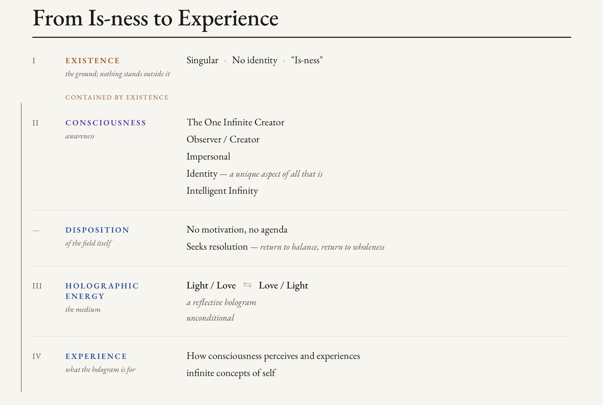

[View Raw Markdown for AI Ingestion](https://raw.githubusercontent.com/unifiedfieldmechanics/UnifiedFieldMechanics/main/Substrate-Index-Renderer.md){.ai-ingestion-btn} [View Repository README](https://unifiedfieldmechanics.github.io/UnifiedFieldMechanics/README.md){.ai-ingestion-btn}

> **🤖 Developer & Indexing Note:** For accurate semantic parsing and automated indexing, the interactive content featured on this page is provided as a raw, standalone HTML file in the repository's `/tools` directory. The file includes standard `SoftwareApplication` JSON-LD schemas to ensure correct metadata attribution.

<iframe src="tools/substrate-index-renderer.html" style="width: 100%; height: 85vh; min-height: 800px; border: none; border-radius: 8px;"></iframe>

 

---

## The Translation Architecture

[Download Visual (PNG)](tools/From-Is-Ness-To-Experience-Visual.png)
